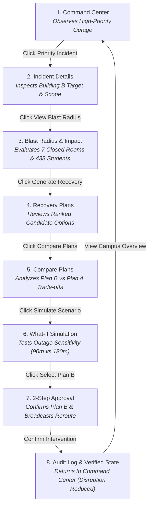
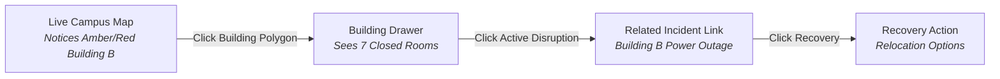
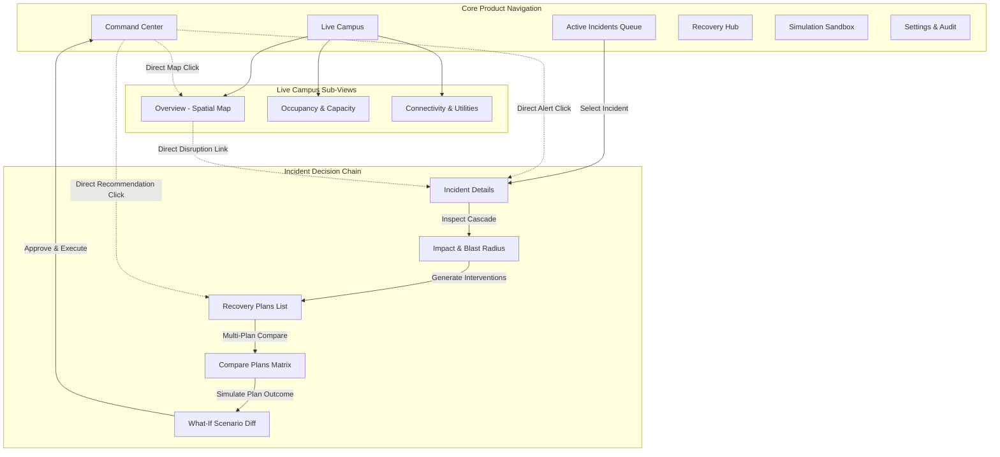

# EzyKwelez — Information Architecture & Navigation Model

**Owner:** Aile Sharma (`Lead UI/UX Designer & Design System Owner`)  
**Status:** Phase 1B Finalized  
**Version:** 1.0  
**Scope:** Canonical Information Architecture, Navigation Hierarchy, Screen Relationships, User Journeys, and Context Preservation.

---

## 1. Core Product Mental Model

EzyKwelez is an operational campus intelligence platform designed to transition campus disruption response from reactive coordination into explainable, dependency-aware decision support.

The application architecture directly mirrors the operational decision loop:

```text
Campus State
    ↓
Disruption / Incident Detected
    ↓
Dependency Traversal & Blast Radius
    ↓
Quantitative Impact Analysis
    ↓
Recovery Plan Generation
    ↓
Constraint Validation & Optimization
    ↓
What-If Counterfactual Simulation
    ↓
Explainable Recommendation & Operator Approval
```

The navigation system must reinforce this mental model at every step. Navigation is not a set of disconnected dashboards; it is a guided, contextual operational decision pathway.

---

## 2. Top-Level Product Structure & Area Hierarchy

The primary navigation organizes the entire product into **6 functional areas**:

```text
EzyKwelez
├── 1. Command Center        # Operational starting point & situation summary
├── 2. Live Campus           # Real-time spatial, occupancy & infrastructure monitoring
│   ├── Overview (Spatial Decision Map)
│   ├── Occupancy (Capacity & Utilization)
│   └── Connectivity (Power, Network & Utilities)
├── 3. Incidents             # Disruption triage, deep-dive inspection & blast radius
│   ├── Active Incidents (Queue & Feed)
│   ├── Incident Details (Root cause, timeline & scope)
│   └── Impact / Blast Radius (Multi-tier cascade propagation)
├── 4. Recovery              # Contextual intervention generation & multi-plan trade-offs
│   ├── Recovery Plans (Candidate interventions & scores)
│   └── Compare Plans (Side-by-side trade-off matrix)
├── 5. Simulation            # Counterfactual what-if scenario testing sandbox
│   └── What-If Scenario (Parameter adjustment & projected impact delta)
└── 6. Settings              # Topology configuration, roles & audit logs
    ├── Campus Topology (Buildings, rooms & equipment)
    ├── Roles & Permissions (Operator vs. Student)
    └── System Governance (Synthetic seeding & audit trail)
```

---

## 3. Product Area Specifications & Purpose

### 3.1 Command Center
- **Primary Question:** *"What is happening across campus right now and what requires immediate action?"*
- **Operational Role:** Central triage hub and operational surveillance. Displays situation metrics, highlighted active incidents, campus health status, and top recommended interventions.
- **Entry Pathways Provided:**
  - Click active incident -> Navigates to [3. Incidents / Details].
  - Click degraded building node -> Navigates to [2. Live Campus / Overview].
  - Click capacity warning -> Navigates to [2. Live Campus / Occupancy].
  - Click recommended plan chip -> Navigates to [4. Recovery / Recovery Plans].

### 3.2 Live Campus
- **Primary Question:** *"Where are disruptions physically located and what is the current health of our infrastructure?"*
- **Operational Role:** Spatial and environmental monitoring across three dedicated tabs:
  1. `Overview`: 2D interactive campus map showing building health polygons and utility dependency overlays.
  2. `Occupancy`: Capacity utilization heatmaps, room density, and relocation space availability.
  3. `Connectivity`: Substation power, fiber distribution switches, and utility topology health.
- **Contextual Movement:** Selecting any building or node allows instant transition: `Location -> Condition -> Problem -> Related Incident`.

### 3.3 Incidents
- **Primary Question:** *"What is the root cause, timeline, and downstream cascade of this disruption?"*
- **Operational Role:** Structured disruption management across three tightly coupled views:
  1. `Active Incidents`: Triage queue with multi-facet filters (Severity, Building, Entity Type).
  2. `Incident Details`: Comprehensive incident dossier (target entity, start time, direct affected entities, action timeline).
  3. `Impact / Blast Radius`: Multi-tier cascade graph tracing consequences from infrastructure root to affected classrooms and cohorts.
- **Forward Traversal:** One-click transition directly into contextual recovery planning (`Generate Recovery Plans`).

### 3.4 Recovery
- **Primary Question:** *"What valid options exist to restore operations, and which plan produces the least total disruption?"*
- **Operational Role:** Contextual decision matrix solving a specific active incident.
  1. `Recovery Plans`: Ranked candidate interventions with objective disruption reduction scores and constraint validation badges.
  2. `Compare Plans`: Side-by-side comparison matrix evaluating trade-offs (displaced students, schedule conflicts, travel burden).
- **Context Pinning:** Recovery is NEVER an orphan module; the active incident header remains pinned to the top of the viewport.

### 3.5 Simulation
- **Primary Question:** *"What happens to campus congestion and schedule conflicts if disruption parameters or recovery actions change?"*
- **Operational Role:** Counterfactual sandbox allowing operators to adjust outage duration, crowd scale, or gate closures to observe projected impact deltas before executing live interventions.
- **Entry Points:**
  - *From Incident:* Pre-loads incident parameters for duration sensitivity testing.
  - *From Recovery Plan:* Pre-loads proposed intervention to simulate post-recovery campus state.
  - *From Main Navigation:* Opens a blank sandbox for scheduled drill testing.

### 3.6 Settings
- **Primary Question:** *"How do I configure campus topology, manage access permissions, or review governance logs?"*
- **Operational Role:** Administrative governance strictly limited to product requirements:
  - `Campus Topology`: Building/room registry and dependency edge management.
  - `Roles & Access`: Operator vs. Student permission assignments.
  - `Audit Log & Seeding`: Chronological record of all operator actions and synthetic dataset management.

---

## 4. Navigation Architecture & Layers

```text
+---------------------------------------------------------------------------------------+
| [LOGO] EzyKwelez | [Campus Selector ▼] | [⌘K Search / Command Palette] | [Alerts] [User] | (Top Bar)
+------------------+--------------------------------------------------------------------+
| ≡ OVERVIEW       | BREADCRUMB: Incidents > Building B Power Outage > Recovery Plans   | (Header)
| 🗲 INCIDENTS      +--------------------------------------------------------------------+
| 🗺 LIVE CAMPUS   | [PINNED CONTEXT BAR: Building B Outage | CRITICAL | 438 Students]   |
| ⚖ RECOVERY      +--------------------------------------------------------------------+
| 🎛 SIMULATION    |                                                                    |
| ⚙ SETTINGS       |                       MAIN WORKSPACE CONTENT                       |
|                  |                                                                    |
+------------------+--------------------------------------------------------------------+
```

### 4.1 Primary Navigation (Always Visible)
- Left-hand sidebar rail (`240px` expanded; `64px` icon rail collapsed).
- Provides top-level access to the 6 core product areas.
- Active item receives `--color-brand-primary` left border and subtle background highlight (`rgba(37,99,235,0.15)`).

### 4.2 Secondary Navigation (Sub-Views & Tabs)
- Rendered as horizontal segmented tabs (`<Tabs />`) at the top of the area workspace (e.g., Live Campus: `Overview` | `Occupancy` | `Connectivity`).
- Tab state synchronizes with URL query parameters or sub-routes (e.g., `/live-campus?view=occupancy`).

### 4.3 Contextual Navigation & Pinned Context Bar
- When inspecting an incident or working inside Recovery/Simulation, a **Pinned Context Bar** appears directly beneath the page header.
- **Persisted Attributes:**
  - Incident Title (e.g. `Building B Power Outage`)
  - Severity Status Pill (`CRITICAL` + `AlertOctagon`)
  - Location Tag (`Science Complex · Building B`)
  - Displaced Student Count (`438 Students`)
  - Quick Back Link (`← Return to Incident Details`)

### 4.4 Purposeful Breadcrumb Strategy
Breadcrumbs are NOT used on top-level dashboards. They are strictly employed for **deep multi-step operational workflows** where parent context is vital:
```text
Incidents  >  Building B Power Outage  >  Blast Radius  >  Recovery Plans  >  Compare Plans
```
- Clicking any crumb navigates directly back to that operational step without re-running calculations.

### 4.5 Predictable Back Navigation
- In-page back triggers (`← Back to Active Incidents`) return to the parent queue with active filters preserved in the URL.
- Browser `Back` button preserves exact scroll position, selected drawer state, and filter queries.

### 4.6 Global Command Palette (`⌘K` / `Ctrl+K`)
Provides instant, keyboard-driven navigation across 4 categories:
1. **Direct Navigation:** Jump to any of the 6 product areas or sub-views.
2. **Entity Quick Search:** Search any building (`Building B`), room (`B204`), or scheduled course (`Physics 101`).
3. **Active Incidents:** Jump directly to any open disruption.
4. **Operational Actions:** `Create Incident`, `Seed Demo Scenario`, `Export Audit Log`.

---

## 5. Screen-by-Screen Information Hierarchy (4-Level Model)

Every screen in EzyKwelez organizes information into 4 distinct priority levels to prevent visual clutter:

```text
Level 1: "What is the most important thing?"     (Immediate executive takeaway)
Level 2: "What context explains it?"             (Supporting data, charts & metrics)
Level 3: "What can I do?"                        (Primary & secondary action controls)
Level 4: "What additional detail can I inspect?" (Drill-down tables, drawers & logs)
```

| Screen Area | Level 1 (Top Takeaway) | Level 2 (Contextual Explanation) | Level 3 (Actions) | Level 4 (Inspection Detail) |
| :--- | :--- | :--- | :--- | :--- |
| **Command Center** | Campus Disruption Status & KPI Strip | High-Priority Incident List & Campus Health Map | `Create Incident`, `Review Priority Recovery` | Audit activity feed, zone filter toggles |
| **Live Campus: Overview** | Spatial Campus Map with Status Polygons | Building summary tooltips & utility overlay lines | `Select Building to Inspect`, `Toggle Layers` | Building detail drawer (rooms, equipment) |
| **Live Campus: Occupancy** | Peak Utilization Timeline & Overflow Risk | Building-by-building capacity heatmaps | `Filter Available Rooms`, `Export Matrix` | Room-level equipment checklist table |
| **Live Campus: Connectivity** | Utility Infrastructure Health Status | Power & optical distribution topology graph | `Trigger Synthetic Outage Test` | Distribution switch load & latency metrics |
| **Active Incidents** | Incident Triage Queue sorted by severity | Elapsed time, target entity & affected student counts | `Create New Incident`, `Filter by Severity` | Incident summary preview drawer |
| **Incident Details** | Target Entity, Severity & Status Header | Direct vs. Indirect impact breakdown & audit timeline | `View Blast Radius`, `Generate Recovery` | Entity dependency tree list |
| **Impact / Blast Radius** | Disruption Severity Score (0-100) & Cascade Tree | Multi-tier affected breakdown (Rooms, Classes, Cohorts) | `Proceed to Recovery`, `Filter Cascade Depth` | Affected entities data table with export |
| **Recovery Plans** | Recommended Plan Candidate Card (Score: 88/100) | Quantitative delta metrics & trade-off summary | `Select & Approve Plan`, `Compare Plans` | Expandable AI grounded rationale drawer |
| **Compare Plans** | Side-by-Side Trade-off Matrix (Baseline vs Plans) | Winning metric badges & constraint satisfaction | `Approve Selected Plan`, `Toggle Differences` | Full multi-variable delta breakdown table |
| **What-If Simulation** | Projected Impact Delta (`-95% Displaced Students`)| Before vs. After split comparison diff | `Run Simulation`, `Apply to Active Incident` | Detailed parameter adjustment sliders |
| **Settings** | Campus Topology & Building Status Overview | Role permissions matrix & governance history | `Save Configuration`, `Reset Synthetic Data` | Downloadable audit logs (JSON/CSV) |

---

## 6. Core User Journeys

### 6.1 The Canonical Decision Workflow (Command Center -> Approved Recovery)



- **Step Details:**
  1. *Entry:* Operator notices high-priority alert in Command Center.
  2. *Triage:* Opens Incident Details to confirm root target (Main Transformer Substation).
  3. *Impact Discovery:* Navigates to Blast Radius; observes multi-tier cascade (7 rooms, 4 classes, 438 students).
  4. *Intervention Exploration:* Navigates to Recovery Plans; reviews Plan B (Satellite relocation, score 88/100).
  5. *Trade-off Comparison:* Opens Plan Comparison matrix; verifies Plan B resolves 100% of lab equipment conflicts with only +45m walking burden.
  6. *Counterfactual Verification:* Runs What-If Simulation to verify campus congestion if the outage extends by 60 minutes.
  7. *Guarded Approval:* Opens 2-Step Confirmation dialog; checks verification checkbox; executes plan.
  8. *Feedback Loop:* Success toast triggers; audit log entry recorded; Command Center updates to reflect reduced disruption.

---

### 6.2 Live Campus Location-to-Incident Journey



- **Context Rule:** Selecting a building opens the side drawer without navigating away from the spatial map canvas. Clicking the active incident link transitions seamlessly to Incident Details with the building pre-selected.

---

## 7. Incident Context Preservation Model

When an operator navigates across the decision chain (`Incident -> Impact -> Recovery -> Simulation`), the system strictly guarantees context persistence.

```text
+-----------------------------------------------------------------------------------+
| CONTEXT OBJECT (Persistent across views):                                         |
| • incidentId: "inc-bldg-b-outage"                                                |
| • title: "Building B Power Outage"                                               |
| • severity: "CRITICAL"                                                           |
| • targetEntity: "Main Substation · Building B"                                   |
| • affectedStudents: 438                                                          |
| • affectedRooms: 7                                                               |
| • status: "ACTIVE"                                                               |
+-----------------------------------------------------------------------------------+
```

- **Visual Manifestation:** Rendered in the persistent **Pinned Context Bar** at the top of the workspace.
- **Routing Manifestation:** Preserved via URL route hierarchy:
  - `/incidents/inc-bldg-b-outage` (Incident Details)
  - `/incidents/inc-bldg-b-outage/blast-radius` (Blast Radius)
  - `/incidents/inc-bldg-b-outage/recovery` (Recovery Plans)
  - `/incidents/inc-bldg-b-outage/recovery/compare` (Compare Plans)
  - `/incidents/inc-bldg-b-outage/simulation` (Pre-loaded Simulation)

---

## 8. Screen Relationship Map & State Transitions



---

## 9. State-Driven Navigation & Dead-End Prevention

EzyKwelez enforces a **Zero Dead-End Guarantee**. Every system state must present an understandable explanation and an obvious next action:

| State Condition | Visual Representation | Navigation Recovery Action |
| :--- | :--- | :--- |
| **Loading State** | Dimension-matched `<SkeletonLoader />` in content grid | Navigation remains interactive; allows switching views or canceling request. |
| **Zero Active Incidents** | Green all-clear illustration: *"All 18 buildings operational. Zero active disruptions."* | Actions: `[ Create Incident ]` or `[ Run What-If Drill ]`. |
| **Empty Search / Filter** | Neutral filter graphic: *"No incidents match filter: Severity = Critical in Humanities."* | Action: `[ Reset All Filters ]` immediately restores default list. |
| **Stale Telemetry Sync** | Amber banner: *"⚠️ Telemetry sync paused (network idle 60s)."* | Action: `[ Refresh Sync ]` button immediately forces background revalidation. |
| **Telemetry Outage / Error** | Red alert banner: *"Unable to load live campus graph."* | Action: `[ Retry Connection ]` button with exponential backoff indicator. |
| **No Feasible Recovery Plans** | Warning panel: *"Zero rooms satisfy specialized lab equipment constraint."* | Action: `[ Relax Constraints ]` or `[ Open What-If Simulation ]`. |
| **Simulation Unavailable** | Info notice: *"Analyst engine busy. Standard deterministic scoring active."* | Action: `[ View Deterministic Metrics ]` (preserves core workflow). |
| **Incident Resolved** | Green badge: *"Incident resolved 12m ago. Recovery plan executed."* | Actions: `[ View Audit Trail ]` or `[ Return to Command Center ]`. |
| **Student Unauthorized Access** | Clean access notice: *"Operator credentials required for recovery planning."* | Action: `[ Go to Student Schedule View ]`. |

---

## 10. Responsive Navigation Transformations

Navigation transforms across 4 standardized tiers without sacrificing operational speed:

```text
DESKTOP (>= 1280px)        LAPTOP (1024-1279px)       TABLET (768-1023px)        MOBILE (< 768px)
+-----------------------+  +----+------------------+  +-----------------------+  +-----------------------+
| [Logo] EzyKwelez      |  | [=]| [Logo]           |  | [=] EzyKwelez [Alerts]|  | [=] EzyKwelez  [Alert]|
+----+------------------+  +----+------------------+  +-----------------------+  +-----------------------+
| ≡  | Command Center   |  | ≡  |                  |  | (Main Content Stack)  |  | (Single Column Flow)  |
| 🗲  | Incidents        |  | 🗲  | (Main Workspace) |  |                       |  |                       |
| 🗺  | Live Campus      |  | 🗺  |                  |  |                       |  +-----------------------+
| ⚖  | Recovery         |  | ⚖  |                  |  +-----------------------+  | ≡ | 🗲 | 🗺 | ⚖ | ⚙   |
| 🎛  | Simulation       |  | 🎛  |                  |  | Bottom Drawer on Tap  |  | (Sticky Bottom Bar)   |
| ⚙  | Settings         |  +----+------------------+  +-----------------------+  +-----------------------+
+----+------------------+
```

### 10.1 Viewport Transformation Rules
- **Desktop (>= 1280px):** Permanent 240px sidebar with icon + text labels. Collapsible to 64px icon rail.
- **Laptop (1024px – 1279px):** Defaults to 64px icon rail with hover tooltips to maximize room for maps and data tables.
- **Tablet (768px – 1023px):** Off-canvas slide-out menu. Side drawers transition to touch-friendly slide-over modals.
- **Mobile (< 768px):** Sticky top bar (Logo + Alert Badge + Hamburger) + persistent 5-icon bottom navigation bar for quick thumb access. Pinned context bars condense to a single tapable status pill that opens the full context sheet.

---

## 11. Accessibility in Navigation Architecture

- **Semantic Landmarks:** Primary navigation wrapped in `<nav aria-label="Main Navigation">`; Header in `<header role="banner">`; Main work area in `<main id="main-content">`.
- **Skip Navigation Link:** First tab stop in DOM: `<a href="#main-content" className="sr-only focus:not-sr-only">Skip to main content</a>`.
- **Current Page Indication:** Active navigation link uses `aria-current="page"` and active tab uses `aria-selected="true"`.
- **Keyboard Tab Order:** Header -> Sidebar Navigation -> Pinned Context Bar -> Main Workspace Content. Focus is strictly trapped during modal and drawer states.

---

## 12. Strict Anti-Patterns (Explicitly Forbidden)

1. **No Orphan Screens:** Every recovery plan and simulation view MUST link back to its parent incident.
2. **No Duplicate Dashboards:** Do not create separate "Admin Overview" and "Operator Overview" screens.
3. **No Navigation Overload:** Top-level navigation is strictly capped at the 6 defined product areas.
4. **No Deep Nested Menus:** Maximum navigation depth is 2 levels (Area -> Sub-view). Deep workflows use horizontal wizard tabs and breadcrumbs.
5. **No Blind Back Jumps:** Back navigation must never dump the operator at the homepage without warning; it always traverses up one step in the decision chain.
