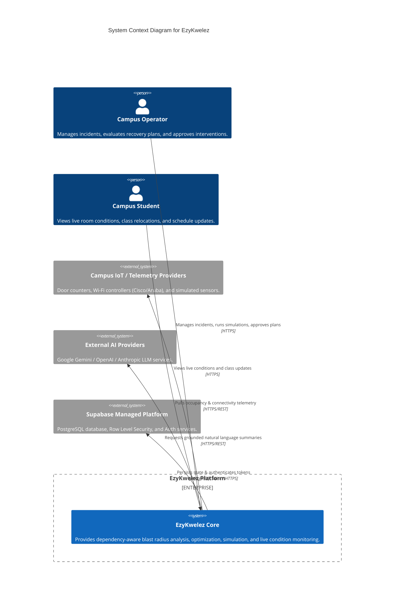
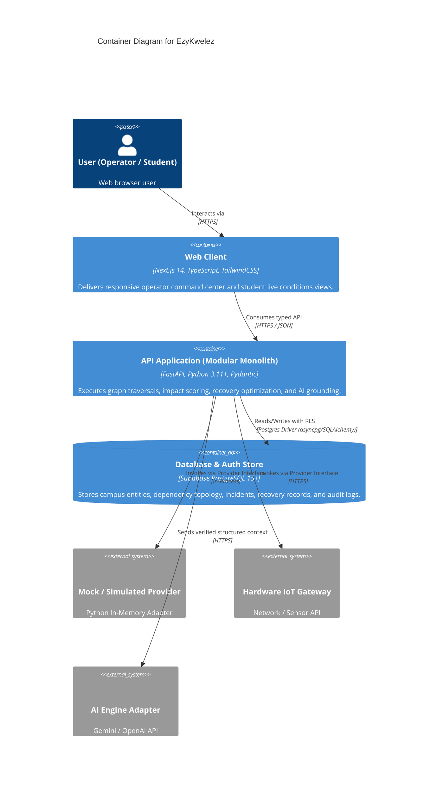
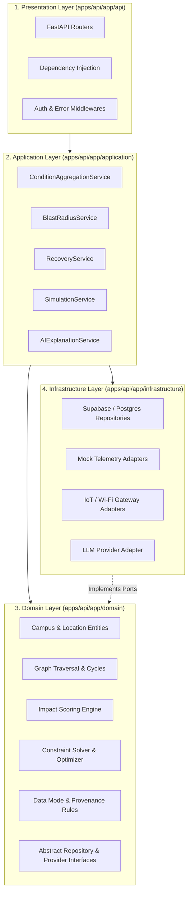
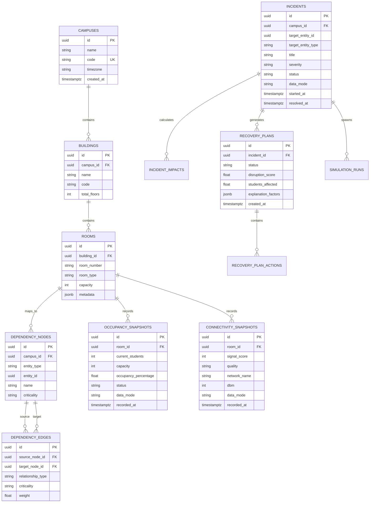
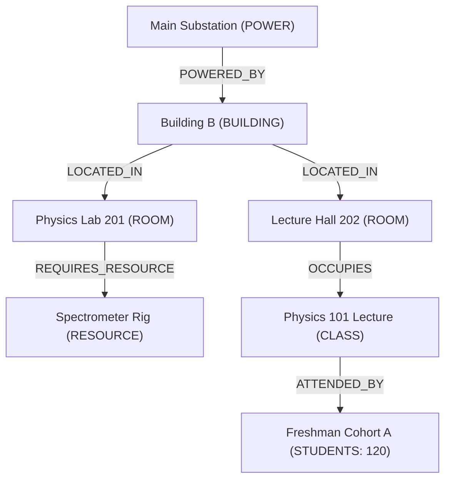
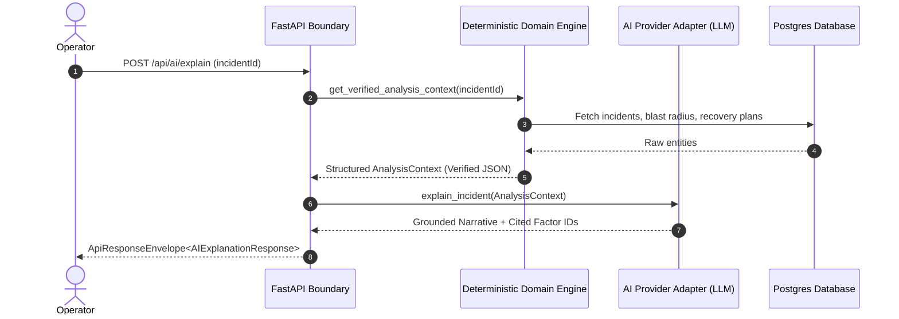
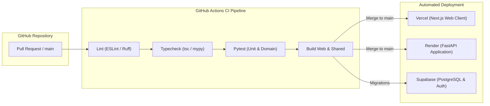

# EzyKwelez — Technical System Architecture & Domain Specification

**Document Status:** Approved Baseline (Phase 1)  
**Lead Architect:** Ishu (System Design & Architecture)  
**Contributors:** Piyush (Backend Integration), Tanisha (Frontend Architecture), Aile (UX/UI Design)  
**Target Topology:** Modular Monolith API (FastAPI) + Modern Web Client (Next.js) + Managed Postgres/Auth (Supabase)  
**Version:** 2.0  

---

## 1. Executive System Overview

EzyKwelez is an intelligent campus continuity and operational recovery platform. It replaces reactive, fragmented crisis coordination with an explainable, dependency-aware decision system.

The fundamental value proposition of EzyKwelez is answering one central question:
> **"When something goes wrong on campus, what else is affected, and what is the optimal, constraint-safe way to recover?"**

### 1.1 The Core Closed Decision Loop

The architecture is structured strictly around an eight-stage closed decision loop:

```text
Campus State
      ↓
Dependencies (Graph Traversal)
      ↓
Incidents / Conditions (Blast Radius)
      ↓
Impact Analysis (Transparent Scoring)
      ↓
Recovery Options (Candidate Generation & Constraint Solving)
      ↓
Optimization (Multi-Objective Disruption Minimization)
      ↓
Simulation (Counterfactual Scenario Testing)
      ↓
Human-Readable Explanation (Grounded AI Synthesis)
```

Each stage operates as an independent bounded context with explicit contracts, ensuring capabilities evolve without systemic coupling.

---

## 2. System Context & Container Architecture

### 2.1 C4 System Context Diagram (Level 1)



### 2.2 C4 Container Diagram (Level 2)



---

## 3. Layered Architecture & Dependency Rule

The backend adheres to a strict **Hexagonal / Clean Layered Architecture**:

```text
Presentation Layer (HTTP Routes, FastAPI Routers, Schema Validation)
      ↓
Application Layer (Use Case Orchestration, Workflows, Provider Coordination)
      ↓
Domain Layer (Pure Entities, Business Invariants, Graph Traversal, Optimizers)
      ↑ (Dependency Inversion)
Infrastructure Layer (Database Repositories, Hardware Adapters, LLM Clients)
```



### Strict Architectural Dependency Constraints:
1. **Domain Purity:** The Domain layer MUST NOT import FastAPI, Pydantic (outside schemas), Supabase SDK, HTTP clients (`httpx`, `requests`), or third-party AI SDKs.
2. **One-Way Inversion:** Infrastructure implements abstract interfaces defined in the Domain/Application layers.
3. **No Direct UI-to-Database Coupling:** The frontend client NEVER communicates directly with Supabase database tables or service-role keys. All operations pass through the FastAPI API layer.

---

## 4. Domain Boundaries & Bounded Contexts

EzyKwelez partitions campus continuity into eight distinct bounded contexts:

```text
EzyKwelez Core
├── 1. Campus & Facilities Domain
│   ├── Location (Hierarchy: Campus → Building → Zone → Room)
│   ├── Occupancy (Current headcount, capacity, thresholds)
│   ├── Connectivity (Signal score, RSSI dBm, network quality)
│   └── Live Conditions Aggregation
├── 2. Dependency Graph Domain
│   ├── Topology Nodes & Typed Edges
│   ├── Cycle Detection & Depth-Bounded Traversal
│   └── Upstream / Downstream Reachability
├── 3. Incident Management Domain
│   ├── Lifecycle (Reported → Investigating → Active → Mitigated → Resolved)
│   ├── Severity & Target Scope
│   └── Audit Trail Integration
├── 4. Blast Radius & Impact Analysis Domain
│   ├── Direct vs. Cascading Disruption
│   ├── Population & Academic Schedule Impact
│   └── Transparent Multi-Factor Impact Scoring
├── 5. Recovery Planning Domain
│   ├── Resource & Room Candidate Generation
│   ├── Feasibility & Hard Constraint Validation
│   └── Relocation Candidate Builder
├── 6. Multi-Objective Optimization Domain
│   ├── Objective Evaluation (Students Displaced, Travel Time, Room Waste)
│   └── Plan Ranking & Trade-off Scoring
├── 7. Counterfactual Simulation Domain
│   ├── Isolated Scenario Clones (Zero mutation on production tables)
│   ├── Parameter Mutation (Duration, Capacity, Availability)
│   └── Before-vs-After Delta Engine
└── 8. Grounded AI Explanation Domain
    ├── Structured Context Compilation
    ├── Read-Only Natural Language Translation
    └── Provider Fail-Safe Fallbacks
```

---

## 5. Live Campus Conditions & Extensible Provider Architecture

### 5.1 Extensible Entity Design (Zero Hardcoding)

The system must support the **Library** and **Canteen** out-of-the-box, while dynamically supporting any campus facility (**Computer Labs, Hostels, Study Halls, Auditoriums, Sports Complexes**) purely via data configuration.

```text
Location Record (DB) ──► Occupancy Provider ──► Connectivity Provider ──► Aggregation Service ──► API Response
```

### 5.2 Provider Port Interfaces

```python
from abc import ABC, abstractmethod
from typing import List
from app.domain.campus.models import OccupancySnapshot, ConnectivitySnapshot

class OccupancyProvider(ABC):
    @abstractmethod
    async def get_occupancy(self, location_id: str) -> OccupancySnapshot:
        """Retrieve occupancy metrics for a given location ID."""
        pass

    @abstractmethod
    async def get_all_occupancies(self, campus_id: str) -> List[OccupancySnapshot]:
        """Retrieve occupancy metrics for all locations in a campus."""
        pass

class ConnectivityProvider(ABC):
    @abstractmethod
    async def get_connectivity(self, location_id: str) -> ConnectivitySnapshot:
        """Retrieve Wi-Fi / connectivity metrics for a given location ID."""
        pass

    @abstractmethod
    async def get_all_connectivity(self, campus_id: str) -> List[ConnectivitySnapshot]:
        """Retrieve connectivity metrics for all locations in a campus."""
        pass
```

### 5.3 Authoritative Business Rules

To prevent business logic fragmentation, classifications are defined authoritatively in domain constants and shared across the monorepo:

#### Occupancy Classification Rules:
$$\text{Occupancy Percentage} = \left( \frac{\text{Current Students}}{\text{Capacity}} \right) \times 100$$

| Occupancy Range | Classification Status | Operational Meaning |
| :--- | :--- | :--- |
| **0% – 49%** | `Low` | Ample capacity available for relocation |
| **50% – 74%** | `Moderate` | Normal operational load |
| **75% – 89%** | `Busy` | High utilization; limited relocation buffer |
| **90% – 100%** | `Very Busy` | Near maximum capacity; not eligible for major additions |
| **> 100%** | `Over Capacity` | Critical bottleneck / safety threshold breached |

#### Connectivity Classification Rules:
| Signal Score (0–100) | Quality Rating | Network Characteristics |
| :--- | :--- | :--- |
| **80 – 100** | `Excellent` | High bandwidth, low latency, RSSI > -60 dBm |
| **60 – 79** | `Good` | Normal academic use, RSSI -60 to -70 dBm |
| **40 – 59** | `Fair` | Degraded speeds, potential packet loss |
| **20 – 39** | `Weak` | Intermittent connectivity, unsuitable for labs |
| **0 – 19** | `Very Weak` | Complete dropout or non-functional network |

---

## 6. Data Provenance & Operational Modes

Every operational metric, telemetry record, and API payload MUST explicitly declare its provenance.

```typescript
export enum DataMode {
  LIVE = "live",           // Verified hardware sensor telemetry (<5m freshness)
  SIMULATED = "simulated", // Synthetic scenario or counterfactual simulation run
  ESTIMATED = "estimated", // Statistical calculation (e.g. timetable * attendance rate)
  UNKNOWN = "unknown",     // Stale data, provider timeout, or unverified source
}
```

### Provenance Safeguards:
1. **Mock Providers:** Structurally incapable of outputting `DataMode.LIVE`. Always tagged as `SIMULATED` or `ESTIMATED`.
2. **Simulation Runs:** Isolated from production tables. All generated records are stamped `SIMULATED`.
3. **UI Transparency:** The frontend renders distinct visual indicators for each data mode to ensure no synthetic data can be mistaken for live telemetry.

---

## 7. Database Architecture & Schema Design

The persistence tier is built on PostgreSQL (managed via Supabase).

### 7.1 Schema Diagram (Core Entities)



### 7.2 Current (Phase 1 Baseline) vs. Planned Tables

| Table Name | Phase | Purpose | Indexes |
| :--- | :--- | :--- | :--- |
| `campuses` | **Current** | University/Campus root entity | `id`, `code` |
| `buildings` | **Current** | Physical building structures | `id`, `campus_id` |
| `rooms` (campus_locations) | **Current** | Individual rooms, labs, canteens | `id`, `building_id`, `room_type` |
| `occupancy_snapshots` | **Current** | Headcount & capacity logs | `room_id, recorded_at DESC` |
| `connectivity_snapshots` | **Current** | Wi-Fi signal & latency metrics | `room_id, recorded_at DESC` |
| `dependency_nodes` | **Current** | Graph vertex definitions | `campus_id`, `(entity_type, entity_id)` |
| `dependency_edges` | **Current** | Directed graph edges | `source_node_id`, `target_node_id` |
| `incidents` | **Current** | Operational incident records | `campus_id`, `status`, `started_at` |
| `recovery_plans` | **Current** | Generated recovery candidates | `incident_id`, `status` |
| `recovery_plan_actions` | **Current** | Step-by-step room reassignments | `recovery_plan_id` |
| `simulation_runs` | **Current** | Isolated scenario executions | `incident_id`, `created_at` |
| `audit_logs` | **Current** | Tamper-evident operator action trail | `campus_id`, `actor_id`, `created_at` |
| `courses` & `classes` | Planned (Phase 2) | Full timetable & cohort mapping | `room_id`, `schedule_window` |
| `iot_device_registry` | Planned (Phase 2) | Physical hardware sensor binding | `device_mac`, `room_id` |

---

## 8. API Contract Specifications

All API endpoints adhere to the standard RESTful envelope format with strict type safety across Python and TypeScript.

### 8.1 Core Endpoint Catalog

```http
# System & Diagnostics
GET    /api/health                             -> HealthCheckResponse

# Campus Facilities & Live Conditions
GET    /api/campus/locations                   -> ApiResponseEnvelope<CampusLocation[]>
GET    /api/campus/conditions                  -> ApiResponseEnvelope<LiveCampusConditionsResponse>
GET    /api/campus/conditions/{locationId}     -> ApiResponseEnvelope<LocationCondition>
GET    /api/campus/graph                       -> ApiResponseEnvelope<DependencyGraphSnapshot>

# Incident Lifecycle & Blast Radius
GET    /api/incidents                          -> ApiResponseEnvelope<IncidentSummary[]>
POST   /api/incidents                          -> ApiResponseEnvelope<IncidentSummary>
GET    /api/incidents/{id}                     -> ApiResponseEnvelope<IncidentDetail>
POST   /api/incidents/{id}/analyze             -> ApiResponseEnvelope<BlastRadiusSummary>

# Recovery & Optimization
GET    /api/incidents/{id}/recovery-plans      -> ApiResponseEnvelope<RecoveryOptionSummary[]>
POST   /api/incidents/{id}/recovery-plans/generate -> ApiResponseEnvelope<RecoveryOptionSummary[]>
POST   /api/recovery-plans/{id}/approve        -> ApiResponseEnvelope<RecoveryPlanApprovalResult>

# Simulation & What-If Drills
POST   /api/incidents/{id}/simulate            -> ApiResponseEnvelope<SimulationResult>

# Grounded AI Operational Explanation
POST   /api/ai/explain                         -> ApiResponseEnvelope<AIExplanationResponse>
```

### 8.2 Standard Error Envelope

```json
{
  "error": {
    "code": "LOCATION_NOT_FOUND",
    "message": "Campus location with ID 'loc_lib_02' does not exist.",
    "requestId": "req_01h8x9p4k2",
    "details": {
      "locationId": "loc_lib_02"
    }
  }
}
```

---

## 9. Dependency Graph & Traversal Algorithm

The campus dependency graph is modeled as a Directed Acyclic Graph (DAG) with cycle-suppression safeguards.



### Traversal Safeguards:
1. **Cycle Prevention:** Breadth-First Search (BFS) / Depth-First Search (DFS) maintains a `visited_nodes` set. If an edge creates a loop, traversal logs a warning and terminates the cycle branch.
2. **Depth Bounding:** Default maximum traversal depth is capped at 6 hops to prevent unbounded graph walking.
3. **Blast Radius Metric Calculation:**
$$\text{Disruption Score} = \sum_{n \in \text{Impacted Nodes}} \left( \text{CriticalityWeight}(n) \times \text{People}(n) \times \text{DurationHours} \right)$$

---

## 10. Multi-Objective Recovery Optimizer

When an incident causes room unavailability, the **Recovery Planning Engine** searches the campus graph for feasible replacements.

### 10.1 Hard Feasibility Constraints:
1. $\text{Capacity}(\text{Candidate Room}) \ge \text{Headcount}(\text{Displaced Class})$
2. $\text{Equipment}(\text{Candidate Room}) \supseteq \text{Required Equipment}(\text{Displaced Class})$
3. $\text{Schedule}(\text{Candidate Room}) \cap \text{Time Window} = \emptyset$ (No double booking)
4. $\text{Accessibility}(\text{Candidate Room}) = \text{True}$ (If required by class)

### 10.2 Objective Function (Minimization):
$$\text{Cost}(P) = w_1 \cdot \Delta \text{DisplacedStudents} + w_2 \cdot \text{WalkingDistanceMeters} + w_3 \cdot \text{CapacityWaste} + w_4 \cdot \text{ScheduleDelayMinutes}$$

* **Default Weights:** $w_1 = 0.40$, $w_2 = 0.25$, $w_3 = 0.20$, $w_4 = 0.15$.
* The optimizer ranks candidate plans and returns the top 3 options with machine-readable `RecommendationReason` factors.

---

## 11. AI Architecture & Explanation Boundary

The AI Operations Analyst is strictly isolated as a read-only summarization layer.



### Grounding Rules:
* The LLM prompt is injected ONLY with verified engine outputs (counts, scores, reasons).
* The LLM is strictly prohibited from inventing new room numbers, changing student counts, or altering plan scores.
* If the LLM provider fails, times out, or returns invalid JSON, the system falls back to a deterministic template summary.

---

## 12. Security Architecture & Threat Model

EzyKwelez adheres to the **OWASP API Security Top 10**:

1. **Authentication & Identity:** Managed via Supabase Auth with JWT verification on all protected endpoints.
2. **Row Level Security (RLS):** Database policies enforce tenant and role isolation:
   - `student` role: Read-only access to published incidents and public room conditions.
   - `operator` role: Full access to incident creation, simulation runs, and plan approvals.
3. **Secret Segregation:**
   - Public frontend (`apps/web`): Only has access to `NEXT_PUBLIC_SUPABASE_URL` and `NEXT_PUBLIC_SUPABASE_ANON_KEY`.
   - Server backend (`apps/api`): Privately holds `SUPABASE_SERVICE_ROLE_KEY`, `SUPABASE_DB_URL`, and `AI_API_KEY`.
   - The Supabase Service Role Key is NEVER sent to the client browser.
4. **Input Validation:** Strict Pydantic models validate all incoming requests, preventing SQL injection and payload poisoning.
5. **CORS Configuration:** Explicit origin whitelisting (`ALLOWED_ORIGINS`) on Render deployments.

---

## 13. Reliability, Resilience & Graceful Degradation

```text
Incoming Telemetry Request
        │
        ▼
   Live Hardware Provider Online?
   ├── YES ──► Output Telemetry (DataMode.LIVE)
   └── NO / Timeout (2.0s)
               │
               ▼
        Cached Snapshot Available (<15m)?
        ├── YES ──► Return Cached Data (DataMode.UNKNOWN, stale=true)
        └── NO ──► Fallback to Estimated/Mock Model (DataMode.ESTIMATED)
```

* **Stale Over Fabricated Rule:** The system always prefers displaying a clearly marked stale reading over fabricating synthetic data as "live".
* **Circuit Breaking:** External API calls to IoT gateways and LLM providers have a 2.5-second timeout with automatic fallback to prevent thread exhaustion.

---

## 14. Observability & Monitoring

Every HTTP transaction generates a structured log record:

```json
{
  "timestamp": "2026-10-07T12:00:01.120Z",
  "requestId": "req_01h8x9p4k2",
  "method": "POST",
  "path": "/api/incidents/inc_01/analyze",
  "statusCode": 200,
  "durationMs": 42.6,
  "actorId": "usr_operator_88",
  "campusId": "cmp_main",
  "domainOperation": "BLAST_RADIUS_EVALUATION"
}
```

* **Zero PII Logging:** Student names, passwords, authorization bearer headers, and raw credentials are scrubbed prior to log formatting.
* **Health Check Endpoints:** `/api/health` performs active database pinging and reports sub-system readiness.

---

## 15. Deployment & CI/CD Topology



---

## 16. Contract Ownership Matrix

| System Component | Frontend (`apps/web`) | Backend (`apps/api`) | Database (`supabase`) | AI Provider |
| :--- | :--- | :--- | :--- | :--- |
| **Presentation & UI Formatting** | **Owner** | Consumer | N/A | N/A |
| **Client Navigation & State** | **Owner** | N/A | N/A | N/A |
| **Domain Logic & Business Rules** | Formatter | **Authoritative Owner** | N/A | N/A |
| **Graph Traversal & Blast Radius** | Display | **Authoritative Owner** | N/A | N/A |
| **Recovery Optimization** | Display | **Authoritative Owner** | N/A | N/A |
| **Persistence & Constraints** | N/A | Client | **Authoritative Owner** | N/A |
| **Row Level Security (RLS)** | N/A | Enforcer | **Authoritative Owner** | N/A |
| **Telemetry Provenance Tagging** | Display | **Authoritative Owner** | Persistence | N/A |
| **Operational Explanation** | Display | Context Builder | N/A | **Translator** |

---

## 17. Architecture Decision Records (ADR) Index

The key architectural decisions governing this platform are formalized in `docs/adr/`:

1. [ADR-001: Modular Monolith vs. Microservices Architecture](file:///docs/adr/ADR-001-modular-monolith-vs-microservices.md)
2. [ADR-002: Provider / Adapter Architecture for Telemetry & Extensibility](file:///docs/adr/ADR-002-provider-adapter-architecture.md)
3. [ADR-003: RESTful API Contract Strategy & Envelope Standard](file:///docs/adr/ADR-003-api-contract-strategy.md)
4. [ADR-004: Data Provenance & Operational Data Modes](file:///docs/adr/ADR-004-data-provenance-and-modes.md)
5. [ADR-005: AI Explanation Boundary & Deterministic Source of Truth](file:///docs/adr/ADR-005-ai-explanation-boundary.md)
6. [ADR-006: Real-Time Communication Strategy & Evolution Roadmap](file:///docs/adr/ADR-006-future-realtime-strategy.md)
