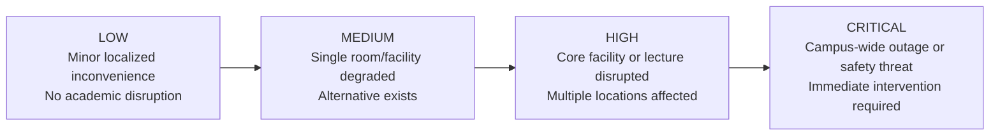
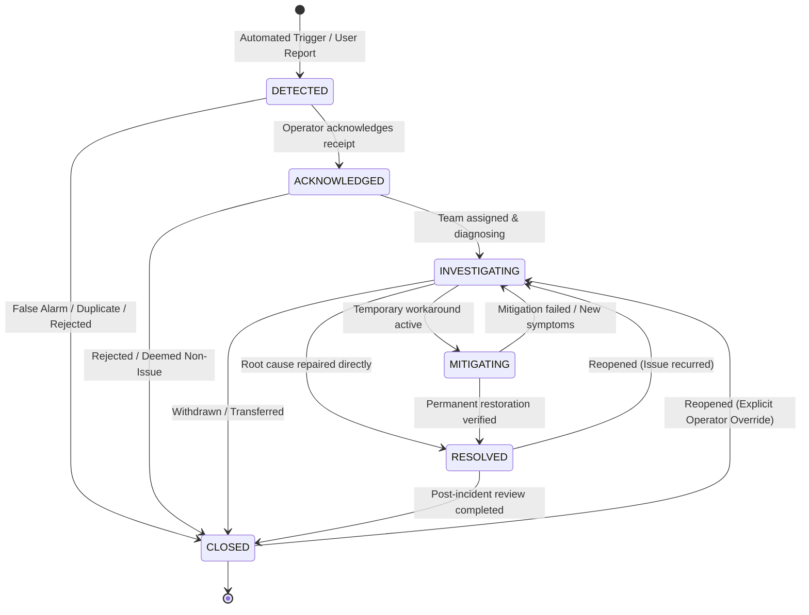
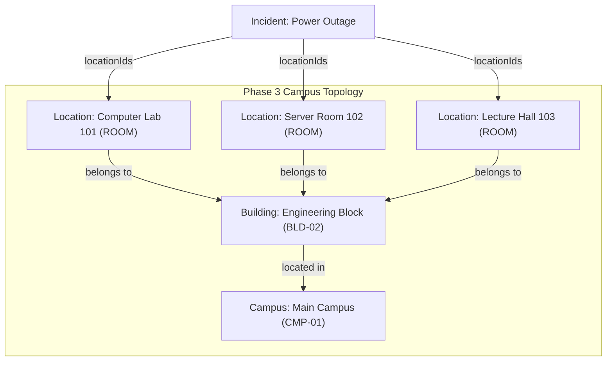
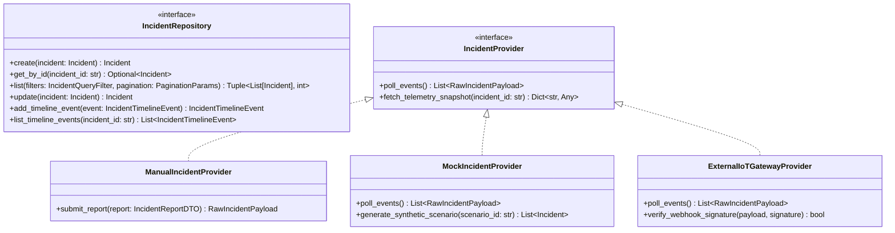
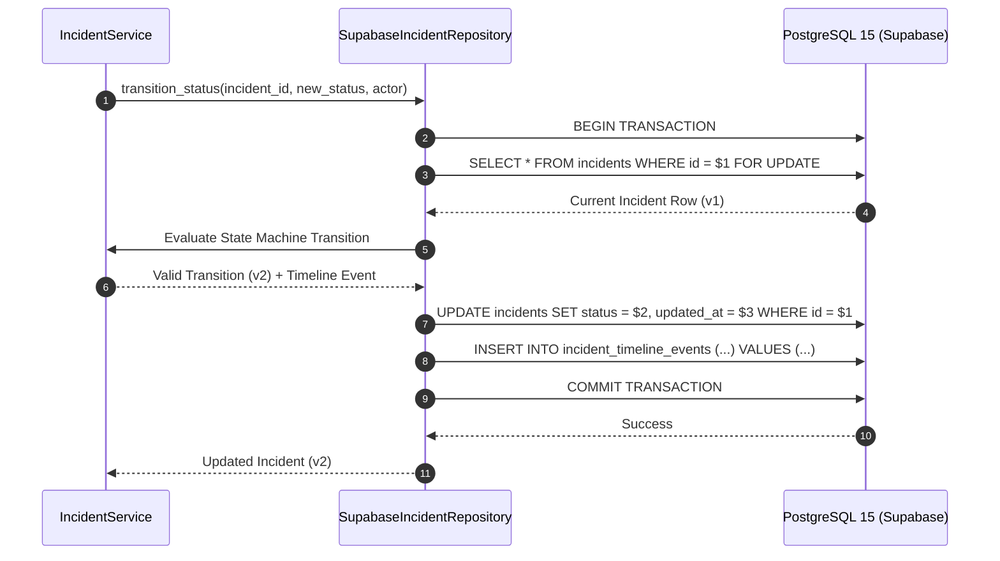
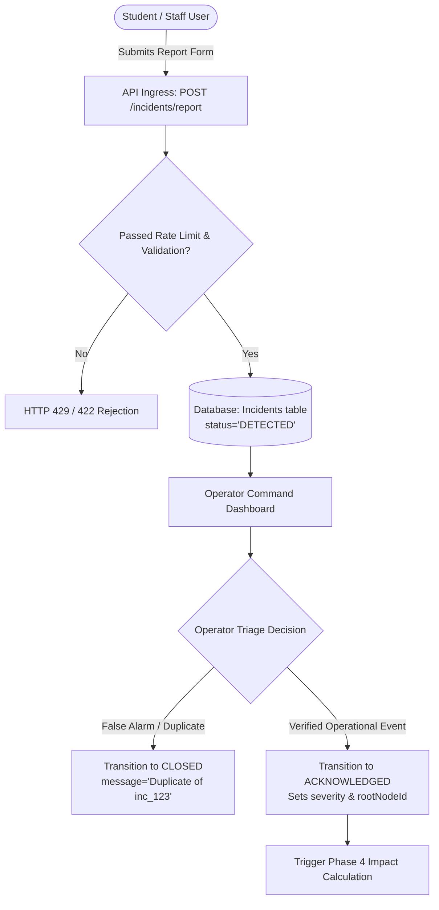
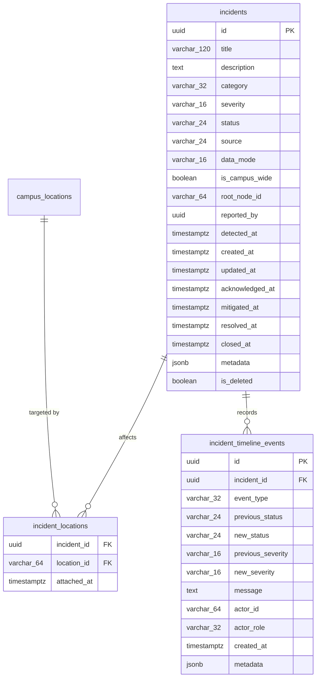
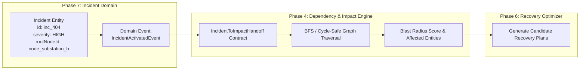
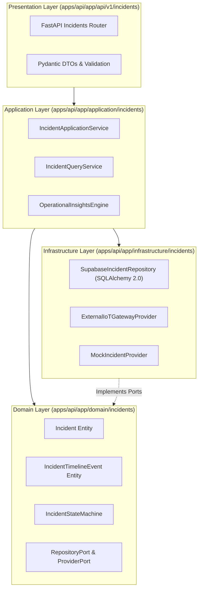

# EzyKwelez — Phase 7: Incident Management and Operational Event Model System Design

**Document Status:** Approved Baseline Specification (System Design Only)  
**Document Identifier:** `DOC-SD-PHASE-07-INCIDENT-SYSTEM`  
**System Area:** Core Operational Domain / Incident Lifecycle & Provenance  
**Target Topology:** Hexagonal / Clean Layered Architecture (FastAPI + Supabase PostgreSQL)  
**Version:** 1.0.0  
**Author:** Lead System Architect  
**Reviewers:** Backend Engineering, Frontend Architecture, UX/UI Design, Reliability Engineering  

---

## 1. Executive Summary

EzyKwelez is an intelligent campus continuity and operational recovery platform designed to replace reactive, fragmented crisis coordination with an explainable, dependency-aware decision loop:

$$\text{Campus Conditions} \longrightarrow \mathbf{\text{Incidents}} \longrightarrow \text{Dependencies} \longrightarrow \text{Impact Analysis} \longrightarrow \text{Recovery Planning} \longrightarrow \text{Human Decision}$$

Phase 7 introduces the **Incident Management and Operational Event Model**. Rather than treating incidents as flat CRUD tickets or generic helpdesk issues, Phase 7 establishes an authoritative, deterministic, and traceable domain foundation for campus disruptions. Every incident represents a structured operational event anchored to physical/logical campus locations, explicit data provenance (`live`, `simulated`, `estimated`, `unknown`), deterministic severity metrics, and a formal, append-only state transition audit ledger.

Phase 7 operates strictly under **Decision Integrity Principles**:
1. **Zero Hallucination / Fact Integrity:** AI systems must never invent, alter, or hallucinate operational facts.
2. **Explicit Provenance:** Simulated or drill incidents are tagged immutably and never masquerade as live telemetry.
3. **Deterministic State Invariants:** Lifecycle transitions are enforced by an immutable domain state machine, preventing illegal operational jumps.
4. **Dependency Inversion:** Persistence, telemetry providers, and external notification adapters are isolated behind domain port abstractions.

---

## 2. Phase 7 Goals

The primary architectural goals for Phase 7 are:
1. **Authoritative Incident Representation:** Model multi-category disruptions (power, network, water, security, facility, crowding, transport, safety, academic) with fine-grained operational attributes.
2. **Deterministic State Machine:** Implement a lifecycle engine enforcing legal status transitions: `DETECTED` $\rightarrow$ `ACKNOWLEDGED` $\rightarrow$ `INVESTIGATING` $\rightarrow$ `MITIGATING` $\rightarrow$ `RESOLVED` $\rightarrow$ `CLOSED` (with controlled reopening).
3. **Immutable Audit Ledger & Timeline:** Record every lifecycle milestone, severity adjustment, and dispatcher intervention as an append-only event stream.
4. **Data Provenance Enforcement:** Ensure explicit attribution of incident origin (`provider`, `manual_report`, `system_detection`, `imported`, `unknown`) and operational data mode (`live`, `simulated`, `estimated`, `unknown`).
5. **Multi-Location Scoping:** Connect incidents to Phase 3 `CampusLocation` entities across single rooms, entire buildings, campus zones, or campus-wide footprints.
6. **Decoupled Provider & Repository Architecture:** Establish clear Ports (`IncidentRepository`, `IncidentProvider`) and Adapters adhering to SOLID and Clean Architecture standards.
7. **Downstream Readiness:** Expose typed integration contracts for Phase 4+ (Dependency Graph Traversal, Blast Radius, and Impact Analysis).

---

## 3. Scope

| In-Scope (Phase 7 System Design) | Description |
| :--- | :--- |
| **Domain Model Specification** | Comprehensive definition of `Incident`, `IncidentTimelineEvent`, `DataMode`, `IncidentSource`, `IncidentSeverity`, and `IncidentCategory`. |
| **Lifecycle State Machine** | Formal state transition rules, allowed/disallowed paths, actor permissions, and milestone timestamps. |
| **Multi-Location Footprint** | Explicit association with Phase 3 `CampusLocation` records and campus-wide scope handling. |
| **Port & Adapter Interfaces** | Abstract Python port interfaces for storage, telemetry ingestion, and domain event dispatch. |
| **REST API OpenAPI Specification** | Endpoint definitions, request/response schemas, validation rules, pagination, sorting, and filtering. |
| **Database Schema Design** | Relational DDL specifications, foreign keys, indexes, and soft-delete/archive rules. |
| **Security & Access Control** | Role-based matrix (Operator, Admin, Staff, Student) with server-side authorization boundaries. |
| **Operational Insights Rules** | Deterministic mathematical aggregations for dashboard intelligence without LLM generation. |
| **Degraded & Failure Modes** | Fail-safe domain behaviors for provider outages, telemetry latency, and partial data states. |
| **Testing & Quality Strategy** | Unit, integration, negative, and contract testing matrices with deterministic test fixtures. |

---

## 4. Non-Goals

To prevent architectural drift and overengineering, Phase 7 explicitly excludes:
* **No Autonomous AI Remediation:** AI is prohibited from closing, mutating, or triggering automated physical campus interventions without human operator confirmation.
* **No Generative Operational Facts:** LLMs are never used to synthesize incident metrics, root causes, or timestamps.
* **No Generic Helpdesk/Ticketing Engine:** Phase 7 is not a generic IT service management (ITSM) tool; it focuses strictly on campus operational continuity and dependency recovery.
* **No In-Memory Fake Real-Time WebSockets in MVP Design:** Core MVP specifications rely on clean REST polling with idempotent mutations; real-time event broadcasting is decoupled via domain events.
* **No Dependency Graph Calculation in Phase 7:** Dependency traversal, blast radius calculation, and recovery planning are downstream concerns consuming Phase 7 outputs.

---

## 5. Existing Architecture Context & Alignment

Phase 7 builds directly upon the established EzyKwelez baseline:
* **Repository:** Monorepo containing `apps/api` (FastAPI 0.110+), `apps/web` (Next.js 14+), and `packages/shared` (TypeScript definitions).
* **Layering:** Strict adherence to Hexagonal / Layered Architecture:
  * `apps/api/app/domain/incidents/`: Pure business logic, state machines, domain events, entities, and abstract ports.
  * `apps/api/app/application/incidents/`: Use case orchestration and application workflows (`IncidentService`).
  * `apps/api/app/infrastructure/incidents/`: SQLAlchemy/Postgres repositories, mock/IoT adapters.
  * `apps/api/app/api/v1/incidents/`: FastAPI presentation routers and Pydantic validation schemas.
* **Phase 3 Alignment:** Consumes Phase 3 `CampusLocation` entities (`id`, `name`, `type`, `campus_id`, `building_id`, `capacity`) without duplicating physical entity definitions.
* **ADR Compliance:** Conforms directly to `ADR-002` (Provider Adapter Architecture), `ADR-004` (Data Provenance and Modes), `ADR-011` (Incident State Machine), `ADR-012` (Audit History), `ADR-013` (Domain Events), and `ADR-014` (Idempotency).

---

## 6. Core Domain Model

```text
Incident
├── id: str (UUIDv4 or prefixed urn `inc_...`)
├── title: str (Short summary, 5..120 chars)
├── description: str (Detailed operational description, max 2000 chars)
├── category: IncidentCategory (POWER, NETWORK, WATER, SECURITY, FACILITY, CROWDING, ACADEMIC, TRANSPORT, SAFETY, OTHER)
├── severity: IncidentSeverity (LOW, MEDIUM, HIGH, CRITICAL)
├── status: IncidentStatus (DETECTED, ACKNOWLEDGED, INVESTIGATING, MITIGATING, RESOLVED, CLOSED)
├── source: IncidentSource (PROVIDER, MANUAL_REPORT, SYSTEM_DETECTION, IMPORTED, UNKNOWN)
├── dataMode: DataMode (LIVE, SIMULATED, ESTIMATED, UNKNOWN)
├── locationIds: List[str] (References to Phase 3 CampusLocation entities, empty = campus-wide)
├── isCampusWide: bool (Explicit boolean flag for facility-wide disruptions)
├── reportedBy: str (User ID, sensor service name, or operator identifier)
├── detectedAt: datetime (ISO 8601 UTC timestamp when condition physically occurred)
├── createdAt: datetime (ISO 8601 UTC timestamp when record was persisted)
├── updatedAt: datetime (ISO 8601 UTC timestamp of last state mutation)
├── acknowledgedAt: Optional[datetime] (Timestamp of transition to ACKNOWLEDGED or beyond)
├── mitigatedAt: Optional[datetime] (Timestamp of transition to MITIGATING or MITIGATED)
├── resolvedAt: Optional[datetime] (Timestamp of transition to RESOLVED)
├── closedAt: Optional[datetime] (Timestamp of transition to CLOSED)
├── rootNodeId: Optional[str] (Target graph node identifier for Phase 4 dependency linking)
├── metadata: Dict[str, Any] (Extensible JSON dictionary for sensor payloads, dispatch codes, telemetry snapshots)
└── timeline: List[IncidentTimelineEvent] (Chronological, append-only operational events)
```

### Detailed Field Specifications:

| Field Name | Type | Required | Mutability | Ownership | Validation & Invariant Rules |
| :--- | :--- | :--- | :--- | :--- | :--- |
| `id` | `str` | Yes | Immutable | System | Non-empty string; matching regex `^inc_[a-zA-Z0-9_-]{8,32}$` or valid UUIDv4. |
| `title` | `str` | Yes | Mutable (Admin/Operator) | Reporter / Operator | Length: $5 \le \text{len} \le 120$ characters. Stripped of control characters and leading/trailing whitespace. |
| `description` | `str` | Yes | Mutable (Admin/Operator) | Reporter / Operator | Length: $10 \le \text{len} \le 2000$ characters. Markdown supported, script tags stripped. |
| `category` | `IncidentCategory` | Yes | Mutable (Admin/Operator) | Domain | Valid member of controlled category enum. Changes append an audit event. |
| `severity` | `IncidentSeverity` | Yes | Mutable (Admin/Operator) | Domain | Valid member of `LOW`, `MEDIUM`, `HIGH`, `CRITICAL`. Changes append an audit event. |
| `status` | `IncidentStatus` | Yes | State-Machine Managed | Domain Engine | Must follow strict lifecycle transition graph. Direct arbitrary modification rejected. |
| `source` | `IncidentSource` | Yes | Immutable | Ingestion Gateway | Attributed at creation; identifies whether manual or automated. |
| `dataMode` | `DataMode` | Yes | Immutable | Ingestion Gateway | `live`, `simulated`, `estimated`, `unknown`. Cannot change after incident creation. |
| `locationIds` | `List[str]` | Yes (can be empty) | Mutable (Operator) | Domain | Every non-empty ID must resolve to a valid Phase 3 `CampusLocation`. Deduplicated. |
| `isCampusWide` | `bool` | Yes | Mutable (Operator) | Domain | If `True`, incident applies across entire campus topology regardless of individual `locationIds`. |
| `reportedBy` | `str` | Yes | Immutable | Auth Context / Provider | Valid user UUID or authorized system identifier (`sys_iot_gateway`, `op_dispatch_01`). |
| `detectedAt` | `datetime (UTC)` | Yes | Mutable (Operator correction) | Telemetry / Reporter | Must not be set in the future ($\text{detectedAt} \le \text{now()}$). |
| `createdAt` | `datetime (UTC)` | Yes | Immutable | Database / System | Automatically assigned at record creation. |
| `updatedAt` | `datetime (UTC)` | Yes | System Managed | Database / System | Monotonically increasing timestamp; updated on every mutation. |
| `acknowledgedAt` | `Optional[datetime]`| No | System Managed | Domain Engine | Recorded when moving out of `DETECTED`. $\text{acknowledgedAt} \ge \text{detectedAt}$. |
| `mitigatedAt` | `Optional[datetime]`| No | System Managed | Domain Engine | Recorded on mitigation milestones. $\text{mitigatedAt} \ge \text{acknowledgedAt}$. |
| `resolvedAt` | `Optional[datetime]`| No | System Managed | Domain Engine | Recorded when entering `RESOLVED`. Invariant: $\text{resolvedAt} \ge \text{detectedAt}$. |
| `closedAt` | `Optional[datetime]`| No | System Managed | Domain Engine | Recorded when entering `CLOSED`. Invariant: $\text{closedAt} \ge \text{resolvedAt}$. |
| `rootNodeId` | `Optional[str]` | No | Mutable (Operator) | Graph Integration | Maps to Phase 4 dependency graph node ID (`node_elec_substation_a`). |
| `metadata` | `Dict[str, Any]` | Yes | Mutable (Mergeable) | Domain | Extensible JSON object for provider telemetry payloads, photos/attachments URIs, and dispatch notes. |

---

## 7. Incident Categories

Phase 7 establishes a controlled, extensible vocabulary of operational disruption categories:

```text
IncidentCategory
├── POWER       # Substation trips, backup generator faults, phase imbalance, circuit breaker overloads
├── NETWORK     # Wi-Fi AP drops, fiber backbone cuts, core switch failure, DHCP pool exhaustion
├── WATER       # Pipe burst, low pressure, contamination, facility flooding, boiler outage
├── SECURITY    # Unauthorized entry, active security threat, perimeter breach, access control failure
├── FACILITY    # HVAC failure, elevator entrapment, structural damage, door lock malfunction
├── CROWDING    # Extreme occupancy exceedance (>100%), corridor bottleneck, safety hazard
├── ACADEMIC    # Lecture hall equipment failure, exam hall disruption, lab contamination
├── TRANSPORT   # Shuttle bus breakdown, parking garage barrier failure, road blockage
├── SAFETY      # Slip hazard, chemical spill, fire alarm verification, extreme weather risk
└── OTHER       # Unclassified operational disruption requiring operator triage
```

### Extensibility Pattern:
Categories are structured as a domain-level string enumeration. The repository and API layer enforce backward compatibility:
1. Unknown incoming category strings from third-party webhook providers map safely to `OTHER` with the original provider classification preserved inside `metadata["raw_category"]`.
2. Adding a new category requires a single-point enum registration in `packages/shared` and `apps/api/app/domain/incidents/models.py` without requiring database schema rewrites or table migrations.

---

## 8. Incident Severity Model

Severity levels are mathematically defined, deterministic, and mapped to specific operational thresholds.



### Authoritative Severity Definitions:

| Severity Level | Operational Impact | Campus Examples | Impact Engine Handoff Weight | Permitted Modifiers |
| :--- | :--- | :--- | :--- | :--- |
| `LOW` | Cosmetic or minor inconvenience. Single device or non-critical room affected. Workarounds readily available. Zero safety risk. | Single Wi-Fi AP offline in hallway; water cooler leak; projector bulb burn-out in seminar room. | $W_{\text{sev}} = 0.15$ | Student Reporter, Staff, Operator, Admin, IoT Sensor |
| `MEDIUM` | Partial operational impairment of a single room or non-vital service. Class or work can proceed with minor adjustments. | HVAC failure in single classroom; door access card reader offline; occupancy reaching 90% in library annex. | $W_{\text{sev}} = 0.40$ | Staff, Operator, Admin, System Monitoring |
| `HIGH` | Major disruption of primary facility, multi-room building wing, or essential IT service. Classes displaced; urgent response required. | Main fiber cut affecting Engineering Block; power loss to 3 lecture halls; main cafeteria water shut-off. | $W_{\text{sev}} = 0.75$ | Operator, Admin, Verified Infrastructure Gateway |
| `CRITICAL` | Severe, campus-wide emergency or catastrophic infrastructure breakdown. Safety hazard or complete continuity failure. | Total campus electrical blackout; toxic spill in chemistry lab; fire alarm activation; campus network core offline. | $W_{\text{sev}} = 1.00$ | Operator, System Admin, Emergency Dispatch Portal |

### Severity Escalation Invariant:
When an incident is escalated (e.g., `MEDIUM` $\rightarrow$ `HIGH`), an `IncidentTimelineEvent` of type `SEVERITY_CHANGED` is automatically appended with `severity_before`, `severity_after`, actor attribution, and an mandatory justification message.

---

## 9. Incident Status Lifecycle & State Machine

The incident lifecycle follows an authoritative, formal state transition machine. State transitions cannot be bypassed, and illegal transitions are rejected at the domain boundary with an `InvalidStatusTransitionError`.



### Transition Verification Matrix:

| From Status | Allowed Target Statuses | Disallowed Targets | Required Authority | Automatic Side-Effects |
| :--- | :--- | :--- | :--- | :--- |
| `DETECTED` | `ACKNOWLEDGED`, `CLOSED` | `INVESTIGATING`, `MITIGATING`, `RESOLVED` | Operator, Admin, System | Sets `acknowledgedAt = now()` on acknowledge; appends timeline event. |
| `ACKNOWLEDGED` | `INVESTIGATING`, `CLOSED` | `DETECTED`, `MITIGATING`, `RESOLVED` | Operator, Admin, Dispatcher | Sets assigned technician / team in metadata; appends timeline event. |
| `INVESTIGATING` | `MITIGATING`, `RESOLVED`, `CLOSED` | `DETECTED`, `ACKNOWLEDGED` | Operator, Admin, Field Tech | Appends diagnosis notes; updates blast radius if root node discovered. |
| `MITIGATING` | `RESOLVED`, `INVESTIGATING` | `DETECTED`, `ACKNOWLEDGED`, `CLOSED` | Operator, Admin, Field Tech | Sets `mitigatedAt = now()`; marks temporary service availability. |
| `RESOLVED` | `CLOSED`, `INVESTIGATING` (reopen) | `DETECTED`, `ACKNOWLEDGED`, `MITIGATING` | Operator, Admin | Sets `resolvedAt = now()`; validates $\text{resolvedAt} \ge \text{detectedAt}$. |
| `CLOSED` | `INVESTIGATING` (reopen) | `DETECTED`, `ACKNOWLEDGED`, `MITIGATING`, `RESOLVED` | Admin, Operator (Senior) | Sets `closedAt = now()`; on reopen: clears `closedAt`, sets reopen audit log. |

---

## 10. Incident Timeline & Event Model

The incident timeline is an **append-only, immutable audit trail**. Once persisted, a timeline event can never be modified, updated, or deleted.

```text
IncidentTimelineEvent
├── id: str (Prefix `evt_...` or UUIDv4)
├── incidentId: str (Foreign key to Incident)
├── eventType: TimelineEventType (CREATED, STATUS_CHANGED, SEVERITY_CHANGED, LOCATION_UPDATED, ROOT_NODE_UPDATED, COMMENT_ADDED, MITIGATION_APPLIED, RESOLVED, CLOSED, REOPENED)
├── previousStatus: Optional[IncidentStatus]
├── newStatus: Optional[IncidentStatus]
├── previousSeverity: Optional[IncidentSeverity]
├── newSeverity: Optional[IncidentSeverity]
├── message: str (Human or automated summary of the event)
├── actor: str (User UUID, system agent, or IoT gateway name)
├── actorRole: str (OPERATOR, ADMIN, STAFF, STUDENT, SYSTEM)
├── timestamp: datetime (ISO 8601 UTC timestamp of event creation)
└── metadata: Dict[str, Any] (Extensible payload: dispatch ticket ID, sensor reading snapshot, delta fields)
```

### Immutability & Ordering Invariants:
1. Timeline events are strictly ordered by `timestamp ASC, id ASC`.
2. Deleting an incident update record is prohibited by database-level foreign key and Row-Level Security rules.
3. Every operational status transition automatically generates an atomic timeline event within the same database transaction.

---

## 11. Data Provenance & Operational Modes

To ensure absolute integrity and prevent synthetic drills or simulated test runs from polluting live campus operations, Phase 7 enforces strict provenance categorization.

```text
DataMode (Authoritative Classification):
├── live       # Verified real-world telemetry from hardware gateways or verified human reports
├── simulated  # Synthetic scenarios generated for training, drills, or hackathon demonstrations
├── estimated  # Statistically inferred conditions derived from adjacent sensors
└── unknown    # Default fail-safe state when provenance headers are absent or unverified

IncidentSource (Origin Identification):
├── provider          # Automated external IoT hardware gateway (e.g., Cisco DNA, BACnet, Modbus)
├── manual_report     # Submitted manually via student/staff mobile web interface
├── system_detection  # Threshold breach identified by backend condition aggregator (Phase 3)
├── imported          # Migrated from legacy facility management database
└── unknown           # Unverified ingress source
```

### Provenance Guardrail Invariants:
* **The "No Masking" Rule:** An incident created with `data_mode = "simulated"` can NEVER be updated to `"live"`.
* **API Transparency:** Every API response exposing an incident or timeline event includes the top-level `data_mode` property.
* **UI Banner Indicator:** Frontends are contractually required to display a distinct, high-contrast banner for simulated incidents to guarantee zero operator confusion.

---

## 12. Campus Location Relationship & Multi-Facility Scoping

Incidents reference the physical and logical entities defined in Phase 3 without duplicating schema definitions.



### Multi-Location Scoping Rules:
1. **Single-Location Scope:** `locationIds = ["loc_lib_room_201"]` $\implies$ Disruption isolated to that specific room.
2. **Multi-Location Scope:** `locationIds = ["loc_eng_101", "loc_eng_102", "loc_eng_103"]` $\implies$ Disruption spans multiple designated facilities.
3. **Campus-Wide Scope:** `isCampusWide = True`, `locationIds = []` $\implies$ Global disruption affecting all campus locations (e.g., total power blackout, severe weather warning).
4. **Referential Integrity Validation:** The `IncidentValidationService` validates that every ID in `locationIds` resolves to an active `CampusLocation` record in the database. If a location is deleted or archived, the incident retains the historical ID for auditability while returning `location_active = False` in hydrated API views.

---

## 13. Incident Provider & Port Architecture

Following the **Hexagonal / Clean Architecture** and `ADR-002`, the domain layer is completely decoupled from external systems, databases, and third-party APIs through abstract Python ports.



### Abstract Port Definitions (`app/domain/incidents/ports.py`):

```python
from abc import ABC, abstractmethod
from typing import Any, Dict, List, Optional, Tuple
from app.domain.incidents.models import (
    Incident,
    IncidentTimelineEvent,
    IncidentStatus,
    IncidentSeverity,
    DataMode,
)

class IncidentQueryFilter:
    def __init__(
        self,
        statuses: Optional[List[IncidentStatus]] = None,
        severities: Optional[List[IncidentSeverity]] = None,
        categories: Optional[List[str]] = None,
        location_ids: Optional[List[str]] = None,
        data_mode: Optional[DataMode] = None,
        source: Optional[str] = None,
        from_detected_at: Optional[str] = None,
        to_detected_at: Optional[str] = None,
        search_term: Optional[str] = None,
        is_active: Optional[bool] = None,
    ):
        self.statuses = statuses
        self.severities = severities
        self.categories = categories
        self.location_ids = location_ids
        self.data_mode = data_mode
        self.source = source
        self.from_detected_at = from_detected_at
        self.to_detected_at = to_detected_at
        self.search_term = search_term
        self.is_active = is_active


class IncidentRepositoryPort(ABC):
    """Abstract Port for Incident Persistence and Querying."""

    @abstractmethod
    async def create(self, incident: Incident) -> Incident:
        """Persist a newly initialized incident domain entity."""
        pass

    @abstractmethod
    async def get_by_id(self, incident_id: str) -> Optional[Incident]:
        """Fetch incident domain entity by unique identifier."""
        pass

    @abstractmethod
    async def list(
        self,
        filters: IncidentQueryFilter,
        offset: int = 0,
        limit: int = 50,
        sort_by: str = "detected_at",
        sort_desc: bool = True,
    ) -> Tuple[List[Incident], int]:
        """Return filtered incident collection along with total matching count."""
        pass

    @abstractmethod
    async def update(self, incident: Incident) -> Incident:
        """Persist updated incident domain state."""
        pass

    @abstractmethod
    async def add_timeline_event(self, event: IncidentTimelineEvent) -> IncidentTimelineEvent:
        """Append an immutable timeline audit event."""
        pass

    @abstractmethod
    async def get_timeline(self, incident_id: str) -> List[IncidentTimelineEvent]:
        """Fetch all timeline events for an incident ordered chronologically."""
        pass


class IncidentProviderPort(ABC):
    """Abstract Port for External Telemetry and Incident Ingestion Feeds."""

    @abstractmethod
    async def poll_incidents(self) -> List[Dict[str, Any]]:
        """Poll telemetry sources for threshold breaches and active alerts."""
        pass
```

---

## 14. Repository Architecture & Concurrency Strategy

The `SupabaseIncidentRepository` implements `IncidentRepositoryPort` using asynchronous SQLAlchemy 2.0 / `asyncpg` queries against PostgreSQL.



### Concurrency & Data Integrity Strategy:
1. **Optimistic & Pessimistic Locking:** State mutations use `SELECT ... FOR UPDATE` row-level locks on the target incident to prevent concurrent race conditions (such as two operators acknowledging the same ticket simultaneously).
2. **Atomic Units of Work:** Incident status updates and their accompanying `IncidentTimelineEvent` records are executed within an indivisible atomic database transaction.
3. **Idempotency Keys (`ADR-014`):** Write operations accept optional `Idempotency-Key` headers stored in Redis/Postgres for 60 seconds to prevent double-submissions from mobile network retries.

---

## 15. Domain & Application Services

Business logic is completely isolated from API routers and database models inside dedicated domain and application services:

```text
apps/api/app/
├── domain/incidents/
│   ├── models.py                  # Pure Domain Entities (Incident, IncidentTimelineEvent)
│   ├── rules.py                   # IncidentStateMachine, Validation Rules, Invariants
│   ├── ports.py                   # Abstract Interfaces (RepositoryPort, ProviderPort)
│   └── events.py                  # Domain Events (IncidentCreated, IncidentStatusChanged)
└── application/incidents/
    ├── service.py                 # IncidentApplicationService (Use-case orchestrator)
    ├── queries.py                 # IncidentQueryService (Read-optimized views)
    └── reporting.py               # IncidentReportingService (Manual report triage)
```

### Service Responsibilities:

| Service Name | Responsibility | Dependencies | Failure Handling |
| :--- | :--- | :--- | :--- |
| `IncidentStateMachine` (Domain) | Pure rule engine validating status transitions and computing milestone timestamps. | None (Zero external deps) | Raises `InvalidStatusTransitionError` immediately. |
| `IncidentValidationService` (Domain) | Enforces invariants (title length, location existence, detected timestamp $\le$ now). | `CampusLocationRepository` | Raises `ValidationError` with field-level details. |
| `IncidentApplicationService` (App) | Orchestrates workflows: creation, status transitions, timeline logging, domain event emission. | `IncidentRepositoryPort`, `DomainEventDispatcher` | Manages database rollback on transaction failure. |
| `IncidentQueryService` (App) | Handles complex multi-attribute filtering, pagination, search, and deterministic sorting. | `IncidentRepositoryPort` | Returns empty list or structured error if query invalid. |
| `OperationalInsightsEngine` (Domain) | Computes deterministic dashboard statistics (active count, affected locations, top category). | None (Calculates over entity sets) | Handles zero-incident collections safely. |

---

## 16. API Contract Design (OpenAPI 3.1 Specification)

All API endpoints follow RESTful standards, RFC-7807 error formatting, and explicit JSON payload contracts.

### 16.1 Summary of Endpoints:

| HTTP Method | Route | Purpose | Role Required |
| :--- | :--- | :--- | :--- |
| `GET` | `/api/v1/incidents` | List & filter operational incidents | Student, Staff, Operator, Admin |
| `POST` | `/api/v1/incidents` | Create a new operational incident | Staff, Operator, Admin |
| `GET` | `/api/v1/incidents/{incident_id}` | Get detailed incident by ID | Student, Staff, Operator, Admin |
| `PATCH` | `/api/v1/incidents/{incident_id}` | Update incident details (title, desc, severity) | Operator, Admin |
| `POST` | `/api/v1/incidents/{incident_id}/status` | Execute lifecycle state transition | Operator, Admin |
| `GET` | `/api/v1/incidents/{incident_id}/timeline` | Retrieve chronological audit timeline | Student (Public only), Staff, Operator, Admin |
| `POST` | `/api/v1/incidents/{incident_id}/timeline` | Add comment / manual note to timeline | Staff, Operator, Admin |
| `GET` | `/api/v1/incidents/insights/summary` | Get deterministic operational statistics | Operator, Admin, Staff |

---

### 16.2 Endpoint Specifications & JSON Payloads:

#### `POST /api/v1/incidents` — Create Incident
**Request Body:**
```json
{
  "title": "Main Electrical Substation B Overload Trip",
  "description": "Primary circuit breaker 4 tripped due to transformer overheat. Engineering block and Computer Labs offline.",
  "category": "POWER",
  "severity": "HIGH",
  "source": "MANUAL_REPORT",
  "data_mode": "LIVE",
  "location_ids": ["loc_eng_bld_01", "loc_lab_101", "loc_lab_102"],
  "is_campus_wide": false,
  "root_node_id": "node_elec_substation_b",
  "detected_at": "2026-10-07T14:30:00Z",
  "metadata": {
    "breaker_id": "CB-404",
    "initial_temperature_celsius": 84.5
  }
}
```

**Success Response (`201 Created`):**
```json
{
  "id": "inc_9f82a1c0d4e3",
  "title": "Main Electrical Substation B Overload Trip",
  "description": "Primary circuit breaker 4 tripped due to transformer overheat. Engineering block and Computer Labs offline.",
  "category": "POWER",
  "severity": "HIGH",
  "status": "DETECTED",
  "source": "MANUAL_REPORT",
  "data_mode": "LIVE",
  "location_ids": ["loc_eng_bld_01", "loc_lab_101", "loc_lab_102"],
  "is_campus_wide": false,
  "root_node_id": "node_elec_substation_b",
  "reported_by": "usr_operator_88",
  "detected_at": "2026-10-07T14:30:00Z",
  "created_at": "2026-10-07T14:32:10Z",
  "updated_at": "2026-10-07T14:32:10Z",
  "acknowledged_at": null,
  "mitigated_at": null,
  "resolved_at": null,
  "closed_at": null,
  "metadata": {
    "breaker_id": "CB-404",
    "initial_temperature_celsius": 84.5
  }
}
```

---

#### `POST /api/v1/incidents/{incident_id}/status` — Execute State Transition
**Request Body:**
```json
{
  "target_status": "INVESTIGATING",
  "message": "Electrical engineering crew dispatched to Substation B. Thermal imaging in progress.",
  "metadata": {
    "assigned_crew": "CREW_ELEC_02",
    "lead_technician": "tech_john_doe"
  }
}
```

**Success Response (`200 OK`):**
```json
{
  "id": "inc_9f82a1c0d4e3",
  "status": "INVESTIGATING",
  "updated_at": "2026-10-07T14:40:15Z",
  "acknowledged_at": "2026-10-07T14:35:00Z",
  "transition": {
    "previous_status": "ACKNOWLEDGED",
    "new_status": "INVESTIGATING",
    "actor": "usr_operator_88",
    "timestamp": "2026-10-07T14:40:15Z",
    "event_id": "evt_771829abc"
  }
}
```

---

#### `GET /api/v1/incidents` — Filter & Query Incidents
**Query Parameters:**
* `status` (repeated or comma-separated): `DETECTED,ACKNOWLEDGED,INVESTIGATING,MITIGATING`
* `severity`: `HIGH,CRITICAL`
* `category`: `POWER,NETWORK`
* `location_id`: `loc_lab_101`
* `data_mode`: `LIVE`
* `is_active`: `true` (filters out `RESOLVED` and `CLOSED`)
* `limit`: `20` (default 20, max 100)
* `offset`: `0`
* `sort_by`: `detected_at` | `severity` | `updated_at`
* `sort_order`: `desc` | `asc`

**Success Response (`200 OK`):**
```json
{
  "items": [
    {
      "id": "inc_9f82a1c0d4e3",
      "title": "Main Electrical Substation B Overload Trip",
      "category": "POWER",
      "severity": "HIGH",
      "status": "INVESTIGATING",
      "data_mode": "LIVE",
      "location_ids": ["loc_eng_bld_01", "loc_lab_101", "loc_lab_102"],
      "is_campus_wide": false,
      "detected_at": "2026-10-07T14:30:00Z",
      "updated_at": "2026-10-07T14:40:15Z"
    }
  ],
  "pagination": {
    "total_count": 1,
    "limit": 20,
    "offset": 0,
    "has_next": false
  }
}
```

---

## 17. Operational Insights Engine (Deterministic Rules)

Phase 7 includes an **Operational Insights Engine** that computes verifiable statistics from active incident records. In accordance with Section 3, generative AI is strictly prohibited from inventing insights.

```text
Deterministic Calculation Rules:
1. Total Active Incidents = Count(status in ['DETECTED', 'ACKNOWLEDGED', 'INVESTIGATING', 'MITIGATING'])
2. Critical Unacknowledged = Count(status == 'DETECTED' and severity == 'CRITICAL')
3. Affected Campus Locations Count = UniqueCount(Flatten(locationIds of active incidents))
4. Primary Risk Category = Mode(category of active incidents weighted by severity weight)
5. Average Time to Acknowledge (TTA) = Mean(acknowledgedAt - detectedAt) for last 20 resolved incidents
6. Average Time to Resolve (TTR) = Mean(resolvedAt - detectedAt) for last 20 resolved incidents
```

### Insight Response Contract (`GET /api/v1/incidents/insights/summary`):
```json
{
  "summary": {
    "active_incidents_count": 4,
    "critical_incidents_count": 1,
    "high_incidents_count": 2,
    "moderate_incidents_count": 1,
    "low_incidents_count": 0,
    "affected_locations_count": 7,
    "unacknowledged_detected_count": 1
  },
  "top_risk_category": "POWER",
  "generated_at": "2026-10-07T15:00:00Z",
  "data_mode": "LIVE"
}
```

---

## 18. Error Model & Fault Taxonomy

Conforming to RFC-7807 (Problem Details for HTTP APIs) and EzyKwelez standard error conventions:

```json
{
  "type": "https://errors.ezykwelez.edu/invalid-status-transition",
  "title": "Invalid Status Transition",
  "status": 400,
  "detail": "Cannot transition incident 'inc_9f82a1c0d4e3' directly from 'DETECTED' to 'RESOLVED'. Must proceed through 'ACKNOWLEDGED' or 'INVESTIGATING'.",
  "code": "INVALID_STATUS_TRANSITION",
  "instance": "/api/v1/incidents/inc_9f82a1c0d4e3/status",
  "invalid_params": [
    {
      "name": "target_status",
      "reason": "Transition not permitted in state machine graph."
    }
  ]
}
```

### Standard Error Codes:

| Error Code | HTTP Status | Trigger Condition |
| :--- | :--- | :--- |
| `INCIDENT_NOT_FOUND` | `404 Not Found` | Requested `incident_id` does not exist in the database. |
| `INVALID_STATUS_TRANSITION` | `400 Bad Request` | Attempting a state machine bypass (e.g. `DETECTED` $\rightarrow$ `RESOLVED`). |
| `INVALID_LOCATION` | `422 Unprocessable Entity` | One or more `location_ids` do not match valid Phase 3 locations. |
| `INVALID_SEVERITY` | `422 Unprocessable Entity` | Provided severity is not in `[LOW, MEDIUM, HIGH, CRITICAL]`. |
| `INVALID_CATEGORY` | `422 Unprocessable Entity` | Provided category is not recognized in the domain registry. |
| `INVALID_DATA_MODE` | `422 Unprocessable Entity` | Provided data mode is not recognized or violates immutability. |
| `UNAUTHORIZED_OPERATION` | `403 Forbidden` | User role lacks permission for the requested action (e.g., Student closing a ticket). |
| `CONCURRENT_MODIFICATION_CONFLICT` | `409 Conflict` | Optimistic lock detected a stale update; client must refresh. |
| `PROVIDER_UNAVAILABLE` | `503 Service Unavailable` | Telemetry gateway timeout or upstream ingestion failure. |

---

## 19. Authorization & Role-Based Access Matrix

Backend authorization is authoritative. Client-side checks serve solely for UX rendering.

```text
EzyKwelez Roles:
├── Student   # Read-only public incidents; submit manual student report (triage queue)
├── Staff     # Read all incidents; submit verified staff incident reports
├── Operator  # Full lifecycle control: triage, acknowledge, investigate, mitigate, resolve
└── Admin     # Full control + hard delete/archive permissions, reopen closed tickets, schema config
```

### Authoritative Permissions Matrix:

| Action / Operation | Student | Staff | Operator | Admin |
| :--- | :---: | :---: | :---: | :---: |
| **View Active Incidents (Public Info)** | ✅ | ✅ | ✅ | ✅ |
| **View Internal Dispatcher Notes** | ❌ | ❌ | ✅ | ✅ |
| **Submit Manual Incident Report** | ✅ (Enters `DETECTED` triage) | ✅ | ✅ | ✅ |
| **Acknowledge Incident** | ❌ | ❌ | ✅ | ✅ |
| **Transition Status (`INVESTIGATING`, `MITIGATING`)** | ❌ | ❌ | ✅ | ✅ |
| **Resolve Incident (`RESOLVED`)** | ❌ | ❌ | ✅ | ✅ |
| **Close Incident (`CLOSED`)** | ❌ | ❌ | ✅ | ✅ |
| **Reopen Closed Incident** | ❌ | ❌ | ✅ (Senior) | ✅ |
| **Change Incident Severity** | ❌ | ❌ | ✅ | ✅ |
| **Attach Sensor Metadata / Dispatch Codes** | ❌ | ✅ | ✅ | ✅ |

---

## 20. Manual Reporting & Triage Workflow

To prevent false reports, spam, or inaccurate student reports from corrupting operational reality:



### Reporting Guardrails:
1. **Rate Limiting:** Unauthenticated/student reporting is rate-limited to 3 reports per 5-minute window per IP/User to prevent denial-of-service or spam attacks.
2. **Mandatory Minimum Fields:** Requires `title` ($\ge 5$ chars), `description` ($\ge 10$ chars), `category`, and at least one `location_id`.
3. **Quarantine State:** All manual reports enter `DETECTED` status and do NOT trigger automated student campus alerts until an Operator transitions them to `ACKNOWLEDGED` or `ACTIVE`.

---

## 21. Database Persistence Design (Supabase PostgreSQL)

The persistence layer uses PostgreSQL 15+ with strict referential integrity, check constraints, and performance indexes.



### Relational DDL Specification:

```sql
-- Core Incidents Table
CREATE TABLE IF NOT EXISTS incidents (
    id UUID PRIMARY KEY DEFAULT gen_random_uuid(),
    title VARCHAR(120) NOT NULL,
    description TEXT NOT NULL,
    category VARCHAR(32) NOT NULL,
    severity VARCHAR(16) NOT NULL,
    status VARCHAR(24) NOT NULL DEFAULT 'DETECTED',
    source VARCHAR(24) NOT NULL DEFAULT 'MANUAL_REPORT',
    data_mode VARCHAR(16) NOT NULL DEFAULT 'LIVE',
    is_campus_wide BOOLEAN NOT NULL DEFAULT FALSE,
    root_node_id VARCHAR(64) NULL,
    reported_by UUID NOT NULL,
    detected_at TIMESTAMPTZ NOT NULL,
    created_at TIMESTAMPTZ NOT NULL DEFAULT clock_timestamp(),
    updated_at TIMESTAMPTZ NOT NULL DEFAULT clock_timestamp(),
    acknowledged_at TIMESTAMPTZ NULL,
    mitigated_at TIMESTAMPTZ NULL,
    resolved_at TIMESTAMPTZ NULL,
    closed_at TIMESTAMPTZ NULL,
    metadata JSONB NOT NULL DEFAULT '{}'::jsonb,
    is_deleted BOOLEAN NOT NULL DEFAULT FALSE,

    -- Constraints
    CONSTRAINT chk_severity CHECK (severity IN ('LOW', 'MEDIUM', 'HIGH', 'CRITICAL')),
    CONSTRAINT chk_status CHECK (status IN ('DETECTED', 'ACKNOWLEDGED', 'INVESTIGATING', 'MITIGATING', 'RESOLVED', 'CLOSED')),
    CONSTRAINT chk_data_mode CHECK (data_mode IN ('live', 'simulated', 'estimated', 'unknown')),
    CONSTRAINT chk_timestamps CHECK (
        (resolved_at IS NULL OR resolved_at >= detected_at) AND
        (closed_at IS NULL OR (resolved_at IS NOT NULL AND closed_at >= resolved_at))
    )
);

-- Performance Indexes
CREATE INDEX IF NOT EXISTS idx_incidents_status_severity ON incidents (status, severity) WHERE is_deleted = FALSE;
CREATE INDEX IF NOT EXISTS idx_incidents_detected_at ON incidents (detected_at DESC);
CREATE INDEX IF NOT EXISTS idx_incidents_data_mode ON incidents (data_mode);
CREATE INDEX IF NOT EXISTS idx_incidents_root_node ON incidents (root_node_id) WHERE root_node_id IS NOT NULL;

-- Incident-Locations Junction Table (Multi-Facility Scoping)
CREATE TABLE IF NOT EXISTS incident_locations (
    incident_id UUID NOT NULL REFERENCES incidents(id) ON DELETE CASCADE,
    location_id VARCHAR(64) NOT NULL REFERENCES campus_locations(id) ON DELETE RESTRICT,
    attached_at TIMESTAMPTZ NOT NULL DEFAULT clock_timestamp(),
    PRIMARY KEY (incident_id, location_id)
);

CREATE INDEX IF NOT EXISTS idx_incident_locations_loc ON incident_locations (location_id);

-- Incident Timeline & Audit Ledger (Append-Only)
CREATE TABLE IF NOT EXISTS incident_timeline_events (
    id UUID PRIMARY KEY DEFAULT gen_random_uuid(),
    incident_id UUID NOT NULL REFERENCES incidents(id) ON DELETE CASCADE,
    event_type VARCHAR(32) NOT NULL,
    previous_status VARCHAR(24) NULL,
    new_status VARCHAR(24) NULL,
    previous_severity VARCHAR(16) NULL,
    new_severity VARCHAR(16) NULL,
    message TEXT NOT NULL,
    actor_id VARCHAR(64) NOT NULL,
    actor_role VARCHAR(32) NOT NULL,
    created_at TIMESTAMPTZ NOT NULL DEFAULT clock_timestamp(),
    metadata JSONB NOT NULL DEFAULT '{}'::jsonb
);

CREATE INDEX IF NOT EXISTS idx_incident_timeline_incident_ts ON incident_timeline_events (incident_id, created_at ASC);
```

---

## 22. Downstream Handoff to Phase 4 (Dependency Graph & Impact Analysis)

Phase 7 serves as the primary operational trigger for Phase 4 (Blast Radius Calculation) and Phase 6 (Recovery Planning).



### Integration Handoff Contract:
When an incident is set to `ACKNOWLEDGED` or `ACTIVE` and contains a `rootNodeId`, the application layer creates an `IncidentToImpactHandoff` payload:
```python
@dataclass(frozen=True)
class IncidentToImpactHandoff:
    incident_id: str
    root_node_id: str
    category: str
    severity: str
    data_mode: str
    detected_at: str
    affected_locations: List[str]
```
This decouples the Incident domain from the Graph Traversal algorithm, allowing the impact engine to run synchronously or asynchronously without circular dependencies.

---

## 23. Security & Injection Defense

1. **Authentication & Token Verification:** All endpoints require signed JWT bearer tokens from Supabase Auth.
2. **Server-Side Input Sanitization:** All text inputs (`title`, `description`, `message`) are sanitized via Pydantic validators to strip HTML/JavaScript script tags, preventing Cross-Site Scripting (XSS).
3. **SQL Injection Prevention:** All database operations utilize parameterized queries through SQLAlchemy Core / ORM bindings.
4. **Privacy / PII Minimization:** Public incident feeds visible to students mask reporter identities (returning `"Campus Security Dispatch"` or `"Automated IoT Telemetry"` rather than individual student personal names).

---

## 24. Observability, Logging, & Metrics

All domain updates emit structured JSON log events to `stdout` with tracing correlation IDs:

```json
{
  "timestamp": "2026-10-07T14:40:15.123Z",
  "level": "INFO",
  "event": "incident.status_changed",
  "correlation_id": "req_88192a_c491",
  "incident_id": "inc_9f82a1c0d4e3",
  "previous_status": "ACKNOWLEDGED",
  "new_status": "INVESTIGATING",
  "actor_id": "usr_operator_88",
  "duration_ms": 14.2,
  "data_mode": "live"
}
```

### Core Metrics to Track:
* `ezykwelez_incident_total_active` (Gauge)
* `ezykwelez_incident_transitions_total` (Counter, labeled by `from_status`, `to_status`)
* `ezykwelez_incident_time_to_acknowledge_seconds` (Histogram)
* `ezykwelez_incident_time_to_resolve_seconds` (Histogram)

---

## 25. Degraded & Failure Modes

| Failure Scenario | System Behavior | Data Integrity Fallback |
| :--- | :--- | :--- |
| **Telemetry Provider Offline** | Polling engine logs warning and marks provider status as degraded. | Existing incident records remain in last known state; `data_mode` falls back to `estimated` or `unknown`. No fake live data created. |
| **Database Network Partition** | FastAPI returns `503 Service Unavailable` with `PROVIDER_UNAVAILABLE` error code. | Write operations abort cleanly without partial mutations. |
| **Location Lookup Failure** | If Phase 3 location service fails during validation, creation is aborted with `INVALID_LOCATION`. | Prevents orphaned incident records with invalid location foreign keys. |
| **Simulated Drill Collision** | Ingress detects drill simulation while live incidents exist. | Simulated incidents are isolated in queries via mandatory `data_mode` filters. |

---

## 26. Comprehensive Testing Strategy

### 26.1 Unit Testing Matrix (`tests/backend/test_incident_domain.py`):
* `test_valid_lifecycle_transitions()`: Verify all 12 legal pathways in the state machine.
* `test_invalid_lifecycle_transitions()`: Assert `InvalidStatusTransitionError` when jumping from `DETECTED` $\rightarrow$ `RESOLVED`.
* `test_timestamp_invariants()`: Assert failure when `resolved_at < detected_at`.
* `test_provenance_immutability()`: Verify `data_mode` cannot be mutated after creation.
* `test_timeline_append_only()`: Assert that transitioning status creates exactly one immutable `IncidentTimelineEvent`.
* `test_operational_insights_calculation()`: Test deterministic math over mock incident sets.

### 26.2 API & Integration Testing Matrix (`tests/backend/test_incident_api.py`):
* `test_create_incident_success()`: Validate full JSON schema response on `201 Created`.
* `test_filter_incidents_by_status_and_severity()`: Test SQL query generation and pagination limits.
* `test_role_based_status_transition_forbidden_for_students()`: Assert HTTP 403 when student token attempts `POST /status`.
* `test_concurrent_transition_locking()`: Simulate 10 concurrent requests; verify single success and 9 idempotent / conflict responses.

---

## 27. Complete C4 & Architecture Diagrams

### 27.1 Domain & Layered Architecture Diagram



---

## 28. Acceptance Criteria

Phase 7 System Design is fully complete and verified under the following criteria:
- [x] Comprehensive, implementation-ready documentation written without hand-waving or ambiguity.
- [x] Core domain model, categories, severity levels, and provenance modes fully specified.
- [x] State machine transition graph and invalid pathways formally verified.
- [x] Multi-location relationship reuses Phase 3 `CampusLocation` entities without duplication.
- [x] Port/Adapter architecture adheres to SOLID and Clean Layered principles.
- [x] Complete REST API endpoints, DTO schemas, and RFC-7807 error models documented.
- [x] Relational DDL with check constraints and performance indexes specified.
- [x] Role-Based Access Control matrix clearly delineates Student, Staff, Operator, and Admin privileges.
- [x] Downstream handoff contracts to Phase 4 (Dependency Graph) and Phase 6 (Recovery) fully specified.
- [x] Zero production implementation, code modifications, or synthetic live data introduced in this design-only phase.

---

## 29. Implementation Notes for Future Developer

When implementing Phase 7 code in the subsequent development sprint:
1. **Domain Isolation First:** Begin by implementing pure entities in `apps/api/app/domain/incidents/models.py` and state machine rules in `rules.py`. Do not import SQLAlchemy, FastAPI, or Pydantic in the domain layer.
2. **Repository Port Implementation:** Implement `SupabaseIncidentRepository` using `asyncpg` with transactions wrapping both the incident mutation and timeline event insert.
3. **Pydantic Presentation Layer:** Place all HTTP request/response schemas under `apps/api/app/schemas/incidents.py`.
4. **TypeScript Contract Sync:** Mirror all Python enums and DTO interfaces in `packages/shared/src/enums/index.ts` and `packages/shared/src/types/index.ts`.
5. **Deterministic Testing:** Run `pytest tests/backend/test_incident_domain.py` with 100% test branch coverage over the state machine transitions before touching the API layer.

---

## 30. Open Questions & Explicit Assumptions

1. **Assumption on Campus Location Authority:** It is assumed that Phase 3 `CampusLocation` records are pre-seeded in the database and provide immutable UUIDs.
2. **Assumption on Supabase Auth Claims:** It is assumed that user JWT tokens contain `user_metadata.role` corresponding to `student`, `staff`, `operator`, or `admin`.
3. **Future Extension Point (Phase 8+ WebSockets):** Real-time pub/sub delivery for incident updates will be handled by listening to PostgreSQL `WAL` events (Supabase Realtime) or a Redis Pub/Sub adapter without modifying the core `IncidentApplicationService` interface.
