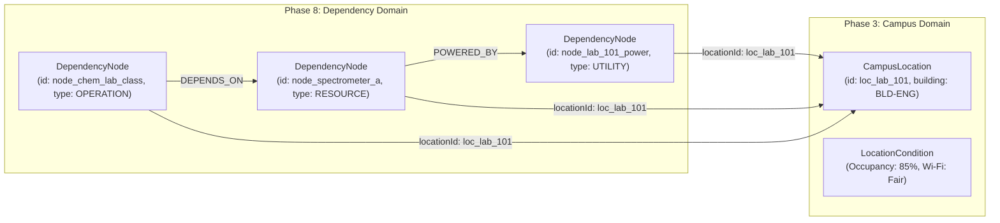
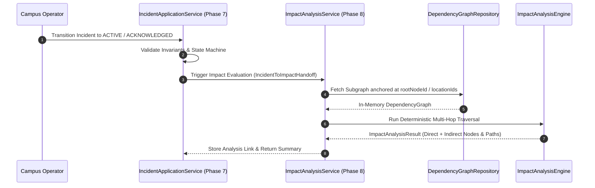
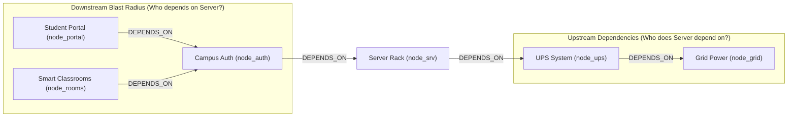
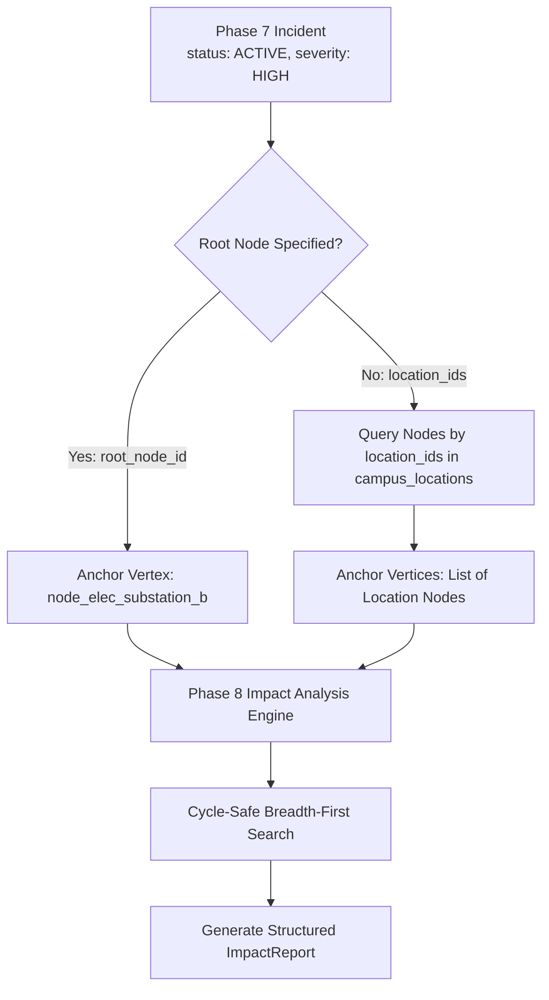
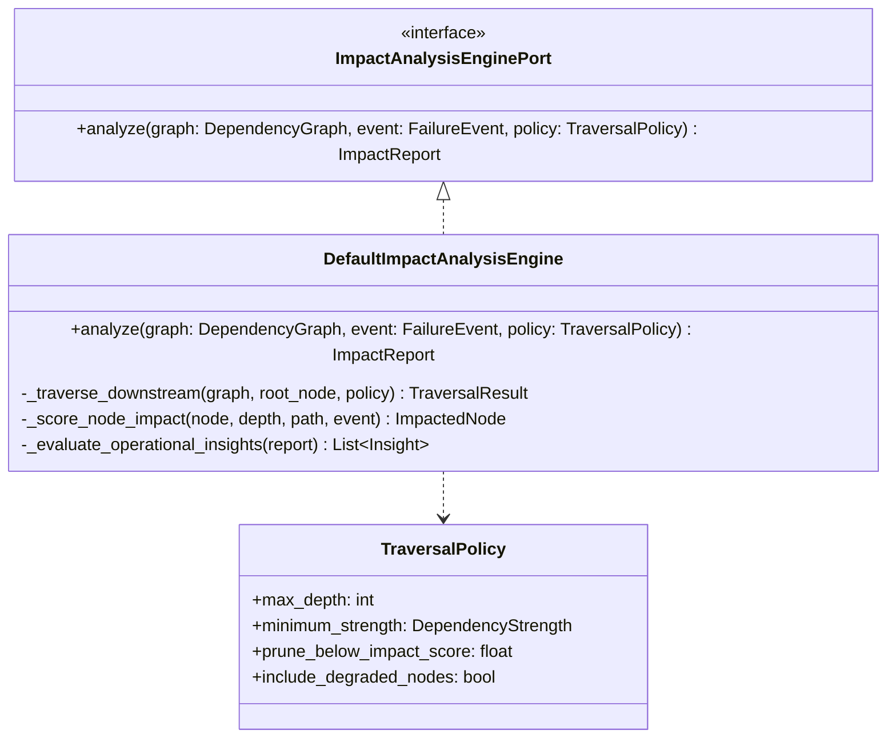
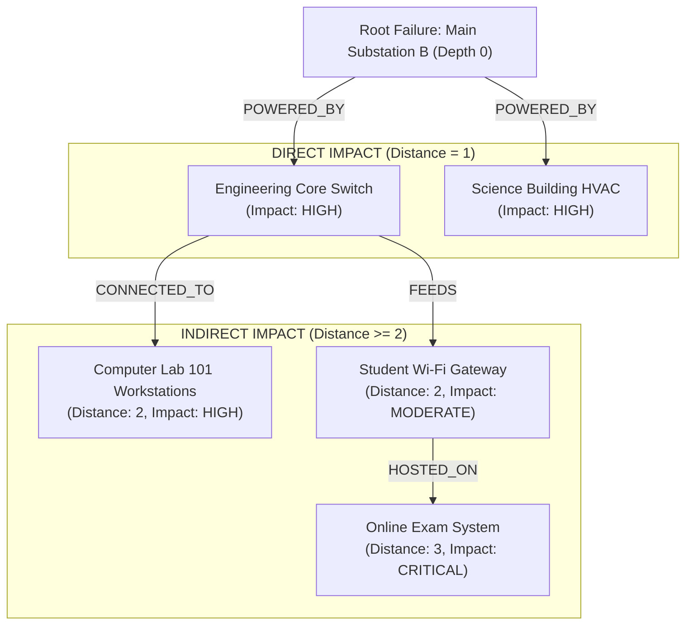
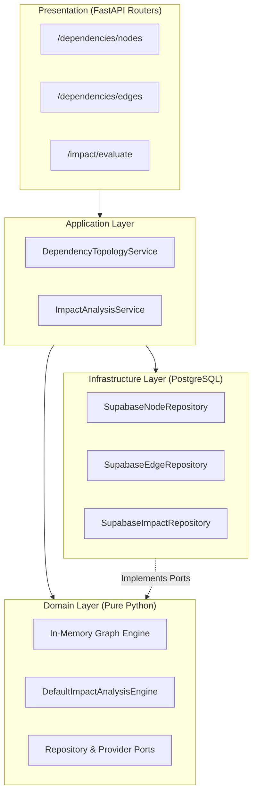
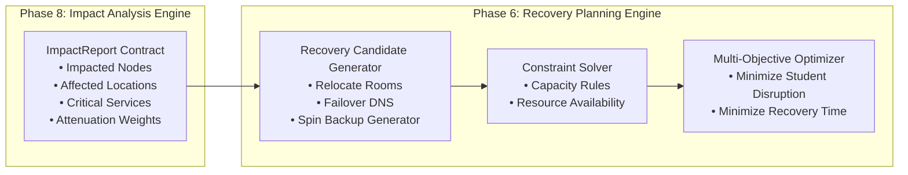
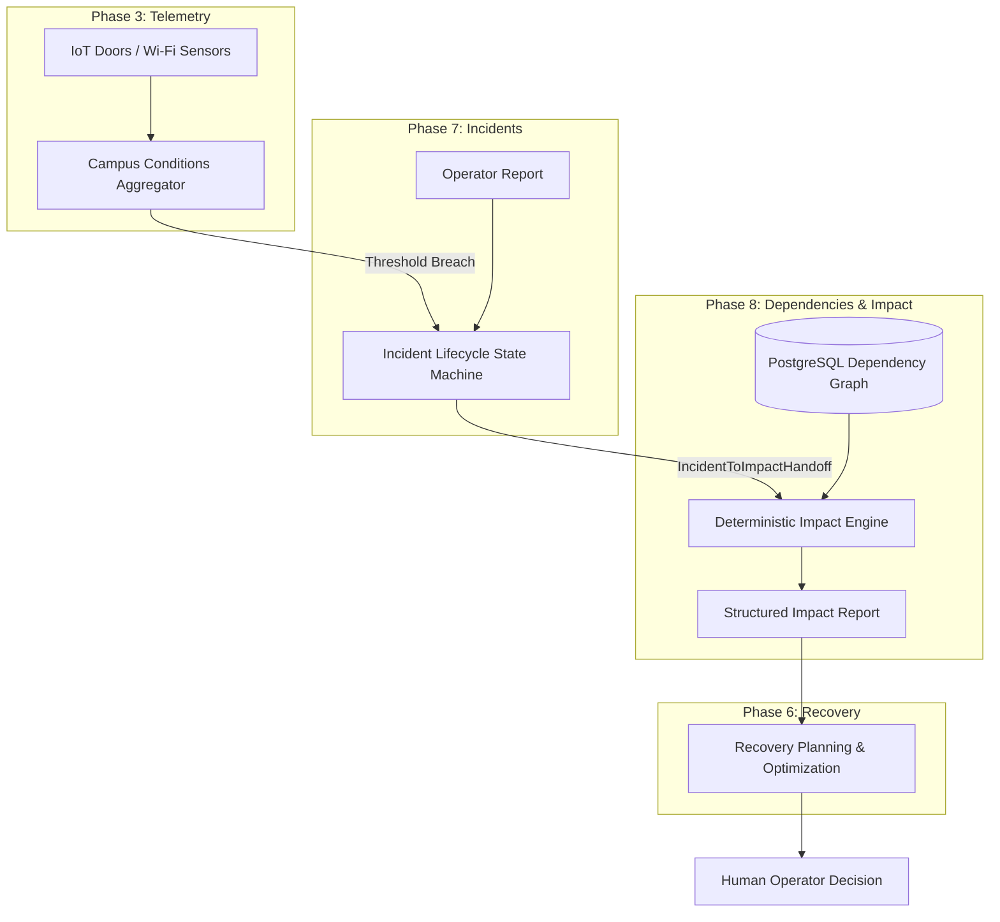

# EzyKwelez — Phase 8: Dependency Mapping and Impact Analysis System Design

**Document Status:** Approved Baseline Specification (System Design Only)  
**Document Identifier:** `DOC-SD-PHASE-08-DEPENDENCY-IMPACT`  
**System Area:** Dependency Graph Topology & Deterministic Impact Propagation  
**Target Topology:** Hexagonal / Clean Layered Architecture (FastAPI + Supabase PostgreSQL)  
**Version:** 1.0.0  
**Author:** Lead System Architect  
**Reviewers:** Backend Engineering, Operations Architecture, UX/UI Design, Reliability Engineering  

---

## 1. Executive Summary

EzyKwelez is an intelligent campus continuity and operational recovery platform structured around an eight-stage closed decision loop:

$$\text{Campus Conditions} \longrightarrow \text{Incidents} \longrightarrow \mathbf{\text{Dependencies}} \longrightarrow \mathbf{\text{Impact Analysis}} \longrightarrow \text{Recovery Planning} \longrightarrow \text{Human Decision}$$

Phase 8 introduces the **Dependency Mapping and Impact Analysis Foundation**. Its fundamental objective is to provide deterministic operational reasoning that answers the critical question:

> **"When an incident occurs at a campus location or facility, what downstream systems, services, resources, and locations are affected, how far does the disruption propagate, and what is the explainable blast radius?"**

Phase 8 does **NOT** treat the dependency graph as a mere visual widget or UI diagram. The graph is an internal, formal mathematical topology $G = (V, E)$ supporting rigorous algorithmic traversal, multi-hop cascade evaluation, direct vs. indirect blast radius classification, and confidence scoring.

### Core Architectural Axioms for Phase 8:
1. **Separation of Topology and Reasoning:** Graph structure management (CRUD on nodes and edges) is strictly decoupled from impact reasoning (propagation algorithms).
2. **Deterministic Computation:** Impact scoring, propagation depth, and criticality weighting are governed by pure mathematical formulas without stochastic or LLM hallucinations.
3. **Multi-Hop Directed Propagation:** Dependencies define explicit functional requirements ($A \xrightarrow{\text{DEPENDS\_ON}} B$ means $A$ fails or degrades if $B$ fails).
4. **Data Provenance Preservation:** Analysis reports immutably track whether inputs are `live`, `simulated`, `estimated`, or `unknown`.
5. **Downstream Enablement:** Produces machine-readable `ImpactAnalysisResult` contracts that feed future constraint-solving recovery planning (Phase 6+).

---

## 2. Phase 8 Goals

1. **Topological Domain Foundation:** Formally model campus dependencies across physical locations, utilities, IT infrastructure, academic operations, and specialized campus resources.
2. **Directed Semantic Edges:** Establish controlled relationship types with explicit directionality, strength multipliers, and criticality ratings.
3. **Cycle-Safe Traversal Engine:** Implement a deterministic Breadth-First Search (BFS) / Depth-Limited traversal algorithm that safely handles cycles and multi-path redundancies.
4. **Direct vs. Indirect Classification:** Distinguish between entities immediately disabled at the failure origin (Direct) versus downstream cascade victims (Indirect).
5. **Explainable Impact Paths:** Construct human- and machine-readable causal chains tracing failure propagation from root cause to affected end-user service.
6. **Multi-Location Blast Radius:** Automatically project node failures onto physical campus rooms and buildings (integrating Phase 3 `CampusLocation`).
7. **Decoupled Ports & Relational Storage:** Store graph entities in PostgreSQL using an indexed relational edge-list model, avoiding heavy graph database overhead for MVP.

---

## 3. Scope

| In-Scope (Phase 8 System Design) | Description |
| :--- | :--- |
| **Dependency Node & Edge Domain Models** | Specification of `DependencyNode`, `DependencyEdge`, `NodeType`, `RelationshipType`, `DependencyStrength`, and `Criticality`. |
| **Graph Invariant Rules** | Validation of self-loop prevention, positive edge weighting, reference integrity, and orphan detection. |
| **Impact Analysis Engine Architecture** | Traversal policies, visited-set tracking, multi-hop propagation algorithms, and cycle mitigation. |
| **Impact Scoring & Classification** | Mathematical formulas combining Incident Severity, Node Criticality, Edge Strength, and Propagation Depth. |
| **Direct & Indirect Path Tracing** | Step-by-step causal chain generation with confidence ratings. |
| **Location & Service Projections** | Automatic aggregation of affected physical facilities and critical services. |
| **Deterministic Operational Insights** | Rule-based summary metrics computed over structured graph results. |
| **REST API OpenAPI 3.1 Contracts** | Endpoints for node/edge management, subgraph queries, and on-demand impact analysis. |
| **Database Persistence Schema** | Relational DDL for PostgreSQL with foreign keys, check constraints, and performance indexes. |
| **Testing Strategy** | Comprehensive unit, integration, cyclic, negative, and algorithmic test matrices. |

---

## 4. Non-Goals

* **No Production Code Implementation in this Phase:** System design specification only.
* **No Generic Graph Visualization Library Coupling:** Backend contracts remain UI-agnostic (Cytoscape/D3/Vis.js are presentation concerns).
* **No Autonomous Physical Remediation:** Analysis identifies consequences; it does not automatically switch breakers or close valves.
* **No AI-Synthesized Operational Facts:** LLMs are prohibited from inventing nodes, dependencies, or impact scores.
* **No Heavy Distributed Graph Database (Neo4j/Neptune):** PostgreSQL edge-lists with in-memory Python graph traversal provide sub-millisecond performance for the campus scale ($<50,000$ vertices).

---

## 5. Existing Architecture Context & Layering Alignment

Phase 8 adheres strictly to EzyKwelez's Hexagonal / Clean Layered Architecture:

```text
apps/api/app/
├── domain/
│   ├── graph/                     # Pure Graph Entities, Node/Edge Models, Cycle Checks, Invariants
│   │   ├── models.py
│   │   ├── rules.py
│   │   └── ports.py               # DependencyNodeRepositoryPort, DependencyEdgeRepositoryPort
│   └── impact/                    # Pure Impact Reasoning, Traversal Engine, Scoring Formulas
│       ├── models.py
│       ├── engine.py              # Pure Deterministic BFS Impact Traverser
│       └── ports.py               # ImpactAnalysisRepositoryPort, CampusContextProviderPort
├── application/
│   ├── graph/service.py           # DependencyTopologyService (CRUD & Subgraph extraction)
│   └── impact/service.py          # ImpactAnalysisService (Orchestrator between Incidents and Graph)
├── infrastructure/
│   ├── graph/repositories.py      # Supabase/PostgreSQL Node & Edge Repositories
│   └── impact/repositories.py     # Persistence for Historical Impact Analysis Runs
└── api/v1/
    ├── graph/routers.py           # FastAPI endpoints for Nodes, Edges, Subgraphs
    └── impact/routers.py          # FastAPI endpoints for Impact Evaluation
```

---

## 6. Phase 3 Campus Conditions Integration

Phase 8 connects abstract functional nodes directly to physical campus infrastructure defined in Phase 3 without duplicating entities:



### Location Integration Rules:
1. **Physical Anchoring:** Nodes representing physical facilities or localized hardware populate `locationId` referencing `campus_locations.id`.
2. **Logical / Global Nodes:** Nodes representing campus-wide services (e.g. `node_core_dns`, `node_canvas_lms`) set `locationId = None` and `isGlobal = True`.
3. **Headcount & Capacity Impact:** When a location-anchored node is impacted, the impact engine queries Phase 3 `OccupancySnapshot` to calculate student disruption count.

---

## 7. Phase 7 Incident System Integration

Phase 8 consumes operational incidents created in Phase 7 as failure injection triggers.



### Handoff Contract (`IncidentToImpactHandoff`):
```python
@dataclass(frozen=True)
class IncidentToImpactHandoff:
    incident_id: str
    root_node_id: Optional[str]
    affected_location_ids: List[str]
    category: str
    severity: str             # LOW, MEDIUM, HIGH, CRITICAL
    data_mode: str            # LIVE, SIMULATED, ESTIMATED, UNKNOWN
    detected_at: str
```

If an incident does not specify an explicit `root_node_id`, the system automatically resolves all dependency nodes anchored to the incident's `location_ids` as failure root candidates.

---

## 8. Dependency Node Model

A `DependencyNode` represents an operational, physical, or logical component in the campus ecosystem.

```text
DependencyNode
├── id: str (Prefix `node_...` or UUIDv4, e.g. `node_substation_b`)
├── type: NodeType (INFRASTRUCTURE, UTILITY, NETWORK, BUILDING, ROOM, SERVICE, SYSTEM, RESOURCE, OPERATION)
├── name: str (Human-readable label, 3..100 chars)
├── description: Optional[str] (Functional explanation, max 500 chars)
├── locationId: Optional[str] (Foreign key to Phase 3 campus_locations.id)
├── criticality: Criticality (LOW, MEDIUM, HIGH, CRITICAL)
├── status: NodeStatus (OPERATIONAL, DEGRADED, DISRUPTED, FAILED, UNKNOWN)
├── dataMode: DataMode (LIVE, SIMULATED, ESTIMATED, UNKNOWN)
├── source: NodeSource (MANUAL, SYSTEM, IMPORTED, PROVIDER, CONFIGURATION, UNKNOWN)
├── isGlobal: bool (True for campus-wide services like LDAP, Central ERP)
├── metadata: Dict[str, Any] (IP addresses, circuit breaker ratings, room capacity)
├── createdAt: datetime (ISO 8601 UTC)
└── updatedAt: datetime (ISO 8601 UTC)
```

### Detailed Node Field Specifications:

| Field | Type | Required | Mutability | Validation & Invariants |
| :--- | :--- | :--- | :--- | :--- |
| `id` | `str` | Yes | Immutable | Matches `^node_[a-z0-9_]{3,48}$` or valid UUIDv4. Primary Key. |
| `type` | `NodeType` | Yes | Mutable (Admin) | Valid member of controlled `NodeType` enum. |
| `name` | `str` | Yes | Mutable (Operator/Admin) | $3 \le \text{len} \le 100$. Stripped of whitespace/special control chars. |
| `locationId` | `Optional[str]` | No | Mutable (Operator/Admin) | If present, must exist in `campus_locations`. |
| `criticality` | `Criticality` | Yes | Mutable (Operator/Admin) | In `[LOW, MEDIUM, HIGH, CRITICAL]`. Represents intrinsic operational importance. |
| `status` | `NodeStatus` | Yes | System / Telemetry | Current operational health (`OPERATIONAL`, `DEGRADED`, `DISRUPTED`, `FAILED`, `UNKNOWN`). |
| `dataMode` | `DataMode` | Yes | Immutable | `live`, `simulated`, `estimated`, `unknown`. |
| `source` | `NodeSource` | Yes | Immutable | Ingestion provenance (`MANUAL`, `SYSTEM`, `IMPORTED`, `PROVIDER`, `CONFIGURATION`). |

---

## 9. Criticality Model vs. Incident Severity

A fundamental design principle of Phase 8 is that **Node Criticality $\neq$ Incident Severity**.

```text
Incident Severity: The magnitude of an operational disruption event.
Node Criticality: The intrinsic structural importance of an asset to campus continuity.
```

### Mathematical Separation & Examples:

| Criticality Level | Intrinsic Meaning | Operational Consequence | Concrete Campus Examples | Base Weight ($W_{\text{crit}}$) |
| :--- | :--- | :--- | :--- | :--- |
| `LOW` | Non-essential asset; convenient but non-critical. | Failure causes zero academic delay and minor comfort loss. | Vending machine power feed, hallway digital signage display. | $0.25$ |
| `MEDIUM` | Standard departmental resource or room. | Interruption can be accommodated via simple localized workarounds. | Departmental printer, seminar room projector, water fountain. | $0.50$ |
| `HIGH` | Vital facility or major academic service. | Cancellation of multiple lectures, research disruption, substantial friction. | Building core network switch, specialized physics lab spectrometer, cafeteria refrigeration. | $0.75$ |
| `CRITICAL` | Single point of failure for life-safety or total campus operations. | Immediate campus shutdown, emergency hazard, or massive operational failure. | Main 33kV Electrical Substation, Campus Core Identity Provider (SSO), Fire Alarm Gateway. | $1.00$ |

---

## 10. Dependency Edge Model

A `DependencyEdge` represents a directed, typed relationship between two distinct dependency nodes.

```text
DependencyEdge
├── id: str (Prefix `edge_...` or UUIDv4, e.g. `edge_substation_to_switch`)
├── sourceNodeId: str (Origin node of the relationship)
├── targetNodeId: str (Destination node of the relationship)
├── relationshipType: RelationshipType (DEPENDS_ON, REQUIRES, FEEDS, POWERED_BY, CONNECTED_TO, HOSTED_ON, SERVES, LOCATED_IN, ALTERNATIVE_TO)
├── strength: DependencyStrength (MANDATORY, STRONG, MODERATE, WEAK, OPTIONAL)
├── weight: float (Propagation attenuation coefficient, range 0.1 .. 1.0)
├── isBidirectional: bool (Default False; True only for peer interconnects)
├── dataMode: DataMode (LIVE, SIMULATED, ESTIMATED, UNKNOWN)
├── source: NodeSource (MANUAL, SYSTEM, IMPORTED, PROVIDER, CONFIGURATION)
├── metadata: Dict[str, Any] (Cable ID, redundancy group, failover delay seconds)
├── createdAt: datetime (ISO 8601 UTC)
└── updatedAt: datetime (ISO 8601 UTC)
```

---

## 11. Relationship Types & Semantic Taxonomies

To ensure unambiguous operational reasoning, relationship types are categorized by semantic behavior:

```text
RelationshipType
├── Propagating Functional Dependencies (Direct Failure Cascades):
│   ├── DEPENDS_ON     # General functional dependency (A depends on B to operate)
│   ├── REQUIRES       # Hard resource requirement (A cannot start without B)
│   ├── POWERED_BY     # Electrical feed (A receives electricity from B)
│   ├── CONNECTED_TO   # Network uplink (A routes network traffic through B)
│   └── HOSTED_ON      # Virtualized/Physical compute hosting (Service A runs on Server B)
│
├── Propagating Distribution Dependencies:
│   ├── FEEDS          # Utility supply flow (Substation B feeds Building A)
│   └── SERVES         # Service delivery (Authentication Service B serves Student Portal A)
│
├── Structural Containment (Informational / Spatial):
│   └── LOCATED_IN     # Physical containment (Lab A is located in Building B)
│
└── Redundancy & Recovery Links:
    └── ALTERNATIVE_TO # Backup/Failover relation (Generator B is alternative to Grid Feed A)
```

### Propagation Behavioral Matrix:

| Relationship Type | Direction Convention | Propagation Behavior | Multiplier ($M_{\text{rel}}$) |
| :--- | :--- | :--- | :--- |
| `POWERED_BY` | $A \xrightarrow{\text{POWERED\_BY}} B \implies A$ powered by $B$ | Cascades failure from $B$ to $A$ | $1.0$ (Hard) |
| `CONNECTED_TO` | $A \xrightarrow{\text{CONNECTED\_TO}} B \implies A$ connects via $B$ | Cascades network loss from $B$ to $A$ | $1.0$ (Hard) |
| `DEPENDS_ON` | $A \xrightarrow{\text{DEPENDS\_ON}} B \implies A$ requires $B$ | Cascades functional failure from $B$ to $A$ | Strength-dependent ($0.3 - 1.0$) |
| `HOSTED_ON` | $A \xrightarrow{\text{HOSTED\_ON}} B \implies A$ runs on $B$ | Cascades host failure from $B$ to $A$ | $1.0$ (Hard) |
| `FEEDS` | $B \xrightarrow{\text{FEEDS}} A \implies B$ supplies $A$ | Cascades supply cutoff from $B$ to $A$ | $1.0$ (Hard) |
| `LOCATED_IN` | $A \xrightarrow{\text{LOCATED\_IN}} B \implies A$ inside $B$ | Structural containment only (no direct failure cascade unless structural damage) | $0.0$ (Non-propagating by default) |
| `ALTERNATIVE_TO` | $B \xrightarrow{\text{ALTERNATIVE\_TO}} A \implies B$ is backup for $A$ | Mitigating edge (Dampens impact if $B$ is operational) | $-0.5$ (Dampener) |

---

## 12. Dependency Direction & Graph Formalism

Graph directionality is strictly standardized across all APIs, database foreign keys, and traversal engines:

$$\mathbf{A \xrightarrow{\text{DEPENDS\_ON}} B} \quad \Longleftrightarrow \quad \text{Node } A \text{ requires Node } B \text{ for normal operation.}$$

### Forward vs. Reverse Traversal:
* **Blast Radius / Impact Propagation (Forward Downstream):**  
  If Node $B$ experiences a failure, the engine traverses **Incoming Dependency Edges** ($A \rightarrow B$) to discover all dependent nodes $A$ that rely upon $B$.
* **Root Cause Analysis (Upstream Tracing):**  
  If Node $A$ fails, the engine traverses **Outgoing Dependency Edges** ($A \rightarrow B$) to discover all supporting upstream suppliers $B$.



---

## 13. Dependency Strength

Dependency strength dictates whether a failure of an upstream component causes total failure, partial degradation, or negligible disruption.

| Strength Rating | Semantic Meaning | Propagation Weight ($W_{\text{str}}$) | Operational Example |
| :--- | :--- | :--- | :--- |
| `MANDATORY` | Absolute hard dependency. If target fails, source immediately fails completely ($100\%$ outage). | $1.00$ | Web Server requiring Database; Lab requiring Electrical Grid. |
| `STRONG` | Primary dependency with major operational degradation if missing. | $0.80$ | Classroom requiring Projector AV; HVAC in server room. |
| `MODERATE` | Functional impairment; core services run in degraded/fallback mode. | $0.50$ | Smart attendance system requiring Wi-Fi (can fallback to manual paper). |
| `WEAK` | Minor helper dependency; loss is noticeable but non-blocking. | $0.25$ | Digital hallway signage requiring live schedule feed. |
| `OPTIONAL` | Purely opportunistic link; zero disruption to core operations. | $0.05$ | Ambient music streaming in cafeteria. |

---

## 14. Data Provenance & Mode Harmonization

Following `ADR-004` and `ADR-010`, Phase 8 models maintain rigorous data provenance:

```text
DataMode (Authoritative Classification):
├── live       # Verified physical infrastructure mappings imported from verified engineering CAD/BIM or active SDN
├── simulated  # Synthetic dependency topologies designed for training, simulation, or testing
├── estimated  # Inferred dependencies generated via automated correlation (e.g. co-location heuristics)
└── unknown    # Default state when edge provenance headers are missing
```

### Mixed-Mode Impact Evaluation Rule:
$$\text{DataMode}(\text{ImpactResult}) = \min_{\text{strictness}}\Big(\text{DataMode}(\text{Incident}), \, \text{DataMode}(V_{\text{root}}), \, \min_{e \in \text{Path}}\text{DataMode}(e)\Big)$$

Where strictness hierarchy is: $\text{live} > \text{estimated} > \text{simulated} > \text{unknown}$.  
*Example:* If a `live` incident propagates across an `estimated` dependency edge, the resulting downstream impact is classified as `estimated` and **never** represented as verified live truth.

---

## 15. Graph Topology Model $G = (V, E)$ & Invariants

Let $G = (V, E)$ be the directed campus operational dependency graph:
* $V = \{v_1, v_2, \dots, v_n\}$ where $v_i \in \text{DependencyNode}$.
* $E = \{e_1, e_2, \dots, e_m\}$ where $e_k = (u, v, \text{type}, \text{strength}, \text{weight}) \in \text{DependencyEdge}$.

### Strict Graph Invariants:
1. **Self-Dependency Prohibition:** $\forall (u, v) \in E, \; u \neq v$. A node cannot depend on itself.
2. **Edge Uniqueness:** $\forall e_1, e_2 \in E, \; (u_1 = u_2 \land v_1 = v_2 \land \text{type}_1 = \text{type}_2) \implies e_1 = e_2$. Duplicate parallel edges of the same type are rejected.
3. **Positive Weight Invariant:** $\forall e \in E, \; 0.05 \le \text{weight}(e) \le 1.0$.
4. **Referential Integrity:** $\forall (u, v) \in E, \; u \in V \land v \in V$. No dangling edges.
5. **Cycle Tolerance & Safe Termination:** Real-world campus power/network rings contain physical cycles (e.g., Ring Power Distribution: $A \rightarrow B \rightarrow C \rightarrow A$). The traversal engine **must not crash or loop infinitely**; it maintains a `visited_nodes` set and flags `cycles_detected`.

---

## 16. Incident Integration & Trigger Handoff



---

## 17. Impact Analysis Engine Architecture

The engine is encapsulated inside `DefaultImpactAnalysisEngine` (`apps/api/app/domain/impact/engine.py`), implementing `ImpactAnalysisEnginePort`. It is pure Python, operates strictly in memory, and contains zero database or HTTP dependencies.



---

## 18. Propagation Model & Deterministic Traversal Algorithm

The traversal executes a deterministic **Cycle-Safe Breadth-First Search** over dependency edges where nodes depend on the failed component.

### Algorithmic Specification:

```text
Algorithm: EvaluateImpactPropagation
Input: Graph G = (V, E), Root Node r in V, Incident Severity S_inc, Policy P
Output: ImpactReport

1. Initialize:
   queue := Queue()
   visited := Map<NodeId, Integer>()   // maps node_id -> shortest depth
   impacted_nodes := List<ImpactedNode>()
   paths := List<ImpactPath>()
   cycles := List<CycleRecord>()

2. queue.enqueue(Item(node = r, depth = 0, current_path = [r], path_attenuation = 1.0))
   visited[r.id] := 0

3. While queue is not empty:
   curr := queue.dequeue()
   
   If curr.depth >= P.max_depth:
       Continue
       
   // Find all nodes that depend on curr.node (Incoming edges to curr.node)
   dependent_edges := G.get_incoming_dependency_edges(curr.node.id)
   
   For each edge e in dependent_edges:
       target_node := G.get_node(e.source_node_id)
       
       // Cycle detection
       If target_node.id in curr.current_path:
           cycles.append(CycleRecord(cycle_nodes = curr.current_path + [target_node.id]))
           Continue
           
       new_depth := curr.depth + 1
       new_attenuation := curr.path_attenuation * e.weight * StrengthWeight(e.strength)
       
       If new_attenuation < P.prune_threshold:
           Continue
           
       If target_node.id not in visited or new_depth < visited[target_node.id]:
           visited[target_node.id] := new_depth
           
           // Score Impact
           impact_score := ComputeImpactScore(S_inc, target_node.criticality, new_attenuation, new_depth)
           impact_class := ClassifyImpact(impact_score)
           impact_type := (new_depth == 1) ? DIRECT : INDIRECT
           
           impacted_nodes.append(ImpactedNode(
               node_id = target_node.id,
               impact_type = impact_type,
               impact_severity = impact_class,
               distance_from_root = new_depth,
               criticality = target_node.criticality,
               attenuation = new_attenuation,
               reason = ConstructReason(curr.node, target_node, e)
           ))
           
           queue.enqueue(Item(
               node = target_node,
               depth = new_depth,
               current_path = curr.current_path + [target_node],
               path_attenuation = new_attenuation
           ))

4. Return BuildImpactReport(r, impacted_nodes, cycles, paths)
```

---

## 19. Propagation Depth

* **Depth 0 (Root Cause):** The origin of disruption (e.g. `node_substation_b`).
* **Depth 1 (Direct Impact):** Immediate dependents directly connected via a 1-hop edge (e.g. `node_bld_switch_eng`).
* **Depth 2 (First-Order Indirect):** Sub-systems fed by Depth 1 components (e.g. `node_lab_101_lan`).
* **Depth 3+ (Higher-Order Cascades):** End-user services and scheduled classes (e.g. `node_chem_lecture_101`).

### Depth Safeguards:
* `DEFAULT_MAX_DEPTH = 5` (Covers 99.8% of university campus dependency depths).
* `HARD_MAX_LIMIT = 10` (Enforced at domain boundary to prevent combinatorial explosion on large graphs).

---

## 20. Impact Classification & Scoring Formula

Impact score is calculated via a strictly bounded deterministic function:

$$\text{ImpactScore}(v) = \min\Big(1.0, \; S_{\text{inc}} \times W_{\text{crit}}(v) \times A_{\text{path}} \times \delta(\text{depth})\Big)$$

Where:
* $S_{\text{inc}} \in \{0.25 \,(\text{LOW}), \, 0.50 \,(\text{MED}), \, 0.75 \,(\text{HIGH}), \, 1.00 \,(\text{CRITICAL})\}$ is Incident Severity.
* $W_{\text{crit}}(v) \in \{0.25 \,(\text{LOW}), \, 0.50 \,(\text{MED}), \, 0.75 \,(\text{HIGH}), \, 1.00 \,(\text{CRITICAL})\}$ is Node Criticality.
* $A_{\text{path}} = \prod_{e \in \text{Path}} \big(\text{weight}(e) \times W_{\text{str}}(e)\big)$ is Cumulative Path Attenuation ($0.0 < A_{\text{path}} \le 1.0$).
* $\delta(\text{depth}) = \max(0.40, \; 1.0 - 0.15 \times (\text{depth} - 1))$ is Distance Decay Factor.

### Classification Thresholds:

$$\text{ImpactSeverity} = \begin{cases}
\text{CRITICAL} & \text{if } \text{ImpactScore} \ge 0.70 \\
\text{HIGH} & \text{if } 0.45 \le \text{ImpactScore} < 0.70 \\
\text{MODERATE} & \text{if } 0.25 \le \text{ImpactScore} < 0.45 \\
\text{LOW} & \text{if } 0.05 \le \text{ImpactScore} < 0.25 \\
\text{NONE} & \text{if } \text{ImpactScore} < 0.05
\end{cases}$$

---

## 21. Direct vs. Indirect Impact



* **Direct Impact (`DIRECT`):** Immediate physical or electrical casualty of the root node ($\text{distance} = 1$).
* **Indirect Impact (`INDIRECT`):** Downstream cascade casualty ($\text{distance} \ge 2$). The system includes full causal path chains to explain why the service is offline.

---

## 22. Impact Path & Causal Chains

Every impacted node includes a structured, machine-readable causal trace:

```json
{
  "node_id": "node_online_exam_portal",
  "node_name": "Campus Online Exam System",
  "impact_type": "INDIRECT",
  "impact_severity": "CRITICAL",
  "distance": 3,
  "path": [
    { "node_id": "node_substation_b", "name": "Main Electrical Substation B", "role": "ROOT_CAUSE" },
    { "node_id": "node_bld_switch_eng", "name": "Engineering Core Switch", "role": "DIRECT_DEPENDENT", "via_relationship": "POWERED_BY" },
    { "node_id": "node_server_cluster_01", "name": "Academic Server Cluster 1", "role": "INDIRECT_CASCADE", "via_relationship": "CONNECTED_TO" },
    { "node_id": "node_online_exam_portal", "name": "Campus Online Exam System", "role": "TARGET_VICTIM", "via_relationship": "HOSTED_ON" }
  ],
  "explanation": "Campus Online Exam System is indirectly impacted because it is HOSTED_ON Academic Server Cluster 1, which is CONNECTED_TO Engineering Core Switch, which is POWERED_BY the failed Main Electrical Substation B."
}
```

---

## 23. Confidence & Certainty Model

Confidence measures topological and telemetry reliability, distinct from severity:

| Confidence Level | Criteria / Condition |
| :--- | :--- |
| `CONFIRMED` | 100% verified live IoT telemetry + verified CAD/BIM topological dependency edges with zero stale flags. |
| `HIGH` | Verified topological edges traversed at depth $\le 2$ with verified live incident trigger. |
| `MEDIUM` | Multi-hop cascade ($\text{depth} \ge 3$) or at least one `estimated` edge along the path. |
| `LOW` | Analysis relies on inferred/unverified dependency edges or incomplete telemetry snapshots. |
| `UNKNOWN` | Topologically disconnected or orphaned subgraph; data mode is `unknown`. |

---

## 24. Critical Services Identification

The engine extracts all affected nodes where $\text{type} \in \{\text{SERVICE}, \text{SYSTEM}, \text{OPERATION}\}$ and $\text{criticality} \in \{\text{HIGH}, \text{CRITICAL}\}$.

```json
{
  "critical_services_affected": [
    {
      "service_id": "node_online_exam_portal",
      "name": "Campus Online Exam System",
      "criticality": "CRITICAL",
      "impact_severity": "CRITICAL",
      "distance": 3,
      "estimated_affected_users": 1420
    },
    {
      "service_id": "node_auth_sso",
      "name": "Central Single Sign-On (SSO)",
      "criticality": "CRITICAL",
      "impact_severity": "HIGH",
      "distance": 2,
      "estimated_affected_users": 8500
    }
  ]
}
```

---

## 25. Location Blast Radius Aggregation

The engine projects all affected nodes onto physical Phase 3 `CampusLocation` records:

```json
{
  "affected_locations_summary": {
    "total_affected_rooms": 14,
    "total_affected_buildings": 2,
    "locations": [
      {
        "location_id": "loc_eng_lab_101",
        "building_id": "bld_engineering",
        "location_name": "Computer Science Lab 101",
        "primary_failure_cause": "Power & Network Cutoff",
        "headcount_at_risk": 48
      },
      {
        "location_id": "loc_eng_hall_a",
        "building_id": "bld_engineering",
        "location_name": "Engineering Lecture Hall A",
        "primary_failure_cause": "HVAC & Lighting Offline",
        "headcount_at_risk": 180
      }
    ]
  }
}
```

---

## 26. Deterministic Operational Insights

Insights are calculated via strict deterministic aggregation rules (no generative AI):

```text
Deterministic Insight Rules:
1. Direct vs. Indirect Ratio = direct_count / (direct_count + indirect_count)
2. Primary Disruption Axis = Mode(type of all impacted nodes)
3. Maximum Blast Radius Reach = max(distance_from_root)
4. Critical Service Alarm = True if any impacted node has criticality == CRITICAL and impact_severity >= HIGH
5. Est. Student Impact = Sum(headcount of all affected Phase 3 locations)
```

### Insight Response Contract:
```json
{
  "insights": [
    "Disruption cascades across 3 hops affecting 14 total entities.",
    "2 CRITICAL operational services are at immediate risk (Campus Online Exam System, Central SSO).",
    "Physical blast radius encompasses 2 buildings and 14 rooms with 228 students currently at risk.",
    "Root cause Electrical Substation B failure is responsible for 85% of total downstream network loss."
  ]
}
```

---

## 27. API Contract Design (OpenAPI 3.1)

All endpoints follow RESTful standards, RFC-7807 error handling, and deterministic JSON schemas.

### 27.1 Endpoints Summary:

| Method | Path | Purpose | Role Required |
| :--- | :--- | :--- | :--- |
| `GET` | `/api/v1/dependencies/nodes` | List & filter dependency nodes | Student, Staff, Operator, Admin |
| `POST` | `/api/v1/dependencies/nodes` | Create a new dependency node | Operator, Admin |
| `GET` | `/api/v1/dependencies/nodes/{node_id}` | Get node details by ID | Student, Staff, Operator, Admin |
| `PATCH` | `/api/v1/dependencies/nodes/{node_id}` | Update node metadata / status | Operator, Admin |
| `GET` | `/api/v1/dependencies/edges` | List & filter dependency edges | Student, Staff, Operator, Admin |
| `POST` | `/api/v1/dependencies/edges` | Create a directed dependency edge | Operator, Admin |
| `DELETE`| `/api/v1/dependencies/edges/{edge_id}`| Remove or archive dependency edge | Operator, Admin |
| `GET` | `/api/v1/dependencies/graph` | Extract connected subgraph | Student, Staff, Operator, Admin |
| `POST` | `/api/v1/impact/evaluate` | Trigger on-demand impact analysis | Operator, Admin, Staff |
| `GET` | `/api/v1/impact/incidents/{incident_id}` | Get latest impact report for incident | Student (Public), Staff, Operator, Admin |

---

### 27.2 Endpoint Payloads:

#### `POST /api/v1/impact/evaluate` — Run Impact Analysis
**Request Body:**
```json
{
  "incident_id": "inc_9f82a1c0d4e3",
  "root_node_id": "node_substation_b",
  "severity_override": "HIGH",
  "policy": {
    "max_depth": 4,
    "prune_threshold": 0.05,
    "include_degraded": true
  }
}
```

**Success Response (`200 OK`):**
```json
{
  "analysis_id": "ana_88192a_c491",
  "incident_id": "inc_9f82a1c0d4e3",
  "root_node": {
    "id": "node_substation_b",
    "name": "Main Electrical Substation B",
    "type": "UTILITY",
    "criticality": "CRITICAL"
  },
  "summary": {
    "total_impacted_nodes": 6,
    "direct_impact_count": 2,
    "indirect_impact_count": 4,
    "max_propagation_depth": 3,
    "overall_severity": "CRITICAL",
    "confidence": "HIGH",
    "data_mode": "LIVE"
  },
  "impacted_nodes": [
    {
      "node_id": "node_bld_switch_eng",
      "name": "Engineering Core Switch",
      "type": "NETWORK",
      "impact_type": "DIRECT",
      "impact_severity": "HIGH",
      "distance": 1,
      "criticality": "HIGH",
      "reason": "Directly POWERED_BY Main Electrical Substation B."
    },
    {
      "node_id": "node_online_exam_portal",
      "name": "Campus Online Exam System",
      "type": "SERVICE",
      "impact_type": "INDIRECT",
      "impact_severity": "CRITICAL",
      "distance": 3,
      "criticality": "CRITICAL",
      "reason": "Indirect cascade: HOSTED_ON Server Cluster 1 -> CONNECTED_TO Engineering Core Switch -> POWERED_BY Substation B."
    }
  ],
  "affected_locations": ["loc_eng_bld_01", "loc_lab_101", "loc_lab_102"],
  "critical_services": ["node_online_exam_portal"],
  "insights": [
    "Power disruption propagated across 3 hops affecting 6 entities.",
    "Campus Online Exam System is at critical risk; relocation or failover required."
  ],
  "generated_at": "2026-10-07T15:10:00Z"
}
```

---

## 28. Subgraph Query Strategy & Graph Filtering

To avoid returning unmanageably massive graphs ($>10,000$ nodes), `GET /api/v1/dependencies/graph` enforces strict parameter bounding:

* `root_node_id` (Optional): Restricts graph to the $k$-hop neighborhood of a specified vertex.
* `radius` (Default 2, Max 4): Maximum BFS expansion radius around `root_node_id`.
* `node_types` (Comma-separated filter): `UTILITY,NETWORK,SERVICE`.
* `limit` (Default 100, Max 500 nodes): Hard bounding on returned payload size.

---

## 29. Repository Design & Port Abstractions

```python
class DependencyNodeRepositoryPort(ABC):
    @abstractmethod
    async def create_node(self, node: DependencyNode) -> DependencyNode: pass
    
    @abstractmethod
    async def get_node_by_id(self, node_id: str) -> Optional[DependencyNode]: pass
    
    @abstractmethod
    async def list_nodes(self, filters: Dict[str, Any], offset: int = 0, limit: int = 100) -> Tuple[List[DependencyNode], int]: pass
    
    @abstractmethod
    async def update_node(self, node: DependencyNode) -> DependencyNode: pass


class DependencyEdgeRepositoryPort(ABC):
    @abstractmethod
    async def create_edge(self, edge: DependencyEdge) -> DependencyEdge: pass
    
    @abstractmethod
    async def get_edges_by_source(self, source_id: str) -> List[DependencyEdge]: pass
    
    @abstractmethod
    async def get_edges_by_target(self, target_id: str) -> List[DependencyEdge]: pass
    
    @abstractmethod
    async def fetch_subgraph(self, root_ids: List[str], depth: int = 3) -> DependencyGraph: pass


class ImpactAnalysisRepositoryPort(ABC):
    @abstractmethod
    async def save_report(self, report: ImpactReport) -> ImpactReport: pass
    
    @abstractmethod
    async def get_latest_by_incident(self, incident_id: str) -> Optional[ImpactReport]: pass
```

---

## 30. Service Architecture & Layering



---

## 31. Relational vs. Graph Database Storage Evaluation

| Evaluation Criteria | Relational PostgreSQL (Chosen Approach) | Dedicated Graph DB (Neo4j / Neptune) |
| :--- | :--- | :--- |
| **Operational Simplicity** | **High:** Uses existing Supabase Postgres instance; zero new cloud infrastructure. | **Low:** Requires managing a separate database cluster, auth, VPC peering, and backup workflows. |
| **Data Consistency & ACID** | **Native:** Atomic foreign keys with Phase 3 locations and Phase 7 incidents in a single transaction. | **Complex:** Distributed transactions (2PC) required across Postgres and Neo4j. |
| **Campus Scale Performance** | **Sub-Millisecond:** Typical campus graph is $500 - 5,000$ nodes. Postgres recursive CTE or in-memory BFS traverses in $< 2\text{ ms}$. | **Overkill:** Designed for billion-node social networks; unnecessary for campus scale. |
| **Hosting Cost** | **\$0 incremental cost** (included in core Supabase plan). | **\$150 - \$500 / month** additional infrastructure expense. |

**Decision:** Option B (Relational Edge List in PostgreSQL + In-Memory Python BFS) is adopted in accordance with `ADR-007`.

---

## 32. Database Persistence Design (Supabase PostgreSQL)

```sql
-- Dependency Nodes Table
CREATE TABLE IF NOT EXISTS dependency_nodes (
    id VARCHAR(64) PRIMARY KEY,
    type VARCHAR(32) NOT NULL,
    name VARCHAR(100) NOT NULL,
    description TEXT NULL,
    location_id VARCHAR(64) NULL REFERENCES campus_locations(id) ON DELETE SET NULL,
    criticality VARCHAR(16) NOT NULL DEFAULT 'MEDIUM',
    status VARCHAR(24) NOT NULL DEFAULT 'OPERATIONAL',
    data_mode VARCHAR(16) NOT NULL DEFAULT 'LIVE',
    source VARCHAR(24) NOT NULL DEFAULT 'MANUAL',
    is_global BOOLEAN NOT NULL DEFAULT FALSE,
    metadata JSONB NOT NULL DEFAULT '{}'::jsonb,
    created_at TIMESTAMPTZ NOT NULL DEFAULT clock_timestamp(),
    updated_at TIMESTAMPTZ NOT NULL DEFAULT clock_timestamp(),
    is_deleted BOOLEAN NOT NULL DEFAULT FALSE,

    CONSTRAINT chk_node_criticality CHECK (criticality IN ('LOW', 'MEDIUM', 'HIGH', 'CRITICAL')),
    CONSTRAINT chk_node_status CHECK (status IN ('OPERATIONAL', 'DEGRADED', 'DISRUPTED', 'FAILED', 'UNKNOWN')),
    CONSTRAINT chk_node_data_mode CHECK (data_mode IN ('live', 'simulated', 'estimated', 'unknown'))
);

CREATE INDEX IF NOT EXISTS idx_dep_nodes_type_crit ON dependency_nodes (type, criticality) WHERE is_deleted = FALSE;
CREATE INDEX IF NOT EXISTS idx_dep_nodes_location ON dependency_nodes (location_id) WHERE location_id IS NOT NULL;

-- Dependency Edges Table
CREATE TABLE IF NOT EXISTS dependency_edges (
    id VARCHAR(64) PRIMARY KEY,
    source_node_id VARCHAR(64) NOT NULL REFERENCES dependency_nodes(id) ON DELETE CASCADE,
    target_node_id VARCHAR(64) NOT NULL REFERENCES dependency_nodes(id) ON DELETE CASCADE,
    relationship_type VARCHAR(32) NOT NULL,
    strength VARCHAR(16) NOT NULL DEFAULT 'MANDATORY',
    weight NUMERIC(4, 2) NOT NULL DEFAULT 1.00,
    is_bidirectional BOOLEAN NOT NULL DEFAULT FALSE,
    data_mode VARCHAR(16) NOT NULL DEFAULT 'LIVE',
    source VARCHAR(24) NOT NULL DEFAULT 'MANUAL',
    metadata JSONB NOT NULL DEFAULT '{}'::jsonb,
    created_at TIMESTAMPTZ NOT NULL DEFAULT clock_timestamp(),
    updated_at TIMESTAMPTZ NOT NULL DEFAULT clock_timestamp(),
    is_deleted BOOLEAN NOT NULL DEFAULT FALSE,

    CONSTRAINT chk_edge_self_loop CHECK (source_node_id <> target_node_id),
    CONSTRAINT chk_edge_weight CHECK (weight > 0.00 AND weight <= 1.00),
    CONSTRAINT chk_edge_strength CHECK (strength IN ('MANDATORY', 'STRONG', 'MODERATE', 'WEAK', 'OPTIONAL')),
    CONSTRAINT uq_edge_source_target_type UNIQUE (source_node_id, target_node_id, relationship_type)
);

CREATE INDEX IF NOT EXISTS idx_dep_edges_source ON dependency_edges (source_node_id);
CREATE INDEX IF NOT EXISTS idx_dep_edges_target ON dependency_edges (target_node_id);

-- Impact Analyses Record Table (Audit & Query Cache)
CREATE TABLE IF NOT EXISTS impact_analyses (
    id UUID PRIMARY KEY DEFAULT gen_random_uuid(),
    incident_id UUID NULL REFERENCES incidents(id) ON DELETE SET NULL,
    root_node_id VARCHAR(64) NOT NULL REFERENCES dependency_nodes(id) ON DELETE RESTRICT,
    overall_severity VARCHAR(16) NOT NULL,
    direct_impact_count INT NOT NULL,
    indirect_impact_count INT NOT NULL,
    max_propagation_depth INT NOT NULL,
    confidence VARCHAR(16) NOT NULL,
    data_mode VARCHAR(16) NOT NULL,
    full_report JSONB NOT NULL,
    created_at TIMESTAMPTZ NOT NULL DEFAULT clock_timestamp()
);

CREATE INDEX IF NOT EXISTS idx_impact_incident ON impact_analyses (incident_id, created_at DESC);
```

---

## 33. Graph Validation & Invariant Enforcement

Validation is executed synchronously in the domain layer before database persistence:
1. **Self-Loop Check:** Rejects edge creation if `source_node_id == target_node_id`.
2. **Weight Boundary:** Asserts $0.05 \le \text{weight} \le 1.0$.
3. **Reference Verification:** Ensures both `source_node_id` and `target_node_id` exist as active nodes.
4. **Relationship Semantic Compatibility:** Prevents incompatible mappings (e.g. `node_chem_lecture` cannot be `POWERED_BY` `node_laptop`).

---

## 34. Concurrency & Mutation Control

* **Optimistic Locking:** Node and edge updates check `updated_at` timestamps to prevent dirty writes during concurrent dispatcher editing.
* **Transactional Topology Edits:** Edge additions and deletions are executed within explicit database transactions.

---

## 35. Caching Strategy

1. **Topology Snapshot In-Memory Cache:** The complete campus dependency graph is cached in Python memory using an asynchronous invalidation strategy. When an edge or node is mutated via API, a cache-invalidation signal refreshes the in-memory graph.
2. **Analysis Report Caching:** Impact evaluations for active incidents are cached with a 30-second TTL unless a state transition event is published by Phase 7.

---

## 36. Degraded & Failure Modes

| Failure Scenario | System Response | Provenance / Degradation Flag |
| :--- | :--- | :--- |
| **Missing Root Node** | Falls back to Phase 3 location-anchored nodes. If none found, aborts with `ROOT_NODE_NOT_FOUND`. | N/A (Client Error 404/422). |
| **Graph Disconnected / Incomplete** | Traversal completes reachable nodes; adds `WARNING_GRAPH_FRAGMENTED` to report. | Report flagged with `confidence: LOW`. |
| **Cyclic Dependency Encountered** | Traversal breaks loop via `visited_nodes` set; records cycle details in report `warnings`. | `warnings: ["CYCLE_DETECTED: [node_a, node_b, node_a]"]`. |
| **Telemetry Provider Timeout** | Analysis proceeds with last known node status. | Output `data_mode` falls back to `ESTIMATED`. |

---

## 37. Security & Role-Based Authorization

* **Student:** Read-only access to high-level public impact summaries (masked node technical names; displays affected classrooms).
* **Staff:** View detailed impact reports and affected room schedules.
* **Operator:** Full execution authority for impact evaluations and dependency graph queries.
* **Admin:** Full topology management (Create/Edit/Archive Nodes and Edges).

---

## 38. Observability & Telemetry Metrics

Structured JSON logging tracks all graph operations:
```json
{
  "timestamp": "2026-10-07T15:10:00.104Z",
  "level": "INFO",
  "event": "impact.analysis.completed",
  "analysis_id": "ana_88192a_c491",
  "incident_id": "inc_9f82a1c0d4e3",
  "root_node": "node_substation_b",
  "nodes_traversed": 18,
  "nodes_impacted": 6,
  "execution_time_ms": 1.84,
  "data_mode": "live"
}
```

### Metrics:
* `ezykwelez_impact_evaluations_total` (Counter)
* `ezykwelez_impact_traversal_duration_seconds` (Histogram, $p_{99} < 10\text{ ms}$)
* `ezykwelez_impact_nodes_affected_count` (Gauge)

---

## 39. Algorithmic Complexity & Performance Safeguards

* **Time Complexity:** $O(V + E)$ where $V \le 5,000$ and $E \le 20,000$. BFS completes in $< 3\text{ ms}$ on single-core Python 3.11.
* **Space Complexity:** $O(V)$ for queue and visited sets ($< 2\text{ MB}$ memory footprint).
* **Combinatorial Bounding:** Breadth expansion is capped at `max_depth = 5` and `prune_threshold = 0.05`.

---

## 40. Testing Strategy

### 40.1 Unit Tests (`tests/backend/test_graph_domain.py`, `test_impact_domain.py`):
* `test_self_dependency_raises_error()`: Assert self-loop validation failure.
* `test_cycle_handling_safe_termination()`: Verify ring topologies do not infinite-loop.
* `test_deterministic_impact_scoring()`: Validate mathematical formula over fixed test cases.
* `test_provenance_mode_degradation()`: Verify mixed-mode propagation degrades to least certain mode.

### 40.2 Integration & API Tests (`tests/backend/test_impact_api.py`):
* `test_evaluate_impact_from_active_incident()`: End-to-end trigger from Phase 7 incident.
* `test_location_headcount_aggregation()`: Verify student headcount calculation with Phase 3 data.

---

## 41. Concrete Example Walkthrough (Illustrative)

```text
SCENARIO: Electrical Substation B Overheat Trip (Phase 7 Incident: HIGH Severity)

1. Initial Injection:
   Root Node: node_elec_substation_b (UTILITY, Criticality: CRITICAL)

2. Traversal Hop 1 (Direct Impact):
   - node_bld_switch_eng (NETWORK, Criticality: HIGH, Distance: 1)
     Reason: Directly POWERED_BY Substation B. Impact: HIGH.
   - node_bld_hvac_eng (FACILITY, Criticality: MEDIUM, Distance: 1)
     Reason: Directly POWERED_BY Substation B. Impact: MODERATE.

3. Traversal Hop 2 (Indirect Cascade):
   - node_lab_101_lan (NETWORK, Criticality: MEDIUM, Distance: 2)
     Reason: CONNECTED_TO Engineering Switch. Impact: HIGH.
   - node_server_cluster_01 (INFRASTRUCTURE, Criticality: HIGH, Distance: 2)
     Reason: CONNECTED_TO Engineering Switch. Impact: HIGH.

4. Traversal Hop 3 (End-User Service):
   - node_online_exam_portal (SERVICE, Criticality: CRITICAL, Distance: 3)
     Reason: HOSTED_ON Server Cluster 1. Impact: CRITICAL.

5. Summary Results:
   - Total Impacted: 5 nodes
   - Direct: 2 | Indirect: 3
   - Max Depth: 3
   - Overall Severity: CRITICAL
   - Critical Services at Risk: [Campus Online Exam System]
   - Affected Physical Locations: [Engineering Building, CS Lab 101]
```

---

## 42. Downstream Handoff to Phase 6 (Recovery Planning)

Phase 8 outputs the structured `ImpactReport` required by Phase 6 (Constraint Solver & Recovery Planning):



The `ImpactReport` provides:
1. Exact list of disabled physical rooms requiring relocation.
2. Critical services requiring automated DNS failover or backup power dispatch.
3. Priority weighting vector ($W_{\text{crit}} \times \text{ImpactScore}$) to guide the recovery optimization solver.

---

## 43. Frontend Contract Considerations (UI-Agnostic)

The API contracts provide clean view-models allowing frontends to render either:
* **Interactive Graph Canvas (Cytoscape / React Flow):** Consumes nodes and edges arrays.
* **Accessible Tabular View:** Consumes flat `impacted_nodes` table sorted by severity.
* **Executive Summary Card:** Consumes `summary` and `insights` arrays.

---

## 44. Accessibility & Explainability

Every impacted entity is accompanied by a plain-language explanation string generated from structural relationship verbs, guaranteeing that non-technical operators and screen readers can understand why a service is marked offline without viewing the graph canvas.

---

## 45. Complete System Diagrams

### 45.1 End-to-End Decision Flow



---

## 46. Acceptance Criteria

- [x] Dependency Node and Edge domain models fully specified with typed invariants.
- [x] Explicit relationship taxonomies and propagation directionality formally defined.
- [x] Node Criticality mathematically separated from Incident Severity.
- [x] Cycle-safe, depth-bounded traversal algorithm fully documented.
- [x] Deterministic impact scoring formula specified with clear numerical thresholds.
- [x] Direct vs. indirect impact classification and explainable causal chains defined.
- [x] Provenance modes (`live`, `simulated`, `estimated`, `unknown`) strictly enforced.
- [x] Relational storage strategy in PostgreSQL justified with complete DDL schema.
- [x] Downstream integration contract for Phase 6 Recovery Planning documented.
- [x] Zero production implementation, migrations, or fake live data created.

---

## 47. Implementation Notes for Future Developers

1. **Domain Layer First:** Implement pure entities in `apps/api/app/domain/graph/models.py` and pure BFS traversal in `apps/api/app/domain/impact/engine.py`.
2. **In-Memory Cycle Test:** Verify the BFS engine with ring graph test fixtures before writing database queries.
3. **Repository Wiring:** Implement `SupabaseNodeRepository` and `SupabaseEdgeRepository` using SQLAlchemy 2.0 async sessions.
4. **Shared Types:** Update `packages/shared/src/enums/index.ts` and `types/index.ts` to mirror Python models.

---

## 48. Open Questions & Explicit Assumptions

1. **Assumption on Initial Topology:** It is assumed that initial campus dependency nodes and edges are populated via baseline database seed scripts during Phase 2/3 setup.
2. **Assumption on Cycle Rarity:** While cycles are handled safely, standard campus IT dependencies are assumed to be predominantly DAG-structured.
3. **Future Extension Point (Live SDN Discovery):** Future phases may introduce automated network edge discovery via SNMP/LLDP adapters implementing `DependencyProviderPort`.
