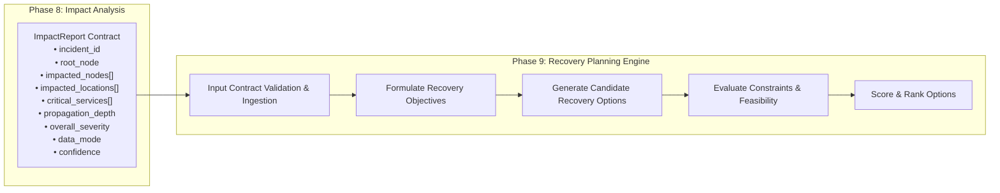
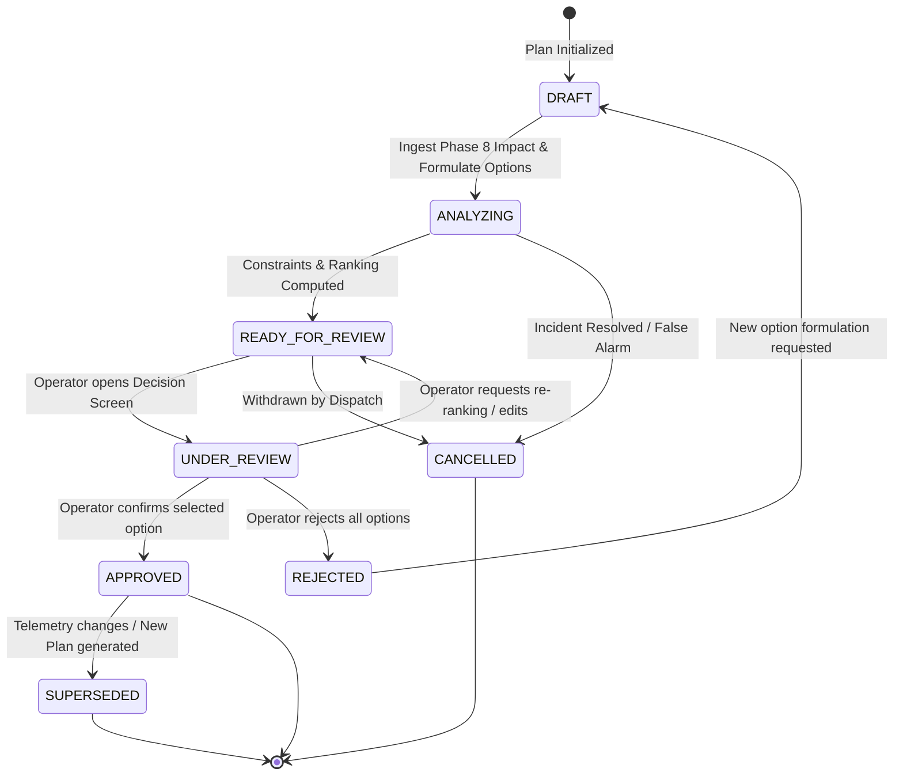
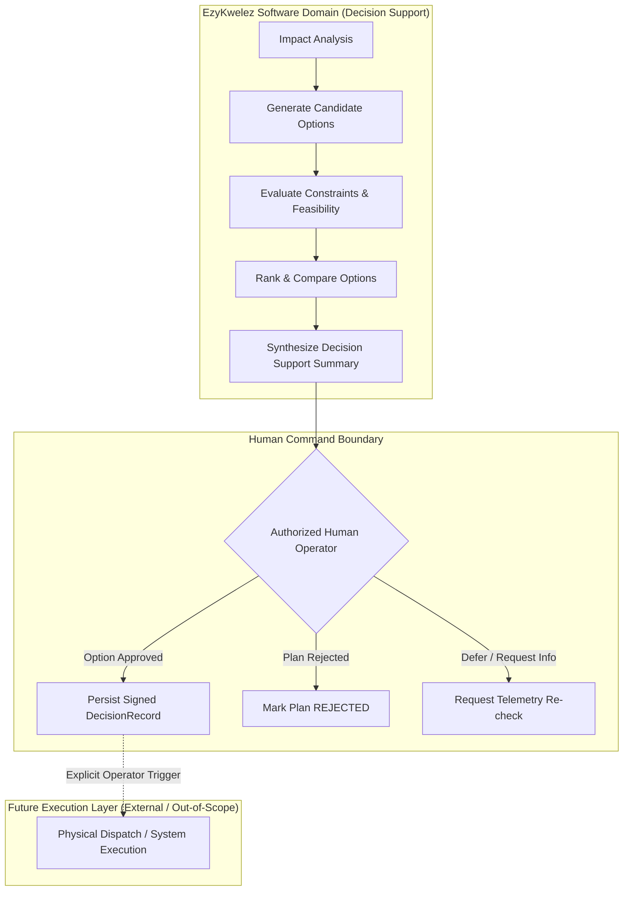
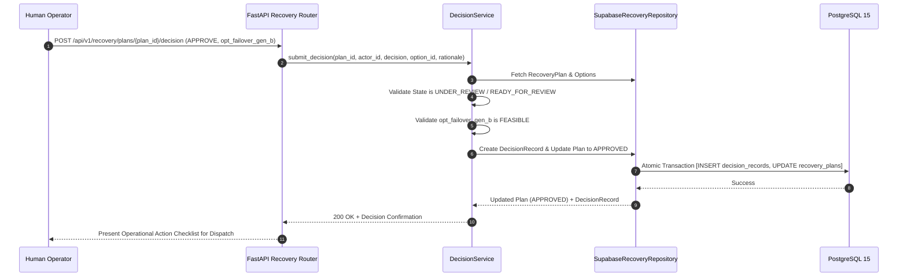
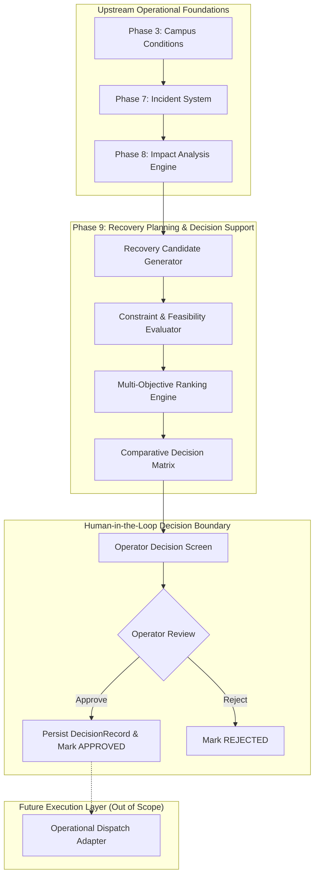

# EzyKwelez — Phase 9: Recovery Planning & Decision Support System Design

**Document Status:** Approved Baseline Specification (System Design Only)  
**Document Identifier:** `DOC-SD-PHASE-09-RECOVERY-DECISION`  
**System Area:** Recovery Planning, Feasibility Evaluation, Multi-Objective Ranking & Decision Support  
**Target Topology:** Hexagonal / Clean Layered Architecture (FastAPI + Supabase PostgreSQL)  
**Version:** 1.0.0  
**Author:** Lead System Architect  
**Reviewers:** Backend Engineering, Operations Architecture, UX/UI Design, Reliability Engineering  

---

## 1. Executive Summary

EzyKwelez is an intelligent campus continuity and operational recovery platform structured around an eight-stage closed decision loop:

$$\text{Campus Conditions} \longrightarrow \text{Incidents} \longrightarrow \text{Dependencies} \longrightarrow \text{Impact Analysis} \longrightarrow \mathbf{\text{Recovery Planning}} \longrightarrow \mathbf{\text{Decision Support}} \longrightarrow \mathbf{\text{Human Decision}}$$

Phase 9 introduces **Recovery Planning & Decision Support**. Having established verified campus conditions (Phase 3), authoritative incident lifecycles (Phase 7), and deterministic dependency impact propagation (Phase 8), the platform now addresses the central decision question:

> **"Given this active incident and its cascading blast radius, what viable recovery options exist, what are their prerequisites, resource requirements, risks, and trade-offs, how do they rank against campus continuity objectives, and what is the transparent rationale presented to the human decision-maker?"**

### Core Architectural Axioms for Phase 9:
1. **Decision Support $\neq$ Autonomous Execution:** The system analyzes, generates, evaluates, ranks, and explains candidate options. It **never** autonomously triggers real-world physical changes, facility lockdowns, network cutovers, or classroom moves without explicit, authenticated human approval.
2. **Deterministic & Explainable Ranking:** Candidate options are evaluated and ranked using transparent mathematical formulas and constraint satisfaction rules rather than black-box or non-reproducible stochastic models.
3. **Structured Trade-Offs & Risk Modeling:** Every recovery option explicitly articulates its operational costs (e.g., faster recovery vs. higher resource consumption).
4. **Data Provenance & Staleness Protection:** Recovery plans are bound to specific `ImpactAnalysisResult` versions; if underlying incident severity or telemetry changes, plans automatically flag `REVIEW_REQUIRED` or `STALE`.
5. **Human-in-the-Loop Auditability:** Every review, decision, approval, rejection, or deferral produces an immutable, cryptographically timestamped `DecisionRecord`.

---

## 2. Phase 9 Goals

1. **Structured Recovery Modeling:** Define domain entities for `RecoveryPlan`, `RecoveryOption`, `RecoveryPrerequisite`, `ResourceRequirement`, `RecoveryRisk`, and `RecoveryTradeoff`.
2. **Deterministic Feasibility Engine:** Evaluate candidate options against hard operational constraints and prerequisite satisfaction (`FEASIBLE`, `CONDITIONALLY_FEASIBLE`, `NOT_FEASIBLE`, `UNKNOWN`).
3. **Multi-Objective Ranking Algorithm:** Score and order options against explicit, configurable campus objectives (e.g., Minimizing Student Disruption, Minimizing Recovery Time, Maximizing Service Continuity).
4. **Transparent Comparative Matrix:** Normalize multi-dimensional option attributes into a standardized `RecoveryOptionComparison` view-model.
5. **Decoupled Future Execution Interface:** Define a clean `RecoveryExecutionPort` boundary separating decision approval from external operational dispatch.
6. **Plan Versioning & Stale Detection:** Detect when incoming Phase 7/8 telemetry renders a draft plan obsolete.
7. **REST API OpenAPI 3.1 Specification:** Deliver typed endpoints for plan generation, option management, multi-objective ranking, operator review, and decision recording.

---

## 3. Scope

| In-Scope (Phase 9 System Design) | Description |
| :--- | :--- |
| **Recovery Domain Models** | Specification of `RecoveryPlan`, `RecoveryOption`, `RecoveryPrerequisite`, `ResourceRequirement`, `RecoveryConstraint`, `DecisionRecord`, and `PlanningObjective`. |
| **Recovery Plan Lifecycle** | Formal state transition engine (`DRAFT` $\rightarrow$ `ANALYZING` $\rightarrow$ `READY_FOR_REVIEW` $\rightarrow$ `UNDER_REVIEW` $\rightarrow$ `APPROVED` $\rightarrow$ `SUPERSEDED` / `CANCELLED`). |
| **Feasibility & Constraint Engine** | Mathematical rules evaluating prerequisite availability, physical room capacities, and technical prerequisites. |
| **Deterministic Ranking Engine** | Multi-factor scoring function weighing impact reduction, time penalties, feasibility bonuses, and risk deductions. |
| **Explainability & Rationale Model** | Machine- and human-readable causal justifications for option rankings. |
| **Human Decision Boundary** | Review, approval, rejection, and deferral workflows with mandatory operator attribution. |
| **REST API OpenAPI Contracts** | Endpoints for plan generation, ranking, comparative analysis, review notes, and decision logging. |
| **Database Persistence Design** | Relational DDL for PostgreSQL with foreign keys, check constraints, and append-only decision audit tables. |
| **Testing Strategy** | Unit, integration, ranking permutation, negative, and degraded-mode test specifications. |

---

## 4. Non-Goals

* **No Production Code Implementation in this Phase:** System design specification only.
* **No Autonomous Command Execution:** Phase 9 does not autonomously send SNMP commands, switch circuit breakers, or alter active DNS records.
* **No AI-Synthesized Operational Facts:** LLMs are prohibited from hallucinating resource availability, repair times, or facility feasibility.
* **No Generic Ticket/Project Management System:** Phase 9 is strictly tailored to campus continuity and recovery optimization.
* **No In-Memory Fake Real-Time WebSockets in MVP:** All decision interactions operate via secure, idempotent REST endpoints.

---

## 5. Existing Architecture Context & Layering Alignment

Phase 9 integrates cleanly into EzyKwelez's Hexagonal Architecture:

```text
apps/api/app/
├── domain/
│   └── recovery/                  # Pure Domain Entities, Invariants, Ranking Engine, Constraint Evaluator
│       ├── models.py              # RecoveryPlan, RecoveryOption, DecisionRecord, Enums
│       ├── rules.py               # Feasibility Rules, Deterministic Ranking Algorithm
│       ├── ports.py               # RecoveryPlanRepositoryPort, DecisionRepositoryPort, ExecutionPort
│       └── events.py              # RecoveryPlanGeneratedEvent, RecoveryPlanReviewedEvent
├── application/
│   └── recovery/
│       ├── service.py             # RecoveryPlanningService (Use-case orchestrator)
│       ├── evaluation.py          # RecoveryEvaluationService (Feasibility & Constraint solving)
│       ├── ranking.py             # RecoveryRankingService (Multi-objective optimization)
│       └── decision.py            # DecisionService (Review & Approval workflows)
├── infrastructure/
│   └── recovery/
│       ├── repositories.py        # Supabase/PostgreSQL Recovery Repositories
│       └── adapters.py            # Mock/Future External Execution Adapters
└── api/v1/
    └── recovery/routers.py        # FastAPI Routers & Pydantic Request/Response Schemas
```

---

## 6. Phase 8 Impact Analysis Input Contract

Phase 9 strictly consumes the structured output emitted by Phase 8 (`ImpactReport` / `ImpactAnalysisResult`). It **never** recalculates graph traversals or rediscovery of blast radius.



### Ingestion Validation Invariants:
1. **Mandatory Fields:** `incident_id`, `analysis_id`, `impacted_nodes`, `overall_severity`, `data_mode`, and `generated_at`.
2. **Staleness Check:** If `ImpactReport.generated_at` is older than `MAX_IMPACT_STALENESS_SECONDS` (default: 300 seconds) or the parent incident's `status` in Phase 7 has mutated since analysis, the planning engine halts with `STALE_IMPACT_ANALYSIS_ERROR`.
3. **Empty Impact Handling:** If `impacted_nodes` is empty (`overall_severity == NONE`), the engine generates a no-op advisory plan (`type: MONITOR`, `feasibility: FEASIBLE`).

---

## 7. Recovery Plan Domain Model

The `RecoveryPlan` is the authoritative root aggregate coordinating candidate options, constraints, objectives, and operator reviews.

```text
RecoveryPlan
├── id: str (Prefix `plan_...` or UUIDv4)
├── incidentId: str (Foreign key to Phase 7 Incident)
├── impactAnalysisId: str (Foreign key to Phase 8 ImpactReport)
├── version: int (Monotonically increasing revision counter, starts at 1)
├── supersedesPlanId: Optional[str] (Reference to previous stale/replaced plan)
├── status: PlanStatus (DRAFT, ANALYZING, READY_FOR_REVIEW, UNDER_REVIEW, APPROVED, REJECTED, SUPERSEDED, CANCELLED)
├── primaryObjective: PlanningObjectiveType (MINIMIZE_STUDENT_DISRUPTION, MINIMIZE_RECOVERY_TIME, etc.)
├── objectives: List[PlanningObjective] (Weighted prioritization vector)
├── options: List[RecoveryOption] (Ranked candidate interventions)
├── constraints: List[RecoveryConstraint] (Hard & soft campus boundary rules)
├── assumptions: List[PlanningAssumption] (Explicit operational hypotheses)
├── selectedOptionId: Optional[str] (Option chosen by operator during approval)
├── dataMode: DataMode (LIVE, SIMULATED, ESTIMATED, UNKNOWN)
├── warnings: List[str] (Staleness alerts, missing prerequisite warnings)
├── createdBy: str (Operator ID or system generator agent)
├── createdAt: datetime (ISO 8601 UTC)
├── updatedAt: datetime (ISO 8601 UTC)
├── reviewedBy: Optional[str] (Operator UUID who approved/rejected)
├── reviewedAt: Optional[datetime] (Timestamp of human review)
└── metadata: Dict[str, Any] (Extensible dispatch tags, campus zone codes)
```

---

## 8. Recovery Plan Lifecycle State Machine

The recovery lifecycle guarantees that no plan can be executed without passing through human review.



### Lifecycle Transition Matrix:

| From Status | Allowed Target Statuses | Authority Required | Automatic Side-Effects |
| :--- | :--- | :--- | :--- |
| `DRAFT` | `ANALYZING`, `CANCELLED` | System, Operator, Admin | Initializes version counter; validates Phase 8 contract. |
| `ANALYZING` | `READY_FOR_REVIEW`, `CANCELLED` | System Planning Engine | Executes constraint evaluation and multi-objective ranking. |
| `READY_FOR_REVIEW` | `UNDER_REVIEW`, `CANCELLED` | Operator, Admin | Locks candidate option list against concurrent modification. |
| `UNDER_REVIEW` | `APPROVED`, `REJECTED`, `READY_FOR_REVIEW` | Operator, Admin | On `APPROVED`: Validates `selected_option_id` is present and feasible; writes `DecisionRecord`. |
| `APPROVED` | `SUPERSEDED` | System (on newer Plan v+1) | Flags previous plan as historical; retains decision audit. |

---

## 9. Recovery Objectives

Recovery objectives define the multi-dimensional optimization criteria used to rank candidate options:

```text
PlanningObjectiveType
├── MINIMIZE_STUDENT_DISRUPTION  # Prioritize restoring high-occupancy lecture halls and active classes
├── MINIMIZE_RECOVERY_TIME       # Prioritize shortest time-to-restore regardless of resource cost
├── MAXIMIZE_SERVICE_CONTINUITY  # Prioritize zero-downtime for critical systems (SSO, Exam Portals)
├── MINIMIZE_RESOURCE_USE        # Prioritize conserving backup diesel, technician overtime, spare hardware
└── MINIMIZE_OPERATIONAL_RISK    # Prioritize safe, reversible, well-tested workarounds
```

### Objective Weighting Structure:
Each objective contains a relative `priority` (`HIGH` = 1.5 multiplier, `MEDIUM` = 1.0 multiplier, `LOW` = 0.5 multiplier) and an optional normalized weight ($0.0 \le w_i \le 1.0$, $\sum w_i = 1.0$).

---

## 10. Recovery Option Model

A `RecoveryOption` represents an actionable, discrete strategy designed to mitigate all or part of the disruption.

```text
RecoveryOption
├── id: str (Prefix `opt_...` or UUIDv4, e.g. `opt_failover_generator_b`)
├── planId: str (Foreign key to RecoveryPlan)
├── title: str (Short actionable label, 5..120 chars)
├── description: str (Detailed operational procedure, max 2000 chars)
├── type: RecoveryOptionType (FAILOVER, REROUTE, RELOCATE, ISOLATE, RESTORE, SUBSTITUTE, REDUCE_LOAD, PRIORITIZE_SERVICE, TEMPORARY_SHUTDOWN, MANUAL_INTERVENTION, MONITOR)
├── feasibility: Feasibility (FEASIBLE, CONDITIONALLY_FEASIBLE, INFEASIBLE, UNKNOWN)
├── estimatedRecoveryTime: EstimatedRecoveryTime (Value in minutes, confidence, assumptions)
├── estimatedImpactReduction: ImpactReduction (Affected nodes reduced, location reduction, percentage)
├── resourceRequirements: List[ResourceRequirement] (Technicians, backup generators, spare switches)
├── prerequisites: List[RecoveryPrerequisite] (Conditions that must be met before execution)
├── targetNodes: List[str] (Phase 8 DependencyNode IDs directly restored/mitigated)
├── affectedLocations: List[str] (Phase 3 CampusLocation IDs restored/relocated)
├── risks: List[RecoveryRisk] (Identified operational, safety, or physical hazards)
├── tradeoffs: List[RecoveryTradeoff] (Structured pros and cons)
├── confidence: ConfidenceLevel (HIGH, MEDIUM, LOW, UNKNOWN)
├── rank: Optional[int] (Deterministic rank position, 1 = Highest recommended)
├── score: Optional[float] (Normalized composite multi-objective score)
├── rationale: str (Plain-language explainability text)
└── metadata: Dict[str, Any] (Specific dispatch codes, room relocation pairings)
```

---

## 11. Controlled Recovery Action Types

```text
RecoveryOptionType (Decision-Support Taxonomy):
├── FAILOVER             # Switch to redundant backup utility/server (e.g. Backup Generator B, Secondary ISP)
├── REROUTE              # Route traffic or utility flow through alternate paths (e.g. Bypass Core Switch)
├── RELOCATE             # Move physical class/event from damaged room to available room (Phase 3 matching)
├── ISOLATE              # Disconnect damaged segment to prevent cascading blast radius (e.g. Trip branch breaker)
├── RESTORE              # Perform direct on-site repair / reboot of root component (e.g. Replace blown fuse)
├── SUBSTITUTE           # Swap equipment with spare unit (e.g. Roll in mobile projector cart)
├── REDUCE_LOAD          # Shed non-critical consumption (e.g. Disable corridor AC to maintain lab power)
├── PRIORITIZE_SERVICE   # Allocate bandwidth/power exclusively to CRITICAL services (e.g. Exams over Wi-Fi)
├── TEMPORARY_SHUTDOWN   # Controlled graceful shutdown of high-risk facility (e.g. Evacuate lab on chemical leak)
├── MANUAL_INTERVENTION  # Dispatch technician for physical diagnosis/manual valve operation
└── MONITOR              # Observe condition without active intervention (Low severity / self-healing)
```

---

## 12. Target Entity Model (Phase 8 Alignment)

Recovery options specify target entities using the established Phase 8 `DependencyNode` identifiers (`targetNodes`) and Phase 3 `CampusLocation` identifiers (`affectedLocations`). **No duplicate asset catalog is created.**

---

## 13. Prerequisites Model

Prerequisites represent mandatory or conditional technical/physical dependencies that must be satisfied before an option can be implemented.

```text
RecoveryPrerequisite
├── id: str
├── type: PrerequisiteType (TECHNICAL, PHYSICAL_ACCESS, AUTHORIZATION, RESOURCE_AVAILABILITY, SAFETY_CLEARANCE)
├── description: str (e.g. "Secondary Diesel Generator B has >= 50% fuel level")
├── status: PrerequisiteStatus (MET, NOT_MET, UNKNOWN)
├── isMandatory: bool (If True, NOT_MET makes option INFEASIBLE)
├── verifiedBy: Optional[str] (Sensor ID, Operator ID, or Facilities Gateway)
└── verifiedAt: Optional[datetime]
```

### Deterministic Feasibility Impact:
* If any mandatory prerequisite has `status == NOT_MET` $\implies$ Option is **`INFEASIBLE`**.
* If any mandatory prerequisite has `status == UNKNOWN` $\implies$ Option is **`CONDITIONALLY_FEASIBLE`**.
* If all mandatory prerequisites have `status == MET` $\implies$ Option is **`FEASIBLE`**.

---

## 14. Resource Requirements Model

```text
ResourceRequirement
├── resourceType: ResourceType (TECHNICIAN, BACKUP_POWER, BACKUP_NETWORK, AVAILABLE_ROOM, EQUIPMENT, STAFF, TIME_WINDOW, OTHER)
├── quantity: float (e.g. 2.0 technicians, 50.0 kW power, 1.0 room)
├── unit: str ("personnel", "kW", "rooms", "units")
├── availability: ResourceAvailability (CONFIRMED_AVAILABLE, ESTIMATED_AVAILABLE, UNAVAILABLE, UNKNOWN)
├── locationId: Optional[str] (Where resource is located / needed)
└── source: str ("facilities_db", "operator_input", "sensor_telemetry")
```

---

## 15. Expected Impact Reduction Model

To prevent false precision while maintaining mathematical comparability, impact reduction combines qualitative and quantitative metrics:

```text
ImpactReduction
├── affectedNodeReductionCount: int (Number of downstream nodes restored to OPERATIONAL)
├── affectedLocationReductionCount: int (Number of campus rooms/facilities restored)
├── criticalServicesRestored: List[str] (Names of CRITICAL services brought back online)
├── estimatedPercent: float (0.0% to 100.0% of total blast radius resolved)
└── qualitativeLevel: ImpactReductionLevel (NONE, LOW, MODERATE, HIGH, VERY_HIGH)
```

---

## 16. Recovery Time Estimation Model

$$\text{EstimatedDuration} = \text{BaseRepairTime} + \text{DispatchLag} + \text{VerificationBuffer}$$

```text
EstimatedRecoveryTime
├── value: float (Duration value, e.g. 25.0)
├── unit: str ("minutes", "hours")
├── confidence: ConfidenceLevel (HIGH, MEDIUM, LOW, UNKNOWN)
├── isEstimate: bool (True for heuristic estimates; False for confirmed fixed maintenance windows)
└── assumptions: List[str] (e.g. ["Assumes technician is on campus", "Assumes spare fuse in stock"])
```

---

## 17. Risk Model

Risk evaluates potential negative side-effects of executing an option (distinct from incident severity or node criticality):

```text
RecoveryRisk
├── description: str (e.g. "Switching to Generator B causes 30-second momentary blackout during transfer")
├── severity: Criticality (LOW, MEDIUM, HIGH, CRITICAL)
├── likelihood: RiskLikelihood (UNLIKELY, POSSIBLE, LIKELY)
├── affectedSystems: List[str] (Nodes potentially perturbed by the recovery action itself)
└── mitigation: Optional[str] (Precautionary measure to minimize risk)
```

---

## 18. Structured Trade-Off Model

Every candidate option exposes structured comparative dimensions relative to the unmitigated baseline:

```text
RecoveryTradeoff
├── dimension: TradeoffDimension (SPEED, RESOURCE_COST, DISRUPTION_SPIKE, LONGEVITY, COMPLEXITY)
├── direction: TradeoffDirection (BETTER, WORSE, NEUTRAL)
├── magnitude: TradeoffMagnitude (MINOR, MODERATE, MAJOR)
└── explanation: str (e.g. "Restores power in 5 mins (BETTER), but consumes emergency diesel reserves (WORSE)")
```

---

## 19. Option Comparison Matrix

The platform computes a normalized comparative data structure consumed by frontends to render clean comparison tables:

```json
{
  "comparison_matrix": {
    "plan_id": "plan_9f82a1c0d4e3",
    "options": [
      {
        "option_id": "opt_failover_gen_b",
        "rank": 1,
        "title": "Spin Backup Generator B",
        "feasibility": "FEASIBLE",
        "impact_reduction_percent": 90.0,
        "recovery_time_minutes": 10.0,
        "risk_level": "LOW",
        "critical_services_restored": 2,
        "tradeoffs_summary": "Fastest recovery; consumes reserve diesel"
      },
      {
        "option_id": "opt_relocate_lab_101",
        "rank": 2,
        "title": "Relocate CS Lab to West Block 204",
        "feasibility": "FEASIBLE",
        "impact_reduction_percent": 60.0,
        "recovery_time_minutes": 25.0,
        "risk_level": "LOW",
        "critical_services_restored": 0,
        "tradeoffs_summary": "Zero equipment risk; causes student transit delay"
      }
    ]
  }
}
```

---

## 20. Multi-Objective Option Ranking Engine

The ranking engine applies a deterministic, reproducible scoring formula:

$$\text{OptionScore}(O) = S_{\text{feasibility}}(O) + S_{\text{reduction}}(O) - P_{\text{time}}(O) - P_{\text{risk}}(O) + B_{\text{critical}}(O)$$

### Parameter Specifications:
1. **Feasibility Base Score ($S_{\text{feasibility}}$):**
   * `FEASIBLE` $= +100.0$ points
   * `CONDITIONALLY_FEASIBLE` $= +50.0$ points
   * `UNKNOWN` $= +20.0$ points
   * `INFEASIBLE` $= -500.0$ points (guarantees infeasible options sink to bottom)
2. **Impact Reduction Score ($S_{\text{reduction}}$):**
   * $\text{ReductionPercent} \times 1.0$ (up to $+100.0$ points)
   * Multiplied by $1.5$ if `MINIMIZE_STUDENT_DISRUPTION` is primary objective.
3. **Recovery Time Penalty ($P_{\text{time}}$):**
   * $0.5 \times \text{DurationMinutes}$ (e.g., 20 mins $= -10.0$ points)
   * Multiplied by $1.5$ if `MINIMIZE_RECOVERY_TIME` is primary objective.
4. **Risk Penalty ($P_{\text{risk}}$):**
   * `CRITICAL` Risk $= -40.0$ points | `HIGH` $= -25.0$ | `MEDIUM` $= -10.0$ | `LOW` $= 0.0$.
5. **Critical Service Recovery Bonus ($B_{\text{critical}}$):**
   * $+25.0$ points per `CRITICAL` service restored.

### Deterministic Tie-Breaking Rule:
If two options have identical scores:
1. Highest Feasibility level wins.
2. Lowest Recovery Time wins.
3. Lowest Risk wins.
4. Lexicographical order of `option_id` wins (guarantees 100% deterministic reproducibility).

---

## 21. Ranking Explanation & Machine-Readable Rationale

Every option includes an auto-generated, structured explanation of its assigned rank:

```text
Rationale Template:
"Ranked #{rank} with composite score {score:.1f}. Features {feasibility} feasibility, {reduction_pct}% blast radius reduction, and {duration} min estimated recovery. Restores {critical_count} critical services with {risk_level} operational risk."
```

---

## 22. Confidence & Certainty Model

$$\text{Confidence}(\text{Option}) = \min\Big(\text{Confidence}(\text{ImpactReport}), \, \text{Confidence}(\text{Prerequisites}), \, \text{Confidence}(\text{Resources})\Big)$$

* `CONFIRMED`: Verified telemetry, all prerequisites tested and `MET`.
* `HIGH`: Live incident data, verified infrastructure, minor heuristic time estimate.
* `MEDIUM`: At least one prerequisite relies on manual operator confirmation.
* `LOW` / `UNKNOWN`: Option depends on unverified or missing resource inputs.

---

## 23. Provenance & Data Mode Propagation

$$\text{DataMode}(\text{RecoveryPlan}) = \min_{\text{strictness}}\Big(\text{DataMode}(\text{ImpactReport}), \, \text{DataMode}(\text{Prerequisites}), \, \text{DataMode}(\text{Resources})\Big)$$

If a recovery plan uses simulated room capacity or estimated generator fuel, its top-level `data_mode` is immutably set to `SIMULATED` or `ESTIMATED`.

---

## 24. Human Decision Boundary & Anti-Autonomous Safety Guardrail

The safety boundary is enforced in software:



**Non-Negotiable Rule:** The platform contains zero API endpoints or database triggers capable of mutating external hardware, DNS, or classroom bookings without an explicit, signed `DecisionRecord` produced by an authenticated `Operator` or `Admin`.

---

## 25. Review, Approval, & Rejection Workflows



---

## 26. Decision Record Entity

```text
DecisionRecord
├── id: str (Prefix `dec_...` or UUIDv4)
├── recoveryPlanId: str (Foreign key to RecoveryPlan)
├── selectedOptionId: Optional[str] (Foreign key to chosen RecoveryOption)
├── decision: DecisionType (APPROVE, REJECT, DEFER, REQUEST_REANALYSIS)
├── decidedBy: str (Operator UUID)
├── decidedByRole: str (OPERATOR, ADMIN, DISPATCH_LEAD)
├── rationale: str (Mandatory operator explanation text)
├── decidedAt: datetime (ISO 8601 UTC)
├── dataMode: DataMode (Preserves plan data mode)
└── metadata: Dict[str, Any] (Dispatch ticket IDs, authorized override codes)
```

---

## 27. Future Execution Port Boundary (`RecoveryExecutionPort`)

To decouple Phase 9 from future automated execution adapters:

```python
class RecoveryExecutionPort(ABC):
    """Abstract Port for future operational dispatch (Phase 10+)."""
    
    @abstractmethod
    async def validate_execution_safety(self, decision: DecisionRecord, option: RecoveryOption) -> bool:
        """Verify pre-execution safety interlocks."""
        pass

    @abstractmethod
    async def dispatch_action(self, decision: DecisionRecord, option: RecoveryOption) -> str:
        """Trigger external physical or IT workflow."""
        pass
```

---

## 28. API Contract Design (OpenAPI 3.1)

### 28.1 Summary of Endpoints:

| Method | Path | Purpose | Role Required |
| :--- | :--- | :--- | :--- |
| `POST` | `/api/v1/recovery/plans` | Formulate a new Recovery Plan for an Incident/Impact | Operator, Admin |
| `GET` | `/api/v1/recovery/plans` | List recovery plans with filtering | Student (Public), Staff, Operator, Admin |
| `GET` | `/api/v1/recovery/plans/{plan_id}` | Retrieve full recovery plan with options | Student (Public), Staff, Operator, Admin |
| `POST` | `/api/v1/recovery/plans/{plan_id}/rank` | Recalculate ranking with custom objective weights | Operator, Admin |
| `GET` | `/api/v1/recovery/plans/{plan_id}/comparison` | Fetch normalized option comparison matrix | Staff, Operator, Admin |
| `POST` | `/api/v1/recovery/plans/{plan_id}/decision` | Submit authoritative human decision (Approve/Reject) | Operator, Admin |
| `GET` | `/api/v1/recovery/plans/{plan_id}/timeline` | Fetch chronological review & decision audit history | Staff, Operator, Admin |

---

### 28.2 Endpoint Payloads:

#### `POST /api/v1/recovery/plans` — Generate Recovery Plan
**Request Body:**
```json
{
  "incident_id": "inc_9f82a1c0d4e3",
  "impact_analysis_id": "ana_88192a_c491",
  "primary_objective": "MINIMIZE_STUDENT_DISRUPTION",
  "objectives": [
    { "type": "MINIMIZE_STUDENT_DISRUPTION", "priority": "HIGH", "weight": 0.6 },
    { "type": "MINIMIZE_RECOVERY_TIME", "priority": "MEDIUM", "weight": 0.4 }
  ]
}
```

**Success Response (`201 Created`):**
```json
{
  "id": "plan_771829abc01",
  "incident_id": "inc_9f82a1c0d4e3",
  "version": 1,
  "status": "READY_FOR_REVIEW",
  "primary_objective": "MINIMIZE_STUDENT_DISRUPTION",
  "options_count": 2,
  "top_ranked_option": {
    "id": "opt_failover_gen_b",
    "rank": 1,
    "title": "Spin Backup Generator B",
    "feasibility": "FEASIBLE",
    "estimated_recovery_time_minutes": 10.0,
    "impact_reduction_percent": 90.0
  },
  "data_mode": "LIVE",
  "generated_at": "2026-10-07T15:20:00Z"
}
```

---

#### `POST /api/v1/recovery/plans/{plan_id}/decision` — Submit Operator Decision
**Request Body:**
```json
{
  "decision": "APPROVE",
  "selected_option_id": "opt_failover_gen_b",
  "rationale": "Approved after confirming diesel fuel levels with Facilities Dispatch Lead.",
  "metadata": {
    "dispatch_ticket": "FAC-2026-8812"
  }
}
```

**Success Response (`200 OK`):**
```json
{
  "decision_id": "dec_441298xyz",
  "plan_id": "plan_771829abc01",
  "status": "APPROVED",
  "selected_option": {
    "id": "opt_failover_gen_b",
    "title": "Spin Backup Generator B",
    "action_type": "FAILOVER"
  },
  "decided_by": "usr_operator_88",
  "decided_at": "2026-10-07T15:25:30Z",
  "message": "Recovery Plan approved. Operator action checklist generated."
}
```

---

## 29. Database Persistence Design (Supabase PostgreSQL)

```sql
-- Core Recovery Plans Table
CREATE TABLE IF NOT EXISTS recovery_plans (
    id VARCHAR(64) PRIMARY KEY,
    incident_id UUID NOT NULL REFERENCES incidents(id) ON DELETE CASCADE,
    impact_analysis_id UUID NULL REFERENCES impact_analyses(id) ON DELETE SET NULL,
    version INT NOT NULL DEFAULT 1,
    supersedes_plan_id VARCHAR(64) NULL REFERENCES recovery_plans(id) ON DELETE SET NULL,
    status VARCHAR(32) NOT NULL DEFAULT 'DRAFT',
    primary_objective VARCHAR(64) NOT NULL DEFAULT 'MINIMIZE_STUDENT_DISRUPTION',
    selected_option_id VARCHAR(64) NULL,
    data_mode VARCHAR(16) NOT NULL DEFAULT 'LIVE',
    warnings JSONB NOT NULL DEFAULT '[]'::jsonb,
    metadata JSONB NOT NULL DEFAULT '{}'::jsonb,
    created_by VARCHAR(64) NOT NULL DEFAULT 'system',
    created_at TIMESTAMPTZ NOT NULL DEFAULT clock_timestamp(),
    updated_at TIMESTAMPTZ NOT NULL DEFAULT clock_timestamp(),
    reviewed_by VARCHAR(64) NULL,
    reviewed_at TIMESTAMPTZ NULL,
    review_notes TEXT NULL,
    is_deleted BOOLEAN NOT NULL DEFAULT FALSE,

    CONSTRAINT chk_plan_status CHECK (status IN ('DRAFT', 'ANALYZING', 'READY_FOR_REVIEW', 'UNDER_REVIEW', 'APPROVED', 'REJECTED', 'SUPERSEDED', 'CANCELLED')),
    CONSTRAINT chk_plan_data_mode CHECK (data_mode IN ('live', 'simulated', 'estimated', 'unknown'))
);

CREATE INDEX IF NOT EXISTS idx_recovery_plans_incident ON recovery_plans (incident_id, version DESC);

-- Recovery Options Table
CREATE TABLE IF NOT EXISTS recovery_options (
    id VARCHAR(64) PRIMARY KEY,
    plan_id VARCHAR(64) NOT NULL REFERENCES recovery_plans(id) ON DELETE CASCADE,
    title VARCHAR(120) NOT NULL,
    description TEXT NOT NULL,
    action_type VARCHAR(32) NOT NULL,
    feasibility VARCHAR(32) NOT NULL DEFAULT 'UNKNOWN',
    estimated_duration_minutes NUMERIC(6, 2) NOT NULL DEFAULT 0.00,
    impact_reduction_percent NUMERIC(5, 2) NOT NULL DEFAULT 0.00,
    rank INT NULL,
    score NUMERIC(8, 2) NULL,
    rationale TEXT NOT NULL,
    confidence VARCHAR(16) NOT NULL DEFAULT 'MEDIUM',
    target_nodes JSONB NOT NULL DEFAULT '[]'::jsonb,
    affected_locations JSONB NOT NULL DEFAULT '[]'::jsonb,
    prerequisites JSONB NOT NULL DEFAULT '[]'::jsonb,
    resource_requirements JSONB NOT NULL DEFAULT '[]'::jsonb,
    risks JSONB NOT NULL DEFAULT '[]'::jsonb,
    tradeoffs JSONB NOT NULL DEFAULT '[]'::jsonb,
    metadata JSONB NOT NULL DEFAULT '{}'::jsonb,
    created_at TIMESTAMPTZ NOT NULL DEFAULT clock_timestamp()
);

CREATE INDEX IF NOT EXISTS idx_recovery_options_plan_rank ON recovery_options (plan_id, rank ASC);

-- Decision Records Table (Append-Only Audit Ledger)
CREATE TABLE IF NOT EXISTS recovery_decisions (
    id UUID PRIMARY KEY DEFAULT gen_random_uuid(),
    recovery_plan_id VARCHAR(64) NOT NULL REFERENCES recovery_plans(id) ON DELETE RESTRICT,
    selected_option_id VARCHAR(64) NULL REFERENCES recovery_options(id) ON DELETE RESTRICT,
    decision VARCHAR(32) NOT NULL,
    decided_by VARCHAR(64) NOT NULL,
    decided_by_role VARCHAR(32) NOT NULL,
    rationale TEXT NOT NULL,
    data_mode VARCHAR(16) NOT NULL DEFAULT 'LIVE',
    metadata JSONB NOT NULL DEFAULT '{}'::jsonb,
    created_at TIMESTAMPTZ NOT NULL DEFAULT clock_timestamp(),

    CONSTRAINT chk_decision_type CHECK (decision IN ('APPROVE', 'REJECT', 'DEFER', 'REQUEST_REANALYSIS'))
);

CREATE INDEX IF NOT EXISTS idx_recovery_decisions_plan ON recovery_decisions (recovery_plan_id, created_at DESC);
```

---

## 30. Plan Versioning & Staleness Management

1. **Re-Analysis Trigger Events:**
   * Phase 7 Incident Severity escalates (e.g. `HIGH` $\rightarrow$ `CRITICAL`).
   * Phase 8 registers newly affected campus locations.
   * Telemetry indicates a mandatory prerequisite is no longer met.
2. **Staleness Handling:**
   * Existing `DRAFT` or `READY_FOR_REVIEW` plan transitions to `SUPERSEDED`.
   * A new revision ($v+1$) is generated referencing `supersedes_plan_id = plan_v1`.
   * If a plan is currently `APPROVED` when telemetry breaks, its status switches to `REVIEW_REQUIRED` with a high-priority operator alert.

---

## 31. Deterministic Operational Decision Insights

Computed by pure mathematical aggregation over candidate options (no generative AI):
1. **Best Feasible Option:** Option with highest score where $\text{feasibility} == \text{FEASIBLE}$.
2. **Speed Champion:** Option with $\min(\text{estimatedRecoveryTime})$ where $\text{feasibility} \neq \text{INFEASIBLE}$.
3. **Maximum Disruption Solver:** Option with $\max(\text{impactReductionPercent})$.
4. **Zero-Risk Candidate:** Option with zero `HIGH` or `CRITICAL` risk factors.

---

## 32. Security & Role-Based Authorization

* **Student:** Read-only access to published recovery summaries for approved plans (room moves, relocation instructions).
* **Staff:** View detailed recovery comparison tables and scheduled room relocations.
* **Operator:** Full authority to generate plans, re-rank objectives, and submit decisions (`APPROVE`, `REJECT`).
* **Admin:** System configuration, overriding stale locks, and archiving plans.

---

## 33. Observability, Logging, & Metrics

```json
{
  "timestamp": "2026-10-07T15:25:30.401Z",
  "level": "INFO",
  "event": "recovery.plan.approved",
  "plan_id": "plan_771829abc01",
  "decision_id": "dec_441298xyz",
  "selected_option_id": "opt_failover_gen_b",
  "decided_by": "usr_operator_88",
  "score": 182.5,
  "data_mode": "live"
}
```

### Metrics:
* `ezykwelez_recovery_plans_generated_total` (Counter)
* `ezykwelez_recovery_decisions_total` (Counter, labeled by `decision`)
* `ezykwelez_recovery_time_to_decision_seconds` (Histogram)

---

## 34. Comprehensive Testing Strategy

### 34.1 Unit Tests (`tests/backend/test_recovery_domain.py`):
* `test_feasibility_evaluation_with_unmet_prerequisites()`: Assert `INFEASIBLE` when mandatory prerequisite fails.
* `test_deterministic_ranking_scores()`: Verify ranking score calculation against reference mathematical tables.
* `test_tie_breaking_order()`: Assert deterministic ordering on tied composite scores.
* `test_data_mode_degradation()`: Verify plan degrades to `SIMULATED` if resource input is simulated.

### 34.2 Integration Tests (`tests/backend/test_recovery_api.py`):
* `test_generate_plan_from_phase8_impact_report()`: End-to-end ingestion and candidate formulation.
* `test_operator_approval_workflow_creates_decision_record()`: Validate database transaction atomicity.
* `test_student_role_forbidden_from_approving_plan()`: Assert HTTP 403 Forbidden.

---

## 35. Concrete Example Walkthrough (Illustrative)

```text
SCENARIO: Electrical Substation B Overheat (HIGH Severity Incident)

1. Input from Phase 8 Impact Analysis:
   - Impacted: Engineering Core Switch, CS Lab 101, Lecture Hall A, Online Exam Portal
   - Critical Service at Risk: Campus Online Exam System
   - Affected Students: 228

2. Formulated Recovery Options:
   - Option 1 (FAILOVER): Spin Secondary Diesel Generator B
     • Feasibility: FEASIBLE (Prerequisites Met: 85% fuel, switchgear online)
     • Recovery Time: 10 minutes
     • Impact Reduction: 90% (Restores all facilities + Online Exam Portal)
     • Risk: LOW (Momentary 10s power transfer flicker)
     • Score: 182.5 -> RANK #1

   - Option 2 (RELOCATE): Relocate CS Lab 101 and Lecture Hall A to West Block 204
     • Feasibility: FEASIBLE (West Block 204 confirmed vacant via Phase 3)
     • Recovery Time: 25 minutes
     • Impact Reduction: 60% (Restores classes; Exam Portal remains offline)
     • Risk: LOW
     • Score: 125.0 -> RANK #2

3. Operator Action:
   - Operator selects Option 1, enters rationale: "Confirmed generator readiness."
   - Status transitions to APPROVED; DecisionRecord persisted.
```

---

## 36. Complete System Diagrams

### 36.1 End-to-End Decision & Recovery Pipeline



---

## 37. Acceptance Criteria

- [x] `RecoveryPlan`, `RecoveryOption`, `RecoveryPrerequisite`, and `DecisionRecord` domain models fully specified.
- [x] Deterministic feasibility evaluation rules documented.
- [x] Multi-objective ranking formula, weights, and tie-breaking algorithms explicitly specified.
- [x] Strict human-in-the-loop decision boundary enforced (zero autonomous command execution).
- [x] Complete REST API OpenAPI 3.1 contracts specified with DTOs and error schemas.
- [x] Relational database DDL schema designed for PostgreSQL with audit tables.
- [x] Plan versioning and staleness detection mechanisms defined.
- [x] Upstream integration with Phase 8 `ImpactReport` and downstream execution port documented.
- [x] Comprehensive test matrices and concrete example walkthrough provided.
- [x] Zero production implementation, database migrations, or fake live data created.

---

## 38. Implementation Notes for Future Developers

1. **Pure Domain First:** Implement entities in `apps/api/app/domain/recovery/models.py` and constraint rules in `rules.py`.
2. **Deterministic Scorer:** Verify `DeterministicRecoveryRankingService` with 100% unit test coverage before implementing database repositories.
3. **Atomic Approval Transaction:** Ensure `DecisionService.submit_decision` wraps the plan status update and decision record creation in a single PostgreSQL transaction.
4. **Sync TypeScript Types:** Export all recovery enums and interfaces to `packages/shared/src/enums/index.ts` and `types/index.ts`.

---

## 39. Open Questions & Explicit Assumptions

1. **Assumption on Prerequisite Feeds:** Phase 9 assumes generator fuel levels and room vacancies can be queried synchronously via Phase 3 telemetry adapters or facility database mocks.
2. **Assumption on Role Authority:** It is assumed that only users with `role: operator` or `role: admin` in their JWT claims are authorized to sign `DecisionRecord` entries.
3. **Future Extension Point (Multi-Incident Optimization):** Future phases may introduce global campus recovery optimization resolving simultaneous co-occurring incidents competing for the same technician pool.
